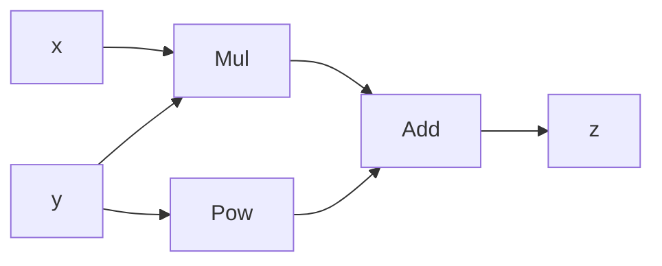

# PyTorch 计算图概念

在深度学习中，**计算图**是描述数学运算和变量之间关系的一种可视化工具。PyTorch通过动态计算图（Dynamic Computation Graph）实现了自动微分（Autograd），这是其核心功能之一。本文将详细介绍PyTorch中的计算图概念，帮助你理解其工作原理和应用场景。

---

## 什么是计算图？

计算图是一种有向无环图（DAG），用于表示数学运算的顺序和依赖关系。图中的节点代表变量或操作，边代表数据流动的方向。在PyTorch中，计算图是动态构建的，这意味着每次执行前向传播时，计算图都会重新生成。

:::note
**动态计算图 vs 静态计算图**  
- **动态计算图**：每次执行时都会重新构建，灵活性高，适合调试和动态模型（如RNN）。  
- **静态计算图**：在模型定义时构建，执行时不可更改，性能优化更好（如TensorFlow 1.x）。
:::

---

## PyTorch 中的计算图

在PyTorch中，计算图的核心是`Tensor`对象。每个`Tensor`都有一个`requires_grad`属性，用于指示是否需要计算梯度。当`requires_grad=True`时，PyTorch会自动跟踪所有与该`Tensor`相关的操作，并构建计算图。

### 示例：构建计算图

以下是一个简单的例子，展示如何构建计算图：

```python
import torch

# 创建两个张量，并启用梯度计算
x = torch.tensor(2.0, requires_grad=True)
y = torch.tensor(3.0, requires_grad=True)

# 定义一个简单的计算
z = x * y + y**2

# 打印结果
print("z =", z)
```

**输出：**
```
z = tensor(15., grad_fn=<AddBackward0>)
```

在这个例子中，`z`是通过`x`和`y`计算得到的。PyTorch会自动构建一个计算图，记录`z`是如何从`x`和`y`计算出来的。

---

## 计算图的可视化

为了更好地理解计算图，我们可以将其可视化。以下是一个简单的计算图示例：



在这个图中：
- `x`和`y`是输入节点。
- `Mul`表示乘法操作，`Pow`表示平方操作。
- `Add`表示加法操作。
- `z`是输出节点。

---

## 反向传播与梯度计算

计算图的一个重要用途是支持反向传播（Backpropagation）。反向传播通过链式法则计算每个变量的梯度，从而实现自动微分。

### 示例：计算梯度

继续上面的例子，我们可以通过调用`z.backward()`来计算`x`和`y`的梯度：

```python
# 计算梯度
z.backward()

# 打印梯度
print("dz/dx =", x.grad)
print("dz/dy =", y.grad)
```

**输出：**
```
dz/dx = tensor(3.)
dz/dy = tensor(9.)
```

:::tip
**梯度计算原理**  
- `dz/dx = y`（因为`z = x * y + y**2`，对`x`求导得到`y`）。  
- `dz/dy = x + 2*y`（对`y`求导得到`x + 2*y`）。
:::

---

## 实际应用场景

计算图在深度学习中有着广泛的应用，以下是几个典型的场景：

1. **神经网络训练**  
   在训练神经网络时，计算图用于记录前向传播和反向传播的过程，从而更新模型参数。

2. **自定义损失函数**  
   当定义复杂的损失函数时，计算图可以自动计算梯度，简化代码实现。

3. **动态模型**  
   对于RNN等动态模型，动态计算图可以灵活地处理变长输入。

---

## 总结

计算图是PyTorch自动微分的核心机制。通过动态构建计算图，PyTorch能够高效地支持前向传播和反向传播，从而实现深度学习模型的训练和优化。理解计算图的概念对于掌握PyTorch至关重要。

---

## 附加资源与练习

### 资源
- [PyTorch官方文档：Autograd](https://pytorch.org/docs/stable/autograd.html)  
- [深度学习中的计算图](https://en.wikipedia.org/wiki/Computational_graph)

### 练习
1. 修改上面的代码，尝试计算更复杂的表达式（如`z = x**2 + y**3`）的梯度。
2. 使用`torchviz`库可视化计算图，观察其结构。

:::caution
**注意**  
在实际使用中，避免在不需要梯度的场景下启用`requires_grad`，以减少内存和计算开销。
:::