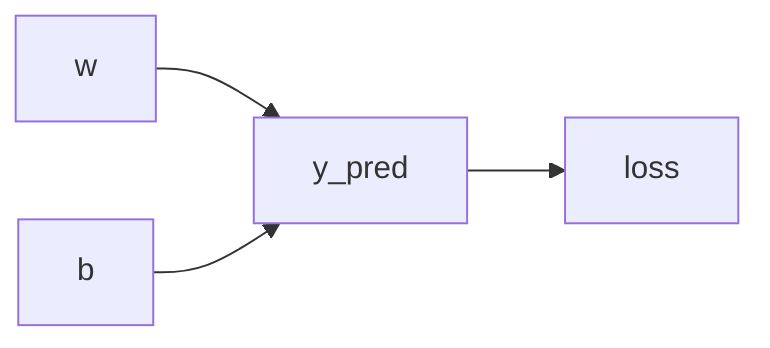

# PyTorch 反向传播

在深度学习中，反向传播（Backpropagation）是训练神经网络的核心算法之一。它通过计算损失函数相对于模型参数的梯度，并使用梯度下降法来更新参数，从而使模型逐渐逼近最优解。PyTorch通过自动微分（Autograd）机制实现了反向传播，使得梯度的计算变得简单高效。

本文将详细介绍PyTorch中的反向传播机制，并通过代码示例和实际案例帮助你理解其工作原理。

---

## 什么是反向传播？

反向传播是一种用于计算神经网络中损失函数相对于模型参数的梯度的算法。它的核心思想是通过链式法则（Chain Rule）将梯度从输出层逐层传递回输入层，从而计算出每个参数的梯度。

在PyTorch中，反向传播是通过自动微分机制实现的。每个张量（Tensor）都有一个 `requires_grad` 属性，当设置为 `True` 时，PyTorch会跟踪对该张量的所有操作，并构建一个计算图（Computation Graph）。在调用 `.backward()` 方法时，PyTorch会自动计算梯度并将其存储在张量的 `.grad` 属性中。

---

## 反向传播的基本步骤

1. **前向传播**：计算模型的输出和损失函数。
2. **构建计算图**：PyTorch自动跟踪所有涉及 `requires_grad=True` 的张量的操作。
3. **反向传播**：调用 `.backward()` 方法，计算损失函数相对于模型参数的梯度。
4. **更新参数**：使用优化器（如SGD、Adam）根据梯度更新模型参数。

---

## 代码示例

以下是一个简单的线性回归模型的示例，展示了如何使用PyTorch进行反向传播。

```python
import torch

# 定义模型参数
w = torch.tensor([2.0], requires_grad=True)
b = torch.tensor([1.0], requires_grad=True)

# 定义输入和目标值
x = torch.tensor([3.0])
y_true = torch.tensor([10.0])

# 前向传播：计算预测值
y_pred = w * x + b

# 计算损失（均方误差）
loss = (y_pred - y_true) ** 2

# 反向传播：计算梯度
loss.backward()

# 打印梯度
print(f"Gradient of w: {w.grad}")
print(f"Gradient of b: {b.grad}")
```

**输出：**
```
Gradient of w: tensor([12.])
Gradient of b: tensor([4.])
```

在这个示例中，我们定义了一个简单的线性模型 `y = w * x + b`，并计算了预测值与真实值之间的均方误差。通过调用 `loss.backward()`，PyTorch自动计算了 `w` 和 `b` 的梯度。

---

## 计算图的可视化

为了更好地理解反向传播的过程，我们可以将计算图可视化。以下是一个简单的计算图示例：



在这个图中：
- `w` 和 `b` 是模型参数。
- `y_pred` 是模型的预测值。
- `loss` 是损失函数。

通过反向传播，梯度从 `loss` 传递回 `w` 和 `b`。

---

## 实际应用场景

反向传播在深度学习中有着广泛的应用。以下是一些常见的场景：

1. **图像分类**：在卷积神经网络（CNN）中，反向传播用于更新卷积核的权重。
2. **自然语言处理**：在循环神经网络（RNN）中，反向传播用于更新词嵌入和隐藏状态的权重。
3. **强化学习**：在策略梯度方法中，反向传播用于计算策略参数的梯度。

---

## 总结

反向传播是深度学习中不可或缺的一部分，它通过自动微分机制高效地计算梯度，从而优化模型参数。PyTorch的自动微分功能使得反向传播的实现变得非常简单，只需设置 `requires_grad=True` 并调用 `.backward()` 方法即可。

通过本文的学习，你应该已经掌握了PyTorch中反向传播的基本原理和使用方法。接下来，你可以尝试在自己的项目中应用这些知识，并进一步探索深度学习的其他领域。

---

## 附加资源与练习

1. **官方文档**：阅读 [PyTorch Autograd 文档](https://pytorch.org/docs/stable/autograd.html) 以了解更多细节。
2. **练习**：尝试修改上述代码示例，使用不同的损失函数（如交叉熵损失）并观察梯度的变化。
3. **扩展阅读**：学习如何使用优化器（如 `torch.optim.SGD`）自动更新模型参数。

:::
Happy coding! 🚀
:::