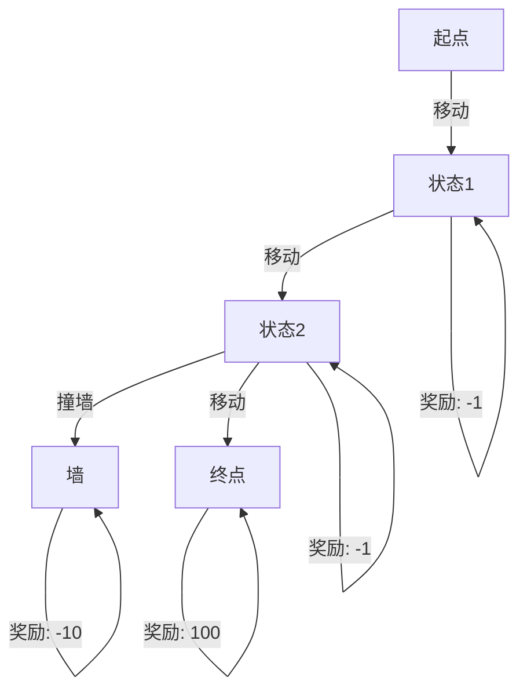

# PyTorch 奖励函数

在强化学习（Reinforcement Learning, RL）中，**奖励函数**是指导智能体（Agent）学习如何与环境交互的核心机制。奖励函数定义了智能体在每个时间步执行动作后所获得的即时反馈，智能体的目标是通过最大化累积奖励来学习最优策略。本文将详细介绍如何在 PyTorch 中设计和实现奖励函数，并通过实际案例帮助初学者理解其应用。

---

## 什么是奖励函数？

奖励函数是强化学习中的一个关键组件，它用于评估智能体在特定状态下执行某个动作的好坏。奖励函数的形式通常为：

```
R(s, a, s')
```

其中：
- `s` 是当前状态，
- `a` 是智能体执行的动作，
- `s'` 是执行动作后转移到的新状态。

奖励函数的设计直接影响智能体的学习效果。一个设计良好的奖励函数能够引导智能体快速学习到最优策略，而设计不当的奖励函数可能导致智能体无法收敛或学习到次优策略。

---

## 奖励函数的设计原则

在设计奖励函数时，需要遵循以下原则：
1. **明确目标**：奖励函数应清晰地反映智能体的目标。
2. **稀疏性与密集性**：稀疏奖励（如只在任务完成时给予奖励）可能导致学习困难，而密集奖励（如每个时间步都给予奖励）可以加速学习。
3. **避免奖励欺骗**：确保奖励函数不会让智能体通过“作弊”行为获得高奖励。

---

## 在 PyTorch 中实现奖励函数

在 PyTorch 中，奖励函数通常是一个自定义函数，根据环境的状态和动作计算奖励值。以下是一个简单的示例，展示如何在 PyTorch 中实现奖励函数。

### 示例：CartPole 环境中的奖励函数

CartPole 是一个经典的强化学习环境，目标是保持杆子竖直不倒。我们可以设计一个奖励函数，当杆子保持竖直时给予正奖励，当杆子倒下时给予负奖励。

```python
import torch

def reward_function(state, action, next_state):
    # 状态包含 Cart 的位置、速度、杆的角度和角速度
    x, x_dot, theta, theta_dot = state
    
    # 如果杆子倒下（角度超过阈值），给予负奖励
    if abs(theta) > 0.2:
        return torch.tensor(-1.0)
    
    # 否则给予正奖励
    return torch.tensor(1.0)
```

### 输入与输出
- **输入**：当前状态 `state`、动作 `action` 和下一状态 `next_state`。
- **输出**：一个标量张量，表示奖励值。

---

## 实际案例：迷宫导航

假设我们有一个迷宫导航任务，智能体需要从起点移动到终点。我们可以设计以下奖励函数：
- 到达终点：+100
- 撞墙：-10
- 每移动一步：-1

```python
def maze_reward_function(state, action, next_state):
    if next_state == goal_state:
        return torch.tensor(100.0)
    elif next_state in wall_states:
        return torch.tensor(-10.0)
    else:
        return torch.tensor(-1.0)
```

### 可视化奖励函数
以下是一个简单的 Mermaid 图表，展示了智能体在迷宫中的奖励分布：



---

## 总结

奖励函数是强化学习中至关重要的组件，它直接影响智能体的学习效果。通过合理设计奖励函数，可以引导智能体快速学习到最优策略。本文介绍了奖励函数的基本概念、设计原则以及在 PyTorch 中的实现方法，并通过实际案例展示了其应用。

---

## 附加资源与练习

1. **练习**：尝试在 CartPole 环境中修改奖励函数，观察智能体的学习效果。
2. **资源**：
   - [OpenAI Gym 文档](https://www.gymlibrary.dev/)
   - [PyTorch 官方教程](https://pytorch.org/tutorials/)
3. **挑战**：设计一个自定义环境的奖励函数，并训练一个智能体完成特定任务。

:::tip
奖励函数的设计需要结合具体任务和环境特点，多尝试不同的奖励函数设计，观察智能体的表现。
:::