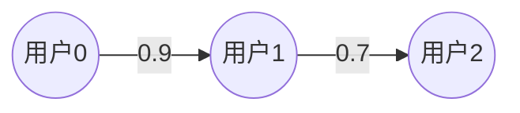

# PyTorch 图数据表示

图神经网络（Graph Neural Networks, GNNs）是处理图结构数据的强大工具。在开始学习图神经网络之前，首先需要了解如何在PyTorch中表示图数据。本文将详细介绍图数据的表示方法，包括节点、边和特征矩阵的构建，并通过代码示例和实际案例帮助你更好地理解。

## 什么是图数据？

图（Graph）是由节点（Nodes）和边（Edges）组成的结构。节点代表实体，边代表实体之间的关系。例如，在社交网络中，节点可以是用户，边可以是用户之间的好友关系。图数据广泛应用于社交网络分析、推荐系统、分子结构预测等领域。

在PyTorch中，图数据通常通过以下方式表示：
- **节点特征矩阵（Node Feature Matrix）**：描述每个节点的特征。
- **边索引（Edge Index）**：描述图中边的连接关系。
- **边特征矩阵（Edge Feature Matrix）**（可选）：描述每条边的特征。

## 图数据的表示方法

### 1. 节点特征矩阵

节点特征矩阵是一个二维张量，形状为 `[num_nodes, num_node_features]`，其中 `num_nodes` 是节点的数量，`num_node_features` 是每个节点的特征数量。例如，假设我们有3个节点，每个节点有2个特征，节点特征矩阵可以表示为：

```python
import torch

node_features = torch.tensor([
    [1.0, 2.0],  # 节点0的特征
    [3.0, 4.0],  # 节点1的特征
    [5.0, 6.0]   # 节点2的特征
])
```

### 2. 边索引

边索引是一个二维张量，形状为 `[2, num_edges]`，其中每一列表示一条边的起点和终点。例如，假设我们有两条边，连接节点0和节点1，以及节点1和节点2，边索引可以表示为：

```python
edge_index = torch.tensor([
    [0, 1],  # 起点
    [1, 2]   # 终点
], dtype=torch.long)
```

:::note
边索引通常使用 `torch.long` 数据类型，因为它表示的是节点的索引。
:::

### 3. 边特征矩阵（可选）

边特征矩阵是一个二维张量，形状为 `[num_edges, num_edge_features]`，其中 `num_edges` 是边的数量，`num_edge_features` 是每条边的特征数量。例如，假设我们有两条边，每条边有1个特征，边特征矩阵可以表示为：

```python
edge_features = torch.tensor([
    [1.0],  # 边0的特征
    [2.0]   # 边1的特征
])
```

## 实际案例：社交网络图

假设我们有一个简单的社交网络，包含3个用户（节点），用户之间的关系（边）如下：
- 用户0和用户1是好友。
- 用户1和用户2是好友。

每个用户有两个特征：年龄和活跃度。每条边有一个特征：好友关系的强度。

我们可以用以下代码表示这个图：

```python
# 节点特征矩阵
node_features = torch.tensor([
    [25, 0.8],  # 用户0的年龄和活跃度
    [30, 0.6],  # 用户1的年龄和活跃度
    [22, 0.9]   # 用户2的年龄和活跃度
])

# 边索引
edge_index = torch.tensor([
    [0, 1],  # 用户0和用户1是好友
    [1, 2]   # 用户1和用户2是好友
], dtype=torch.long)

# 边特征矩阵
edge_features = torch.tensor([
    [0.9],  # 用户0和用户1的好友关系强度
    [0.7]   # 用户1和用户2的好友关系强度
])
```

## 可视化图结构

为了更好地理解图结构，我们可以使用 `mermaid` 绘制图：



## 总结

在本文中，我们学习了如何在PyTorch中表示图数据，包括节点特征矩阵、边索引和边特征矩阵的构建方法。通过这些表示方法，我们可以将复杂的图结构数据转换为适合机器学习模型处理的张量形式。

## 附加资源与练习

- **练习1**：尝试构建一个包含4个节点和3条边的图，并为每个节点和边添加特征。
- **练习2**：使用 `mermaid` 绘制你构建的图结构。
- **进一步学习**：阅读 [PyTorch Geometric](https://pytorch-geometric.readthedocs.io/) 文档，了解如何使用图神经网络处理图数据。

:::tip
如果你对图神经网络感兴趣，可以继续学习图卷积网络（GCN）等模型，它们能够直接处理图结构数据。
:::