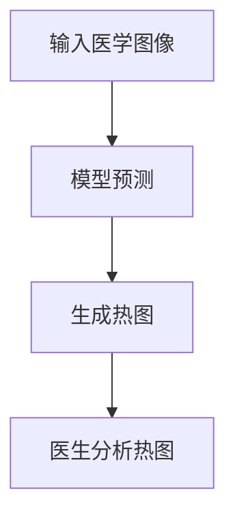

# PyTorch 可解释AI

## 介绍

在深度学习中，模型的复杂性往往使其成为一个“黑箱”，即我们难以理解模型是如何做出决策的。**可解释AI（Explainable AI, XAI）** 的目标是揭开这个黑箱，帮助我们理解模型的决策过程。PyTorch 提供了多种工具和技术来实现可解释AI，使开发者能够更好地理解和信任他们的模型。

本文将介绍 PyTorch 中实现可解释AI的基本概念、工具和实际应用场景。

---

## 什么是可解释AI？

可解释AI是指通过技术手段解释机器学习模型的预测结果，帮助用户理解模型是如何做出决策的。这对于医疗、金融等高风险领域尤为重要，因为这些领域的决策需要透明和可解释。

在 PyTorch 中，可解释AI通常通过以下方式实现：
- **特征重要性分析**：识别哪些输入特征对模型的预测结果影响最大。
- **可视化技术**：通过热图、梯度图等方式展示模型的决策过程。
- **代理模型**：使用简单的模型（如线性回归）近似复杂模型的行为。

---

## PyTorch 中的可解释AI工具

PyTorch 提供了多种工具来实现可解释AI，以下是常用的几种：

### 1. Captum

[Captum](https://captum.ai/) 是 PyTorch 的一个开源库，专门用于模型解释。它提供了多种解释方法，包括：
- **Integrated Gradients**：计算输入特征对模型输出的贡献。
- **Saliency Maps**：通过计算输入图像的梯度来生成热图，显示哪些像素对模型的预测最重要。
- **Layer-wise Relevance Propagation (LRP)**：逐层传播相关性，解释模型的决策过程。

#### 示例：使用 Captum 生成 Saliency Map

```python
import torch
import torch.nn as nn
import torchvision.models as models
from captum.attr import Saliency

# 加载预训练的 ResNet 模型
model = models.resnet18(pretrained=True)
model.eval()

# 定义输入图像
input_image = torch.randn(1, 3, 224, 224)

# 使用 Saliency 方法
saliency = Saliency(model)
saliency_map = saliency.attribute(input_image, target=0)

print(saliency_map)
```

**输出**：`saliency_map` 是一个与输入图像大小相同的张量，表示每个像素对模型预测的贡献。

---

### 2. TorchCAM

[TorchCAM](https://github.com/frgfm/torch-cam) 是一个轻量级库，用于生成类激活图（Class Activation Maps, CAM），帮助可视化模型在图像分类任务中的关注区域。

#### 示例：使用 TorchCAM 生成类激活图

```python
from torchcam.methods import GradCAM
from torchvision.io import read_image
from torchvision.transforms.functional import normalize, resize

# 加载图像
image = read_image("example.jpg")
image = resize(image, (224, 224))
image = normalize(image.float() / 255, [0.485, 0.456, 0.406], [0.229, 0.224, 0.225])

# 使用 GradCAM
cam_extractor = GradCAM(model)
out = model(image.unsqueeze(0))
cams = cam_extractor(out.squeeze(0).argmax().item(), out)

print(cams[0])
```

**输出**：`cams[0]` 是一个热图，显示模型在预测时关注的图像区域。

---

## 实际案例

### 案例 1：医疗图像分类

在医疗领域，可解释AI可以帮助医生理解模型对医学图像的诊断依据。例如，使用 GradCAM 生成的热图可以显示模型在诊断肺癌时关注的肺部区域。



### 案例 2：金融风控

在金融风控中，可解释AI可以帮助解释模型拒绝贷款申请的原因。通过特征重要性分析，可以识别出影响决策的关键因素，如收入、信用评分等。

---

## 总结

可解释AI是深度学习中的重要研究方向，它帮助我们理解模型的决策过程，增强模型的透明度和可信度。PyTorch 提供了多种工具（如 Captum 和 TorchCAM）来实现可解释AI，适用于图像分类、医疗诊断、金融风控等多个领域。

---

## 附加资源与练习

- **资源**：
  - [Captum 官方文档](https://captum.ai/)
  - [TorchCAM GitHub 仓库](https://github.com/frgfm/torch-cam)
  - [PyTorch 官方教程](https://pytorch.org/tutorials/)

- **练习**：
  1. 使用 Captum 的 Integrated Gradients 方法分析一个简单的分类模型。
  2. 尝试在 TorchCAM 中生成不同类别的类激活图，并比较它们的差异。
  3. 选择一个实际数据集（如 CIFAR-10），实现可解释AI并解释模型的预测结果。

通过学习和实践，你将能够更好地理解和应用 PyTorch 中的可解释AI技术！