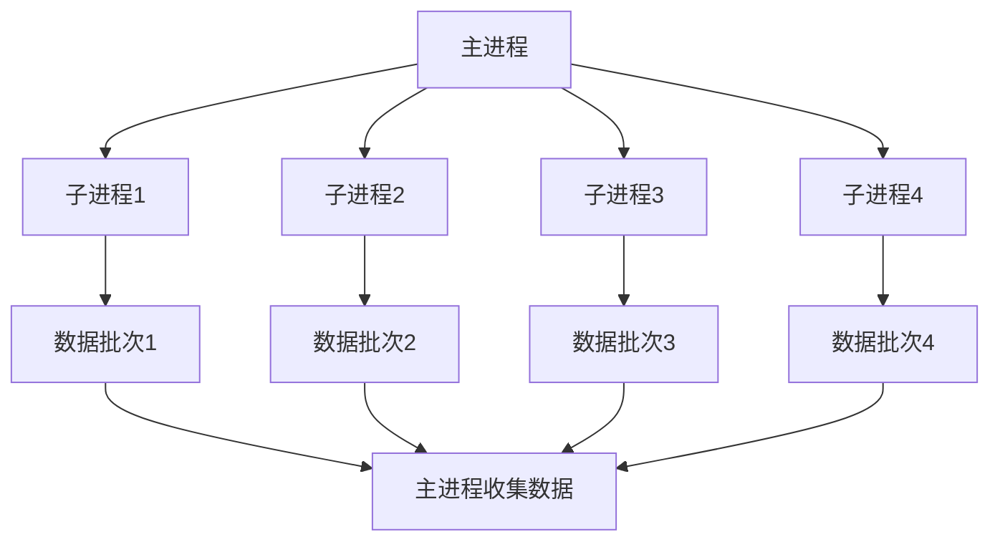

# PyTorch 多进程数据加载

在深度学习中，数据加载和预处理通常是训练过程中的瓶颈之一。PyTorch提供了多进程数据加载功能，可以显著加速数据加载过程，从而提高训练效率。本文将详细介绍如何使用PyTorch的多进程数据加载功能，并通过代码示例和实际案例帮助你理解其工作原理。

## 什么是多进程数据加载？

多进程数据加载是指在数据加载过程中使用多个进程来并行处理数据。PyTorch通过`DataLoader`类实现了这一功能，允许你在数据加载时指定`num_workers`参数来控制使用的进程数量。通过多进程数据加载，数据预处理和加载可以在多个CPU核心上并行进行，从而减少数据加载的时间。

## 如何使用多进程数据加载？

在PyTorch中，使用多进程数据加载非常简单。你只需要在创建`DataLoader`时指定`num_workers`参数即可。以下是一个简单的示例：

```python
import torch
from torch.utils.data import DataLoader, Dataset

class MyDataset(Dataset):
    def __init__(self, data):
        self.data = data

    def __len__(self):
        return len(self.data)

    def __getitem__(self, idx):
        return self.data[idx]

# 假设我们有一些数据
data = list(range(1000))

# 创建数据集
dataset = MyDataset(data)

# 创建DataLoader，使用4个进程
dataloader = DataLoader(dataset, batch_size=32, shuffle=True, num_workers=4)

# 遍历数据
for batch in dataloader:
    print(batch)
```

在这个示例中，我们创建了一个简单的数据集`MyDataset`，并使用`DataLoader`加载数据。通过设置`num_workers=4`，我们指定了使用4个进程来并行加载数据。

:::note
**注意**：`num_workers`的值应根据你的CPU核心数量进行调整。通常，`num_workers`的值不应超过CPU核心数。
:::

## 多进程数据加载的工作原理

当你设置`num_workers`参数时，PyTorch会创建多个子进程来并行加载数据。每个子进程都会独立地从数据集中读取数据，并进行预处理。主进程则负责从这些子进程中收集数据，并将其组合成批次。



在这个图中，主进程创建了4个子进程，每个子进程独立地加载数据并生成数据批次。主进程随后收集这些批次数据，并将其传递给模型进行训练。

## 实际案例：图像分类任务中的多进程数据加载

在图像分类任务中，数据加载和预处理通常非常耗时。以下是一个使用多进程数据加载的示例，展示了如何在图像分类任务中加速数据加载。

```python
import torch
from torch.utils.data import DataLoader
from torchvision import datasets, transforms

# 定义数据预处理
transform = transforms.Compose([
    transforms.Resize((224, 224)),
    transforms.ToTensor(),
    transforms.Normalize(mean=[0.485, 0.456, 0.406], std=[0.229, 0.224, 0.225])
])

# 加载数据集
dataset = datasets.ImageFolder(root='path/to/dataset', transform=transform)

# 创建DataLoader，使用4个进程
dataloader = DataLoader(dataset, batch_size=32, shuffle=True, num_workers=4)

# 遍历数据
for images, labels in dataloader:
    print(images.shape, labels)
```

在这个示例中，我们使用了`torchvision.datasets.ImageFolder`来加载图像数据集，并使用`DataLoader`进行多进程数据加载。通过设置`num_workers=4`，我们显著加速了数据加载过程。

:::tip
**提示**：在实际应用中，你可以通过调整`num_workers`的值来找到最佳的性能平衡点。通常，`num_workers`的值越大，数据加载速度越快，但也会占用更多的内存。
:::

## 总结

多进程数据加载是PyTorch中一个非常有用的功能，可以显著加速数据加载和预处理过程。通过合理设置`num_workers`参数，你可以充分利用多核CPU的计算能力，从而提高训练效率。

在实际应用中，多进程数据加载特别适用于数据量较大或预处理较复杂的任务，如图像分类、目标检测等。通过本文的介绍和示例代码，你应该已经掌握了如何使用PyTorch的多进程数据加载功能。

## 附加资源与练习

- **练习**：尝试在自己的数据集上使用多进程数据加载，并观察训练速度的变化。
- **资源**：阅读PyTorch官方文档中关于`DataLoader`的更多内容，了解更多高级用法和参数设置。

希望本文对你理解和使用PyTorch的多进程数据加载功能有所帮助！如果你有任何问题或建议，欢迎在评论区留言。