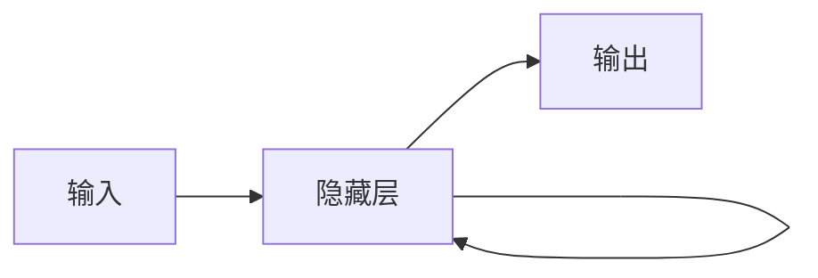

# PyTorch 序列预测

序列预测是机器学习和深度学习中的一个重要任务，它涉及根据历史数据预测未来的值。例如，股票价格预测、天气预测和文本生成等任务都可以看作是序列预测问题。在本文中，我们将使用PyTorch中的循环神经网络（RNN）来实现序列预测。

## 什么是序列预测？

序列预测是指根据一系列历史数据点，预测未来的数据点。这些数据点可以是时间序列数据（如股票价格、温度变化），也可以是文本数据（如句子中的下一个单词）。序列预测的核心思想是利用历史数据中的模式和趋势来推断未来的值。

## 循环神经网络（RNN）简介

循环神经网络（RNN）是一种专门用于处理序列数据的神经网络。与传统的神经网络不同，RNN具有记忆能力，能够记住之前的状态并将其用于当前的计算。这使得RNN在处理时间序列数据、自然语言处理等任务时表现出色。

### RNN的基本结构

RNN的基本结构包括输入层、隐藏层和输出层。隐藏层的状态会在每个时间步被更新，并且会传递到下一个时间步。这种结构使得RNN能够处理任意长度的序列数据。



## 使用PyTorch实现序列预测

接下来，我们将通过一个简单的例子来演示如何使用PyTorch实现序列预测。我们将使用一个简单的正弦波序列作为输入数据，并训练一个RNN模型来预测未来的值。

### 1. 导入必要的库

首先，我们需要导入PyTorch和其他必要的库。

```python
import torch
import torch.nn as nn
import numpy as np
import matplotlib.pyplot as plt
```

### 2. 生成训练数据

我们将生成一个正弦波序列作为训练数据。

```python
# 生成正弦波数据
seq_length = 20
time_steps = np.linspace(0, np.pi, seq_length + 1)
data = np.sin(time_steps)

# 将数据转换为PyTorch张量
data = torch.FloatTensor(data).unsqueeze(1)
```

### 3. 定义RNN模型

接下来，我们定义一个简单的RNN模型。

```python
class SimpleRNN(nn.Module):
    def __init__(self, input_size, hidden_size, output_size):
        super(SimpleRNN, self).__init__()
        self.hidden_size = hidden_size
        self.rnn = nn.RNN(input_size, hidden_size, batch_first=True)
        self.fc = nn.Linear(hidden_size, output_size)

    def forward(self, x, hidden):
        out, hidden = self.rnn(x, hidden)
        out = self.fc(out)
        return out, hidden
```

### 4. 训练模型

现在，我们可以开始训练模型了。

```python
# 初始化模型、损失函数和优化器
input_size = 1
hidden_size = 32
output_size = 1
model = SimpleRNN(input_size, hidden_size, output_size)
criterion = nn.MSELoss()
optimizer = torch.optim.Adam(model.parameters(), lr=0.01)

# 训练模型
epochs = 100
for epoch in range(epochs):
    hidden = None
    optimizer.zero_grad()
    output, hidden = model(data[:-1], hidden)
    loss = criterion(output, data[1:])
    loss.backward()
    optimizer.step()

    if (epoch + 1) % 10 == 0:
        print(f'Epoch [{epoch+1}/{epochs}], Loss: {loss.item():.4f}')
```

### 5. 测试模型

训练完成后，我们可以使用模型来预测未来的值。

```python
# 预测未来的值
with torch.no_grad():
    predicted, _ = model(data[:-1], None)
    predicted = predicted.numpy()

# 绘制结果
plt.plot(time_steps[1:], data[1:].numpy(), label='True Data')
plt.plot(time_steps[1:], predicted, label='Predicted Data')
plt.legend()
plt.show()
```

:::note
在上面的代码中，我们使用了一个简单的RNN模型来预测正弦波序列。通过训练，模型能够学习到正弦波的模式，并预测未来的值。
:::

## 实际应用场景

序列预测在许多实际应用中都有广泛的应用。以下是一些常见的应用场景：

1. **股票价格预测**：根据历史股票价格数据，预测未来的股票价格。
2. **天气预测**：根据历史气象数据，预测未来的天气情况。
3. **文本生成**：根据已有的文本数据，生成新的文本内容。

## 总结

在本文中，我们介绍了如何使用PyTorch中的循环神经网络（RNN）进行序列预测。我们从基础概念入手，逐步讲解了如何构建和训练RNN模型，并通过一个简单的正弦波序列预测的例子展示了其应用。希望本文能帮助你理解序列预测的基本原理，并激发你在实际项目中使用RNN的兴趣。

## 附加资源与练习

- **进一步学习**：你可以尝试使用更复杂的RNN变体（如LSTM或GRU）来提高模型的预测性能。
- **练习**：尝试使用不同的序列数据（如股票价格数据）来训练和测试模型，并观察模型的预测效果。

:::tip
如果你对RNN的更多细节感兴趣，可以参考PyTorch官方文档中的相关章节，或者阅读一些关于深度学习的经典教材。
:::