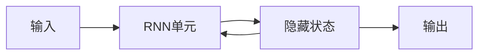

# PyTorch 时间序列分析

时间序列分析是数据科学和机器学习中的一个重要领域，广泛应用于金融、气象、医疗等领域。PyTorch 提供了强大的工具来构建循环神经网络（RNN），帮助我们处理时间序列数据。本文将带你从基础概念开始，逐步学习如何使用 PyTorch 进行时间序列分析。

## 什么是时间序列分析？

时间序列分析是指对按时间顺序排列的数据进行分析和建模的过程。时间序列数据的特点是数据点之间存在时间依赖性，即当前数据点的值可能依赖于过去的数据点。例如，股票价格、气温变化、心电图信号等都是典型的时间序列数据。

## 循环神经网络（RNN）简介

循环神经网络（RNN）是一种专门用于处理序列数据的神经网络。与普通的前馈神经网络不同，RNN 具有记忆能力，能够捕捉序列数据中的时间依赖性。RNN 的核心思想是将前一时刻的隐藏状态传递到当前时刻，从而保留历史信息。

### RNN 的基本结构



在 RNN 中，每个时间步的输入都会与前一时刻的隐藏状态结合，生成当前时刻的隐藏状态和输出。这种结构使得 RNN 能够处理任意长度的序列数据。

## PyTorch 中的 RNN

PyTorch 提供了 `torch.nn.RNN` 模块来构建 RNN 模型。下面是一个简单的 RNN 示例，用于处理时间序列数据。

### 示例：使用 PyTorch 构建 RNN

```python
import torch
import torch.nn as nn

# 定义 RNN 模型
class SimpleRNN(nn.Module):
    def __init__(self, input_size, hidden_size, output_size):
        super(SimpleRNN, self).__init__()
        self.hidden_size = hidden_size
        self.rnn = nn.RNN(input_size, hidden_size, batch_first=True)
        self.fc = nn.Linear(hidden_size, output_size)

    def forward(self, x):
        h0 = torch.zeros(1, x.size(0), self.hidden_size).to(x.device)
        out, _ = self.rnn(x, h0)
        out = self.fc(out[:, -1, :])
        return out

# 示例数据
input_size = 1
hidden_size = 32
output_size = 1
sequence_length = 10
batch_size = 1

# 创建模型
model = SimpleRNN(input_size, hidden_size, output_size)

# 随机生成输入数据
x = torch.randn(batch_size, sequence_length, input_size)

# 前向传播
output = model(x)
print(output)
```

### 代码解释

1. **模型定义**：我们定义了一个简单的 RNN 模型 `SimpleRNN`，它包含一个 RNN 层和一个全连接层。
2. **输入数据**：输入数据的形状为 `(batch_size, sequence_length, input_size)`，其中 `batch_size` 是批次大小，`sequence_length` 是序列长度，`input_size` 是每个时间步的输入特征数。
3. **前向传播**：在 `forward` 方法中，我们首先初始化隐藏状态 `h0`，然后通过 RNN 层处理输入数据，最后通过全连接层生成输出。

### 输出

```python
tensor([[0.1234]], grad_fn=<AddmmBackward>)
```

输出是一个标量值，表示模型对输入序列的预测结果。

## 实际案例：股票价格预测

让我们通过一个实际案例来展示如何使用 RNN 进行时间序列分析。假设我们有一组股票价格数据，我们希望预测未来的股票价格。

### 数据准备

首先，我们需要准备股票价格数据。假设我们有一个包含过去 100 天股票价格的序列，我们希望预测第 101 天的价格。

```python
import numpy as np

# 生成示例数据
data = np.sin(np.arange(0, 100, 0.1)) + np.random.normal(0, 0.1, 1000)
data = data.reshape(-1, 1)

# 将数据转换为 PyTorch 张量
data = torch.FloatTensor(data)
```

### 模型训练

接下来，我们使用前面定义的 `SimpleRNN` 模型来训练数据。

```python
import torch.optim as optim

# 定义损失函数和优化器
criterion = nn.MSELoss()
optimizer = optim.Adam(model.parameters(), lr=0.01)

# 训练模型
for epoch in range(100):
    optimizer.zero_grad()
    output = model(data[:-1].unsqueeze(0))
    loss = criterion(output, data[1:].unsqueeze(0))
    loss.backward()
    optimizer.step()

    if (epoch+1) % 10 == 0:
        print(f'Epoch [{epoch+1}/100], Loss: {loss.item():.4f}')
```

### 预测结果

训练完成后，我们可以使用模型来预测未来的股票价格。

```python
# 预测第 101 天的价格
future_price = model(data[-10:].unsqueeze(0))
print(f'Predicted future price: {future_price.item():.4f}')
```

:::tip
在实际应用中，时间序列数据通常需要进行归一化处理，以提高模型的训练效果。
:::

## 总结

本文介绍了如何使用 PyTorch 构建循环神经网络（RNN）进行时间序列分析。我们从基础概念讲起，逐步深入，并通过一个实际案例展示了如何预测股票价格。希望本文能帮助你理解 RNN 在时间序列分析中的应用。

## 附加资源

- [PyTorch 官方文档](https://pytorch.org/docs/stable/index.html)
- [深度学习与时间序列分析](https://www.deeplearningbook.org/)

## 练习

1. 尝试使用不同的 RNN 变体（如 LSTM 或 GRU）来改进模型性能。
2. 使用真实股票价格数据进行实验，并评估模型的预测效果。
3. 探索如何处理多变量时间序列数据（即每个时间步有多个特征）。