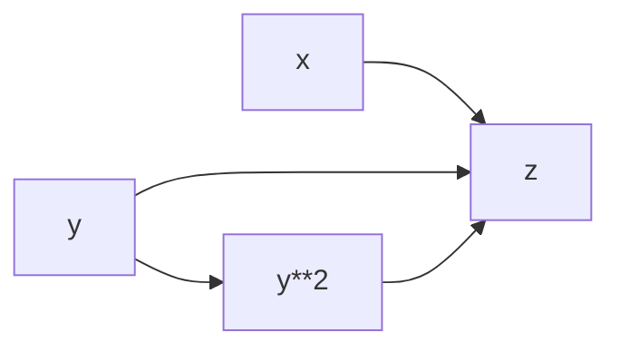

# PyTorch 动态计算图

在深度学习中，计算图（Computational Graph）是描述模型计算过程的核心工具。PyTorch 使用**动态计算图**（Dynamic Computational Graph）来构建和优化模型的计算流程。与静态计算图不同，动态计算图在每次前向传播时都会重新构建，这使得 PyTorch 更加灵活和易于调试。

本文将详细介绍 PyTorch 动态计算图的概念、工作原理以及实际应用场景。

---

## 什么是动态计算图？

计算图是一种用于描述数学运算的有向无环图（DAG）。在 PyTorch 中，计算图是动态的，这意味着它在每次前向传播时都会重新构建。这种动态性使得 PyTorch 能够支持更灵活的模型设计，例如动态调整模型结构或条件分支。

与静态计算图（如 TensorFlow 1.x 中的计算图）不同，动态计算图不需要预先定义完整的计算流程。相反，它会在运行时根据代码的执行顺序动态生成。

---

## 动态计算图的工作原理

在 PyTorch 中，动态计算图的核心是 `torch.Tensor` 和 `torch.autograd` 模块。每个 `Tensor` 对象都有一个 `requires_grad` 属性，用于指示是否需要计算梯度。当 `requires_grad=True` 时，PyTorch 会自动跟踪与该 `Tensor` 相关的所有操作，并构建计算图。

以下是一个简单的例子：

```python
import torch

# 创建两个张量
x = torch.tensor(2.0, requires_grad=True)
y = torch.tensor(3.0, requires_grad=True)

# 定义一个计算
z = x * y + y**2

# 计算梯度
z.backward()

print(f"dz/dx: {x.grad}")  # 输出 dz/dx: 3.0
print(f"dz/dy: {y.grad}")  # 输出 dz/dy: 9.0
```

在这个例子中，PyTorch 会自动构建以下计算图：



:::note
**注意**：`backward()` 方法用于计算梯度，它会根据计算图自动反向传播梯度。
:::

---

## 动态计算图的优势

1. **灵活性**：动态计算图允许在运行时修改模型结构，例如根据输入数据动态调整网络层。
2. **易于调试**：由于计算图是动态生成的，开发者可以直接使用 Python 的调试工具（如 `pdb`）来检查中间结果。
3. **直观性**：动态计算图的行为与普通的 Python 代码一致，使得代码更易于理解和编写。

---

## 实际应用场景

### 1. 动态调整模型结构

在某些任务中，模型的结构可能需要根据输入数据动态调整。例如，在自然语言处理中，句子的长度可能不同，因此需要动态调整 RNN 的步数。

```python
import torch
import torch.nn as nn

class DynamicRNN(nn.Module):
    def __init__(self, input_size, hidden_size):
        super(DynamicRNN, self).__init__()
        self.rnn = nn.RNN(input_size, hidden_size, batch_first=True)

    def forward(self, x):
        # x 的形状为 (batch_size, seq_len, input_size)
        output, _ = self.rnn(x)
        return output

# 示例输入
x = torch.randn(2, 10, 5)  # batch_size=2, seq_len=10, input_size=5
model = DynamicRNN(input_size=5, hidden_size=8)
output = model(x)
print(output.shape)  # 输出 torch.Size([2, 10, 8])
```

### 2. 条件分支

动态计算图支持条件分支，这使得模型可以根据输入数据选择不同的计算路径。

```python
import torch

def dynamic_branch(x):
    if x.sum() > 0:
        return x * 2
    else:
        return x + 1

x = torch.tensor([1.0, -2.0, 3.0], requires_grad=True)
y = dynamic_branch(x)
y.backward(torch.tensor([1.0, 1.0, 1.0]))
print(x.grad)  # 输出 tensor([2., 1., 2.])
```

---

## 总结

PyTorch 的动态计算图是其核心特性之一，它为深度学习模型的构建和调试提供了极大的灵活性。通过动态计算图，开发者可以轻松实现动态调整模型结构、条件分支等复杂功能。

:::tip
**提示**：如果你对动态计算图的工作原理感兴趣，可以深入研究 `torch.autograd` 模块，了解其内部实现机制。
:::

---

## 附加资源与练习

1. **官方文档**：阅读 [PyTorch Autograd 文档](https://pytorch.org/docs/stable/autograd.html) 了解更多细节。
2. **练习**：尝试实现一个简单的动态神经网络，根据输入数据的形状动态调整隐藏层的大小。
3. **扩展阅读**：了解 TensorFlow 2.x 中的 `Eager Execution` 模式，比较其与 PyTorch 动态计算图的异同。

通过不断实践和探索，你将更好地掌握 PyTorch 动态计算图的强大功能！