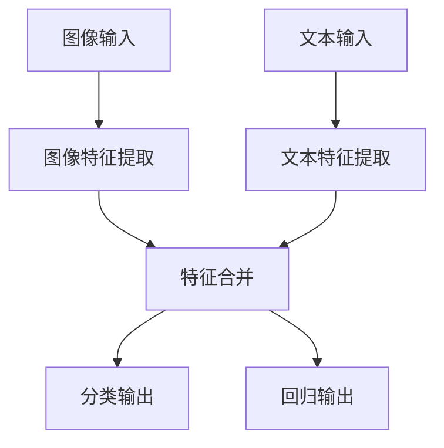

# PyTorch 多输入输出模型

在深度学习中，许多任务需要处理多个输入或生成多个输出。例如，图像描述生成任务可能需要同时处理图像和文本输入，而多任务学习可能需要同时预测多个目标。PyTorch提供了灵活的工具来构建这样的多输入输出模型。本文将逐步介绍如何实现这些模型，并通过实际案例展示其应用。

## 什么是多输入输出模型？

多输入输出模型是指能够接受多个输入数据流并生成多个输出的神经网络模型。这种模型通常用于处理复杂的任务，例如：

- **多模态学习**：同时处理图像、文本、音频等多种类型的数据。
- **多任务学习**：同时预测多个相关或不相关的目标。
- **序列到序列模型**：输入和输出都是序列数据，例如机器翻译。

在PyTorch中，我们可以通过定义自定义的 `nn.Module` 类来实现多输入输出模型。

---

## 构建多输入输出模型

### 1. 定义模型结构

假设我们需要构建一个模型，它接受两个输入：一个图像和一个文本向量，并生成两个输出：一个分类结果和一个回归值。以下是实现该模型的代码示例：

```python
import torch
import torch.nn as nn

class MultiInputOutputModel(nn.Module):
    def __init__(self, image_feature_size, text_feature_size, num_classes):
        super(MultiInputOutputModel, self).__init__()
        
        # 图像特征提取层
        self.image_fc = nn.Sequential(
            nn.Linear(image_feature_size, 128),
            nn.ReLU(),
            nn.Linear(128, 64),
            nn.ReLU()
        )
        
        # 文本特征提取层
        self.text_fc = nn.Sequential(
            nn.Linear(text_feature_size, 64),
            nn.ReLU(),
            nn.Linear(64, 32),
            nn.ReLU()
        )
        
        # 合并特征后的全连接层
        self.combined_fc = nn.Sequential(
            nn.Linear(64 + 32, 128),
            nn.ReLU(),
            nn.Linear(128, 64),
            nn.ReLU()
        )
        
        # 输出层
        self.classifier = nn.Linear(64, num_classes)  # 分类输出
        self.regressor = nn.Linear(64, 1)            # 回归输出

    def forward(self, image_input, text_input):
        # 提取图像特征
        image_features = self.image_fc(image_input)
        
        # 提取文本特征
        text_features = self.text_fc(text_input)
        
        # 合并特征
        combined_features = torch.cat((image_features, text_features), dim=1)
        combined_features = self.combined_fc(combined_features)
        
        # 生成输出
        classification_output = self.classifier(combined_features)
        regression_output = self.regressor(combined_features)
        
        return classification_output, regression_output
```

### 2. 模型输入与输出

假设我们有以下输入数据：

- 图像特征：`image_input`，形状为 `(batch_size, image_feature_size)`。
- 文本特征：`text_input`，形状为 `(batch_size, text_feature_size)`。

模型的输出为：

- 分类结果：`classification_output`，形状为 `(batch_size, num_classes)`。
- 回归值：`regression_output`，形状为 `(batch_size, 1)`。

### 3. 训练模型

在训练多输入输出模型时，我们需要为每个输出定义损失函数，并将它们结合起来。例如：

```python
# 定义模型
model = MultiInputOutputModel(image_feature_size=256, text_feature_size=100, num_classes=10)

# 定义损失函数
criterion_classification = nn.CrossEntropyLoss()
criterion_regression = nn.MSELoss()

# 定义优化器
optimizer = torch.optim.Adam(model.parameters(), lr=0.001)

# 训练循环
for epoch in range(num_epochs):
    for image_input, text_input, classification_target, regression_target in dataloader:
        # 前向传播
        classification_output, regression_output = model(image_input, text_input)
        
        # 计算损失
        loss_classification = criterion_classification(classification_output, classification_target)
        loss_regression = criterion_regression(regression_output, regression_target)
        total_loss = loss_classification + loss_regression
        
        # 反向传播和优化
        optimizer.zero_grad()
        total_loss.backward()
        optimizer.step()
```

---

## 实际案例：多模态情感分析

假设我们需要构建一个模型来分析社交媒体帖子中的情感。输入包括帖子的图像和文本，输出为情感分类（正面、负面、中性）和情感强度（0到1之间的值）。

### 数据流图



### 实现步骤

1. 使用预训练的卷积神经网络（如ResNet）提取图像特征。
2. 使用预训练的词嵌入（如Word2Vec或BERT）提取文本特征。
3. 将图像和文本特征合并，并通过全连接层生成分类和回归输出。

---

## 总结

多输入输出模型是处理复杂任务的强大工具。通过灵活地组合不同的输入和输出，我们可以构建适用于多种场景的深度学习模型。本文介绍了如何在PyTorch中实现多输入输出模型，并通过一个实际案例展示了其应用。

:::tip 附加资源
- [PyTorch官方文档](https://pytorch.org/docs/stable/index.html)
- 《深度学习入门：基于Python的理论与实现》
:::

:::note 练习
1. 修改上述代码，使其支持三个输入（例如图像、文本和音频）。
2. 尝试使用不同的损失函数组合来优化模型。
:::