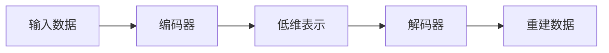

# PyTorch 自编码器

自编码器（Autoencoder）是一种无监督学习的神经网络模型，主要用于数据的降维和特征提取。它通过学习输入数据的压缩表示（编码），然后从该表示中重建原始数据（解码）。自编码器在图像处理、异常检测和生成模型等领域有广泛的应用。

## 自编码器的基本结构

自编码器由两部分组成：编码器（Encoder）和解码器（Decoder）。编码器将输入数据压缩为低维表示，而解码器则从该低维表示中重建原始数据。



### 编码器
编码器是一个神经网络，它将输入数据映射到一个低维的潜在空间。这个潜在空间的维度通常远小于输入数据的维度。

### 解码器
解码器是另一个神经网络，它将潜在空间的表示映射回原始数据空间，试图重建输入数据。

## PyTorch 实现自编码器

下面是一个简单的自编码器的PyTorch实现示例。我们将使用MNIST数据集来训练自编码器。

```python
import torch
import torch.nn as nn
import torch.optim as optim
from torchvision import datasets, transforms
from torch.utils.data import DataLoader

# 定义自编码器模型
class Autoencoder(nn.Module):
    def __init__(self):
        super(Autoencoder, self).__init__()
        self.encoder = nn.Sequential(
            nn.Linear(28*28, 128),
            nn.ReLU(),
            nn.Linear(128, 64),
            nn.ReLU(),
            nn.Linear(64, 12),
            nn.ReLU(),
            nn.Linear(12, 3)  # 压缩到3维
        )
        self.decoder = nn.Sequential(
            nn.Linear(3, 12),
            nn.ReLU(),
            nn.Linear(12, 64),
            nn.ReLU(),
            nn.Linear(64, 128),
            nn.ReLU(),
            nn.Linear(128, 28*28),
            nn.Sigmoid()  # 输出在0到1之间
        )

    def forward(self, x):
        encoded = self.encoder(x)
        decoded = self.decoder(encoded)
        return decoded

# 加载MNIST数据集
transform = transforms.Compose([transforms.ToTensor()])
train_dataset = datasets.MNIST(root='./data', train=True, download=True, transform=transform)
train_loader = DataLoader(train_dataset, batch_size=64, shuffle=True)

# 初始化模型、损失函数和优化器
model = Autoencoder()
criterion = nn.MSELoss()
optimizer = optim.Adam(model.parameters(), lr=0.001)

# 训练模型
num_epochs = 10
for epoch in range(num_epochs):
    for data in train_loader:
        img, _ = data
        img = img.view(img.size(0), -1)  # 展平图像
        output = model(img)
        loss = criterion(output, img)
        
        optimizer.zero_grad()
        loss.backward()
        optimizer.step()
    
    print(f'Epoch [{epoch+1}/{num_epochs}], Loss: {loss.item():.4f}')
```

### 代码解释
1. **模型定义**：我们定义了一个简单的自编码器模型，包含一个编码器和一个解码器。编码器将28x28的图像压缩到3维，解码器则从3维重建回28x28的图像。
2. **数据加载**：使用`torchvision`加载MNIST数据集，并将其转换为张量。
3. **训练过程**：我们使用均方误差（MSE）作为损失函数，并使用Adam优化器来训练模型。

### 输入和输出
- **输入**：28x28的MNIST图像。
- **输出**：重建后的28x28图像。

## 自编码器的实际应用

自编码器在许多领域都有广泛的应用，以下是一些常见的应用场景：

1. **数据降维**：自编码器可以将高维数据压缩到低维空间，便于数据可视化和分析。
2. **异常检测**：通过训练自编码器来重建正常数据，异常数据通常会有较高的重建误差。
3. **图像去噪**：自编码器可以学习到数据的本质特征，从而去除噪声。
4. **生成模型**：变分自编码器（VAE）和生成对抗网络（GAN）等模型可以生成新的数据样本。

## 总结

自编码器是一种强大的无监督学习工具，能够有效地进行数据降维和特征提取。通过PyTorch，我们可以轻松地构建和训练自编码器模型，并将其应用于各种实际问题中。

:::tip
**练习**：尝试修改上述代码，使用不同的数据集（如CIFAR-10）来训练自编码器，并观察重建效果。
:::

:::note
**附加资源**：
- [PyTorch官方文档](https://pytorch.org/docs/stable/index.html)
- [Deep Learning with PyTorch: A 60 Minute Blitz](https://pytorch.org/tutorials/beginner/deep_learning_60min_blitz.html)
- [Autoencoders in PyTorch](https://blog.paperspace.com/autoencoders-in-pytorch/)
:::