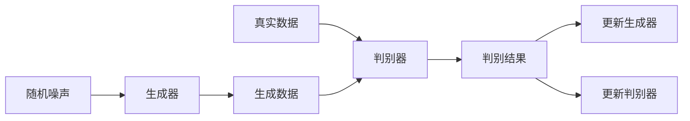

# PyTorch 生成对抗网络基础

生成对抗网络（Generative Adversarial Networks，简称GAN）是深度学习领域中的一种重要模型，由Ian Goodfellow等人于2014年提出。GAN的核心思想是通过两个神经网络——生成器（Generator）和判别器（Discriminator）的对抗训练，生成逼真的数据。本文将带你了解GAN的基本概念，并通过PyTorch实现一个简单的GAN模型。

## 什么是生成对抗网络？

GAN由两个主要部分组成：
1. **生成器（Generator）**：生成器的作用是从随机噪声中生成数据（如图像）。它的目标是生成尽可能逼真的数据，以欺骗判别器。
2. **判别器（Discriminator）**：判别器的作用是区分输入数据是真实的还是由生成器生成的。它的目标是尽可能准确地识别出真实数据和生成数据。

生成器和判别器在训练过程中相互对抗，最终达到一个平衡状态，生成器能够生成逼真的数据，而判别器无法区分真实数据和生成数据。

## GAN的训练过程

GAN的训练过程可以概括为以下步骤：
1. 生成器从随机噪声中生成数据。
2. 判别器对生成的数据和真实数据进行分类。
3. 根据判别器的输出，更新生成器和判别器的参数。
4. 重复上述过程，直到生成器能够生成逼真的数据。



## PyTorch 实现简单的GAN

下面我们通过PyTorch实现一个简单的GAN模型，用于生成手写数字图像。

### 1. 导入必要的库

```python
import torch
import torch.nn as nn
import torch.optim as optim
from torchvision import datasets, transforms
from torch.utils.data import DataLoader
import matplotlib.pyplot as plt
```

### 2. 定义生成器和判别器

```python
# 定义生成器
class Generator(nn.Module):
    def __init__(self, latent_dim, img_shape):
        super(Generator, self).__init__()
        self.model = nn.Sequential(
            nn.Linear(latent_dim, 128),
            nn.LeakyReLU(0.2),
            nn.Linear(128, 256),
            nn.BatchNorm1d(256),
            nn.LeakyReLU(0.2),
            nn.Linear(256, 512),
            nn.BatchNorm1d(512),
            nn.LeakyReLU(0.2),
            nn.Linear(512, img_shape),
            nn.Tanh()
        )

    def forward(self, z):
        return self.model(z)

# 定义判别器
class Discriminator(nn.Module):
    def __init__(self, img_shape):
        super(Discriminator, self).__init__()
        self.model = nn.Sequential(
            nn.Linear(img_shape, 512),
            nn.LeakyReLU(0.2),
            nn.Linear(512, 256),
            nn.LeakyReLU(0.2),
            nn.Linear(256, 1),
            nn.Sigmoid()
        )

    def forward(self, img):
        return self.model(img)
```

### 3. 初始化模型和优化器

```python
# 参数设置
latent_dim = 100
img_shape = 28 * 28
lr = 0.0002
batch_size = 64
epochs = 200

# 初始化生成器和判别器
generator = Generator(latent_dim, img_shape)
discriminator = Discriminator(img_shape)

# 定义优化器
optimizer_G = optim.Adam(generator.parameters(), lr=lr)
optimizer_D = optim.Adam(discriminator.parameters(), lr=lr)

# 定义损失函数
criterion = nn.BCELoss()
```

### 4. 训练GAN

```python
# 加载MNIST数据集
transform = transforms.Compose([
    transforms.ToTensor(),
    transforms.Normalize([0.5], [0.5])
])

dataset = datasets.MNIST(root='./data', train=True, transform=transform, download=True)
dataloader = DataLoader(dataset, batch_size=batch_size, shuffle=True)

# 训练循环
for epoch in range(epochs):
    for i, (imgs, _) in enumerate(dataloader):
        # 真实数据
        real_imgs = imgs.view(imgs.size(0), -1)
        real_labels = torch.ones(imgs.size(0), 1)
        # 生成数据
        z = torch.randn(imgs.size(0), latent_dim)
        fake_imgs = generator(z)
        fake_labels = torch.zeros(imgs.size(0), 1)

        # 训练判别器
        optimizer_D.zero_grad()
        real_loss = criterion(discriminator(real_imgs), real_labels)
        fake_loss = criterion(discriminator(fake_imgs.detach()), fake_labels)
        d_loss = real_loss + fake_loss
        d_loss.backward()
        optimizer_D.step()

        # 训练生成器
        optimizer_G.zero_grad()
        g_loss = criterion(discriminator(fake_imgs), real_labels)
        g_loss.backward()
        optimizer_G.step()

    print(f"Epoch [{epoch}/{epochs}] D_loss: {d_loss.item()}, G_loss: {g_loss.item()}")
```

### 5. 生成图像

训练完成后，我们可以使用生成器生成手写数字图像：

```python
# 生成图像
z = torch.randn(1, latent_dim)
generated_img = generator(z).view(28, 28).detach().numpy()

# 显示图像
plt.imshow(generated_img, cmap='gray')
plt.show()
```

## 实际应用场景

GAN在许多领域都有广泛的应用，例如：
- **图像生成**：生成逼真的图像，如人脸、风景等。
- **图像修复**：修复损坏或缺失的图像部分。
- **风格迁移**：将一种图像的风格迁移到另一种图像上。
- **数据增强**：生成额外的训练数据，以提高模型的泛化能力。

## 总结

本文介绍了生成对抗网络（GAN）的基本概念，并通过PyTorch实现了一个简单的GAN模型。GAN通过生成器和判别器的对抗训练，能够生成逼真的数据，具有广泛的应用前景。希望本文能帮助你理解GAN的基本原理，并激发你进一步探索的兴趣。

## 附加资源与练习

- **进一步阅读**：
  - [Generative Adversarial Networks by Ian Goodfellow](https://arxiv.org/abs/1406.2661)
  - [PyTorch官方文档](https://pytorch.org/docs/stable/index.html)
- **练习**：
  - 尝试修改生成器和判别器的结构，观察生成图像的变化。
  - 使用不同的数据集（如CIFAR-10）训练GAN，生成其他类型的图像。

:::tip
在训练GAN时，生成器和判别器的平衡非常重要。如果一方过于强大，训练可能会失败。因此，调整学习率和网络结构是关键。
:::