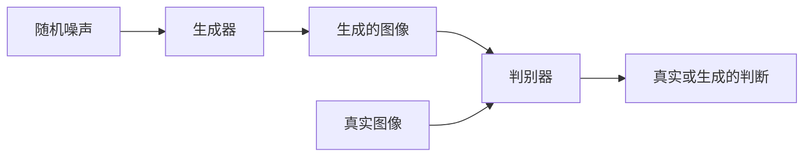
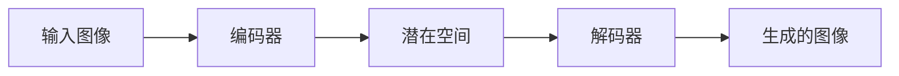

# PyTorch 图像生成

图像生成是深度学习中的一个重要领域，它涉及使用神经网络生成新的图像。PyTorch 是一个强大的深度学习框架，提供了丰富的工具和库来帮助开发者实现图像生成模型。本文将介绍如何使用 PyTorch 实现图像生成，并重点讨论生成对抗网络（GAN）和变分自编码器（VAE）这两种常见的图像生成模型。

## 什么是图像生成？

图像生成是指通过算法生成新的图像，这些图像可以是完全虚构的，也可以是基于现有图像的变体。图像生成模型通常通过学习大量图像数据的分布，从而能够生成与训练数据相似的新图像。常见的图像生成模型包括生成对抗网络（GAN）、变分自编码器（VAE）等。

## 生成对抗网络（GAN）

生成对抗网络（GAN）由两个神经网络组成：生成器（Generator）和判别器（Discriminator）。生成器负责生成新的图像，而判别器则负责判断图像是真实的还是生成的。两者通过对抗训练的方式不断优化，最终生成器能够生成逼真的图像。

### GAN 的基本结构



### GAN 的实现

以下是一个简单的 GAN 实现示例，使用 PyTorch 构建生成器和判别器：

```python
import torch
import torch.nn as nn

# 定义生成器
class Generator(nn.Module):
    def __init__(self, latent_dim, img_shape):
        super(Generator, self).__init__()
        self.model = nn.Sequential(
            nn.Linear(latent_dim, 128),
            nn.LeakyReLU(0.2),
            nn.Linear(128, 256),
            nn.BatchNorm1d(256),
            nn.LeakyReLU(0.2),
            nn.Linear(256, 512),
            nn.BatchNorm1d(512),
            nn.LeakyReLU(0.2),
            nn.Linear(512, 1024),
            nn.BatchNorm1d(1024),
            nn.LeakyReLU(0.2),
            nn.Linear(1024, img_shape),
            nn.Tanh()
        )

    def forward(self, z):
        return self.model(z)

# 定义判别器
class Discriminator(nn.Module):
    def __init__(self, img_shape):
        super(Discriminator, self).__init__()
        self.model = nn.Sequential(
            nn.Linear(img_shape, 512),
            nn.LeakyReLU(0.2),
            nn.Linear(512, 256),
            nn.LeakyReLU(0.2),
            nn.Linear(256, 1),
            nn.Sigmoid()
        )

    def forward(self, img):
        return self.model(img)

# 初始化生成器和判别器
latent_dim = 100
img_shape = 28 * 28
generator = Generator(latent_dim, img_shape)
discriminator = Discriminator(img_shape)
```

### GAN 的训练

GAN 的训练过程包括以下步骤：

1. 生成器生成假图像。
2. 判别器对假图像和真实图像进行分类。
3. 计算损失并更新生成器和判别器的参数。

```python
# 定义损失函数和优化器
adversarial_loss = nn.BCELoss()
optimizer_G = torch.optim.Adam(generator.parameters(), lr=0.0002)
optimizer_D = torch.optim.Adam(discriminator.parameters(), lr=0.0002)

# 训练循环
for epoch in range(num_epochs):
    for i, (imgs, _) in enumerate(dataloader):
        # 真实图像
        real_imgs = imgs.view(imgs.size(0), -1)

        # 训练判别器
        optimizer_D.zero_grad()
        z = torch.randn(batch_size, latent_dim)
        fake_imgs = generator(z)
        real_loss = adversarial_loss(discriminator(real_imgs), torch.ones(batch_size, 1))
        fake_loss = adversarial_loss(discriminator(fake_imgs.detach()), torch.zeros(batch_size, 1))
        d_loss = real_loss + fake_loss
        d_loss.backward()
        optimizer_D.step()

        # 训练生成器
        optimizer_G.zero_grad()
        z = torch.randn(batch_size, latent_dim)
        fake_imgs = generator(z)
        g_loss = adversarial_loss(discriminator(fake_imgs), torch.ones(batch_size, 1))
        g_loss.backward()
        optimizer_G.step()
```

:::tip
在 GAN 的训练过程中，生成器和判别器的训练需要保持平衡。如果判别器过于强大，生成器可能无法生成高质量的图像；反之，如果生成器过于强大，判别器可能无法区分真实图像和生成图像。
:::

## 变分自编码器（VAE）

变分自编码器（VAE）是另一种常见的图像生成模型。与 GAN 不同，VAE 通过学习数据的潜在分布来生成新的图像。VAE 由编码器和解码器组成，编码器将输入图像映射到潜在空间，解码器则从潜在空间生成新的图像。

### VAE 的基本结构



### VAE 的实现

以下是一个简单的 VAE 实现示例：

```python
class VAE(nn.Module):
    def __init__(self, latent_dim):
        super(VAE, self).__init__()
        self.encoder = nn.Sequential(
            nn.Linear(28 * 28, 512),
            nn.ReLU(),
            nn.Linear(512, 256),
            nn.ReLU(),
            nn.Linear(256, latent_dim * 2)
        )
        self.decoder = nn.Sequential(
            nn.Linear(latent_dim, 256),
            nn.ReLU(),
            nn.Linear(256, 512),
            nn.ReLU(),
            nn.Linear(512, 28 * 28),
            nn.Sigmoid()
        )

    def reparameterize(self, mu, logvar):
        std = torch.exp(0.5 * logvar)
        eps = torch.randn_like(std)
        return mu + eps * std

    def forward(self, x):
        h = self.encoder(x)
        mu, logvar = h.chunk(2, dim=1)
        z = self.reparameterize(mu, logvar)
        return self.decoder(z), mu, logvar

# 初始化 VAE
latent_dim = 20
vae = VAE(latent_dim)
```

### VAE 的训练

VAE 的训练过程包括以下步骤：

1. 编码器将输入图像映射到潜在空间。
2. 解码器从潜在空间生成新的图像。
3. 计算重构损失和 KL 散度，并更新模型参数。

```python
# 定义损失函数和优化器
def loss_function(recon_x, x, mu, logvar):
    BCE = nn.functional.binary_cross_entropy(recon_x, x, reduction='sum')
    KLD = -0.5 * torch.sum(1 + logvar - mu.pow(2) - logvar.exp())
    return BCE + KLD

optimizer = torch.optim.Adam(vae.parameters(), lr=0.001)

# 训练循环
for epoch in range(num_epochs):
    for i, (imgs, _) in enumerate(dataloader):
        imgs = imgs.view(imgs.size(0), -1)
        optimizer.zero_grad()
        recon_imgs, mu, logvar = vae(imgs)
        loss = loss_function(recon_imgs, imgs, mu, logvar)
        loss.backward()
        optimizer.step()
```

:::note
VAE 的损失函数包括两部分：重构损失（Reconstruction Loss）和 KL 散度（KL Divergence）。重构损失衡量生成图像与原始图像的相似度，而 KL 散度则衡量潜在空间的分布与标准正态分布的差异。
:::

## 实际应用场景

图像生成模型在许多领域都有广泛的应用，例如：

- **艺术创作**：生成逼真的艺术作品或风格迁移。
- **数据增强**：生成新的训练数据以提高模型的泛化能力。
- **医学影像**：生成医学图像以辅助诊断和治疗。

## 总结

本文介绍了如何使用 PyTorch 实现图像生成模型，包括生成对抗网络（GAN）和变分自编码器（VAE）。通过本文的学习，你应该能够理解图像生成的基本概念，并能够使用 PyTorch 构建简单的图像生成模型。

## 附加资源与练习

- **练习**：尝试使用不同的数据集（如 CIFAR-10 或 CelebA）训练 GAN 或 VAE 模型，并观察生成图像的质量。
- **资源**：
  - [PyTorch 官方文档](https://pytorch.org/docs/stable/index.html)
  - [GAN 论文](https://arxiv.org/abs/1406.2661)
  - [VAE 论文](https://arxiv.org/abs/1312.6114)

:::caution
在训练 GAN 或 VAE 时，模型的训练时间可能较长，建议在 GPU 环境下进行训练以加快速度。
:::