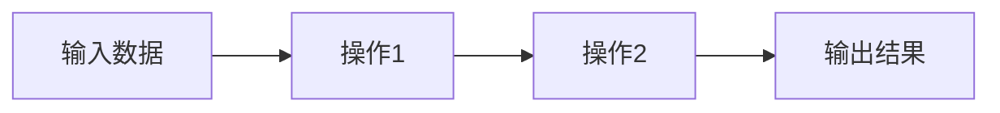

# TensorFlow 编程模型

TensorFlow是一个强大的开源机器学习框架，广泛应用于深度学习、神经网络和其他机器学习任务。理解TensorFlow的编程模型是掌握其使用的关键。本文将详细介绍TensorFlow编程模型的核心概念，并通过代码示例和实际案例帮助你快速上手。

## 什么是TensorFlow编程模型？

TensorFlow编程模型是构建和训练机器学习模型的一种方式。它的核心思想是将计算表示为**计算图（Computation Graph）**，其中节点表示操作（如加法、乘法等），边表示数据（即张量，Tensor）。通过这种方式，TensorFlow能够高效地执行复杂的计算任务。

### 计算图（Computation Graph）

计算图是TensorFlow的核心概念之一。它是一个有向无环图（DAG），其中每个节点代表一个操作（如加法、乘法等），而边代表在这些操作之间流动的数据（即张量）。



在这个简单的计算图中，输入数据经过一系列操作后，最终生成输出结果。

### 张量（Tensor）

张量是TensorFlow中的基本数据类型。你可以将张量理解为多维数组。例如，标量是0维张量，向量是1维张量，矩阵是2维张量，以此类推。

```python
import tensorflow as tf

# 创建一个标量（0维张量）
scalar = tf.constant(3.0)

# 创建一个向量（1维张量）
vector = tf.constant([1.0, 2.0, 3.0])

# 创建一个矩阵（2维张量）
matrix = tf.constant([[1.0, 2.0], [3.0, 4.0]])
```

### 会话（Session）

在TensorFlow 1.x中，计算图需要在会话（Session）中执行。会话负责分配资源并执行图中的操作。虽然TensorFlow 2.x已经移除了会话的概念，但了解它仍然有助于理解TensorFlow的工作原理。

```python
# TensorFlow 1.x 中的会话示例
import tensorflow as tf

# 创建一个计算图
a = tf.constant(5.0)
b = tf.constant(6.0)
c = a * b

# 创建一个会话并执行计算图
with tf.Session() as sess:
    result = sess.run(c)
    print(result)  # 输出: 30.0
```

:::note
在TensorFlow 2.x中，会话的概念已经被移除，计算图会立即执行（即**即时执行模式**，Eager Execution）。
:::

## TensorFlow 2.x 的编程模型

TensorFlow 2.x 引入了即时执行模式（Eager Execution），使得代码更加直观和易于调试。在即时执行模式下，操作会立即执行并返回结果，而不需要显式地创建会话。

### 即时执行模式（Eager Execution）

在即时执行模式下，你可以像编写普通Python代码一样编写TensorFlow代码。

```python
import tensorflow as tf

# 启用即时执行模式
tf.config.run_functions_eagerly(True)

# 创建张量并执行操作
a = tf.constant(5.0)
b = tf.constant(6.0)
c = a * b

print(c)  # 输出: tf.Tensor(30.0, shape=(), dtype=float32)
```

### 计算图的构建与执行

尽管即时执行模式使得代码更加直观，但在某些情况下，你可能仍然需要构建计算图以提高性能。TensorFlow 2.x 提供了 `@tf.function` 装饰器，可以将Python函数转换为TensorFlow计算图。

```python
import tensorflow as tf

# 使用 @tf.function 装饰器将函数转换为计算图
@tf.function
def multiply(a, b):
    return a * b

# 调用函数
result = multiply(tf.constant(5.0), tf.constant(6.0))
print(result)  # 输出: tf.Tensor(30.0, shape=(), dtype=float32)
```

## 实际案例：线性回归

让我们通过一个简单的线性回归模型来展示TensorFlow编程模型的实际应用。

```python
import tensorflow as tf
import numpy as np

# 生成一些随机数据
x = np.random.rand(100).astype(np.float32)
y = 3 * x + 2 + np.random.normal(0, 0.1, 100)

# 定义模型参数
W = tf.Variable(tf.random.normal([1]))
b = tf.Variable(tf.zeros([1]))

# 定义线性回归模型
def linear_regression(x):
    return W * x + b

# 定义损失函数（均方误差）
def mean_square_error(y_true, y_pred):
    return tf.reduce_mean(tf.square(y_true - y_pred))

# 定义优化器
optimizer = tf.optimizers.SGD(learning_rate=0.1)

# 训练模型
for step in range(200):
    with tf.GradientTape() as tape:
        y_pred = linear_regression(x)
        loss = mean_square_error(y, y_pred)
    
    gradients = tape.gradient(loss, [W, b])
    optimizer.apply_gradients(zip(gradients, [W, b]))

    if step % 20 == 0:
        print(f"Step {step}, Loss: {loss.numpy()}, W: {W.numpy()}, b: {b.numpy()}")

# 输出最终参数
print(f"Final W: {W.numpy()}, Final b: {b.numpy()}")
```

在这个案例中，我们使用TensorFlow构建了一个简单的线性回归模型，并通过梯度下降法优化模型参数。

## 总结

TensorFlow编程模型是构建和训练机器学习模型的基础。通过理解计算图、张量和会话等核心概念，你可以更好地掌握TensorFlow的使用。TensorFlow 2.x 的即时执行模式使得代码更加直观，而 `@tf.function` 装饰器则提供了构建计算图的能力。

## 附加资源与练习

- **官方文档**: [TensorFlow官方文档](https://www.tensorflow.org/guide) 是学习TensorFlow的最佳资源。
- **练习**: 尝试使用TensorFlow构建一个简单的神经网络模型，并使用MNIST数据集进行训练。

:::tip
如果你在学习过程中遇到问题，可以查阅官方文档或加入TensorFlow社区寻求帮助。
:::