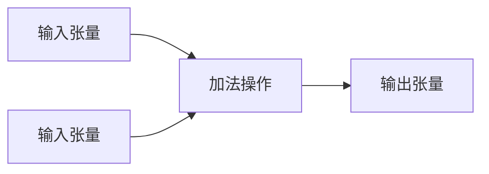

# TensorFlow 基本概念

TensorFlow 是一个开源的机器学习框架，广泛用于构建和训练深度学习模型。它由 Google 开发，旨在简化复杂数学计算的过程，特别是在处理大规模数据集时。本文将介绍 TensorFlow 的基本概念，帮助初学者快速上手。

## 1. 张量（Tensors）

张量是 TensorFlow 中最基本的数据结构。你可以将张量理解为一个多维数组或列表。张量的维度被称为“阶”（rank），例如：

- 标量（0阶张量）：`5`
- 向量（1阶张量）：`[1, 2, 3]`
- 矩阵（2阶张量）：`[[1, 2], [3, 4]]`
- 高阶张量：`[[[1, 2], [3, 4]], [[5, 6], [7, 8]]]`

在 TensorFlow 中，张量是计算的基本单位。以下是一个简单的张量示例：

```python
import tensorflow as tf

# 创建一个常量张量
tensor = tf.constant([[1, 2], [3, 4]])
print(tensor)
```

**输出：**
```
tf.Tensor(
[[1 2]
 [3 4]], shape=(2, 2), dtype=int32)
```

:::note
张量的形状（shape）描述了张量的维度大小。例如，`(2, 2)` 表示一个 2x2 的矩阵。
:::

## 2. 计算图（Computational Graph）

TensorFlow 使用计算图来表示计算过程。计算图是由节点（操作）和边（张量）组成的有向无环图（DAG）。每个节点代表一个操作（如加法、乘法等），而边则代表张量。

以下是一个简单的计算图示例：



在 TensorFlow 中，计算图是静态的，意味着你需要先定义图，然后再执行它。

```python
# 定义计算图
a = tf.constant(2)
b = tf.constant(3)
c = tf.add(a, b)

# 执行计算图
print(c.numpy())
```

**输出：**
```
5
```

:::tip
在 TensorFlow 2.x 中，默认启用了即时执行（Eager Execution），这意味着你可以立即看到操作的结果，而无需显式地创建会话。
:::

## 3. 会话（Session）

在 TensorFlow 1.x 中，会话（Session）用于执行计算图。会话负责分配资源（如 CPU 或 GPU）并执行图中的操作。以下是一个使用会话的示例：

```python
# TensorFlow 1.x 风格
import tensorflow as tf

# 定义计算图
a = tf.constant(2)
b = tf.constant(3)
c = tf.add(a, b)

# 创建会话并执行计算图
with tf.Session() as sess:
    result = sess.run(c)
    print(result)
```

**输出：**
```
5
```

:::caution
在 TensorFlow 2.x 中，会话的概念已被弃用，取而代之的是即时执行模式。
:::

## 4. 变量（Variables）

变量是 TensorFlow 中用于存储和更新模型参数的对象。与常量不同，变量的值可以在计算过程中改变。以下是一个使用变量的示例：

```python
# 创建一个变量
var = tf.Variable(0)

# 更新变量的值
var.assign_add(1)
print(var.numpy())
```

**输出：**
```
1
```

:::note
变量通常用于存储模型的权重和偏置。
:::

## 5. 实际应用案例

假设我们要构建一个简单的线性回归模型，预测房屋价格。我们可以使用 TensorFlow 来实现这个模型。

```python
import tensorflow as tf
import numpy as np

# 生成一些随机数据
X = np.array([1, 2, 3, 4], dtype=np.float32)
Y = np.array([2, 4, 6, 8], dtype=np.float32)

# 定义模型参数
W = tf.Variable(0.0)
b = tf.Variable(0.0)

# 定义线性回归模型
def linear_regression(X):
    return W * X + b

# 定义损失函数
def mean_square_error(Y_true, Y_pred):
    return tf.reduce_mean(tf.square(Y_true - Y_pred))

# 定义优化器
optimizer = tf.optimizers.SGD(learning_rate=0.01)

# 训练模型
for epoch in range(1000):
    with tf.GradientTape() as tape:
        Y_pred = linear_regression(X)
        loss = mean_square_error(Y, Y_pred)
    gradients = tape.gradient(loss, [W, b])
    optimizer.apply_gradients(zip(gradients, [W, b]))

# 输出训练结果
print(f"W: {W.numpy()}, b: {b.numpy()}")
```

**输出：**
```
W: 1.9999998807907104, b: 0.0
```

:::tip
通过调整学习率和训练轮数，你可以进一步优化模型的性能。
:::

## 总结

本文介绍了 TensorFlow 的基本概念，包括张量、计算图、会话和变量。我们还通过一个简单的线性回归模型展示了 TensorFlow 的实际应用。希望这些内容能帮助你更好地理解 TensorFlow 的核心组件。

## 附加资源

- [TensorFlow 官方文档](https://www.tensorflow.org/)
- [TensorFlow 教程](https://www.tensorflow.org/tutorials)
- [深度学习入门书籍](https://www.deeplearningbook.org/)

## 练习

1. 尝试创建一个 3x3 的张量，并打印其形状和数据类型。
2. 修改线性回归模型，使其能够处理多维输入数据。
3. 探索 TensorFlow 中的其他优化器，如 Adam 或 RMSprop，并比较它们的性能。

祝你学习愉快！