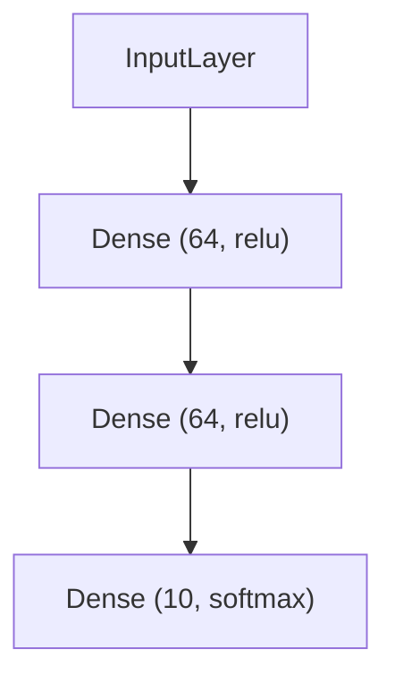

# TensorFlow 可视化模型结构

在深度学习中，理解模型的结构是至关重要的。TensorFlow提供了多种工具来帮助我们可视化模型的结构，从而更好地理解模型的层次、参数和连接方式。本文将介绍如何使用TensorFlow可视化模型结构，并通过实际案例展示其应用。

## 什么是模型结构可视化？

模型结构可视化是指将神经网络的结构以图形化的方式展示出来，包括每一层的类型、输入输出形状、参数数量等信息。通过可视化，我们可以更直观地理解模型的设计，发现潜在的问题，并进行调试。

## 使用TensorFlow可视化模型结构

TensorFlow提供了多种方法来可视化模型结构，其中最常用的是使用`tf.keras.utils.plot_model`函数。这个函数可以将模型的结构以图形化的方式输出，并保存为图片文件。

### 安装依赖

在开始之前，确保你已经安装了TensorFlow和Graphviz。Graphviz是一个开源的图形可视化软件，`plot_model`函数依赖它来生成模型结构图。

```bash
pip install tensorflow
pip install graphviz
```

### 示例：可视化一个简单的神经网络

让我们从一个简单的神经网络开始，展示如何使用`plot_model`函数可视化模型结构。

```python
import tensorflow as tf
from tensorflow.keras import layers

# 定义一个简单的神经网络模型
model = tf.keras.Sequential([
    layers.Dense(64, activation='relu', input_shape=(784,)),
    layers.Dense(64, activation='relu'),
    layers.Dense(10, activation='softmax')
])

# 可视化模型结构
tf.keras.utils.plot_model(model, to_file='model.png', show_shapes=True, show_layer_names=True)
```

在这个示例中，我们定义了一个包含两个隐藏层的简单神经网络。`plot_model`函数将模型结构保存为`model.png`文件，并显示每一层的输入输出形状和名称。

### 输出结果

运行上述代码后，你将得到一个类似以下的模型结构图：



### 参数解释

- `to_file`：指定保存模型结构图的文件名。
- `show_shapes`：是否显示每一层的输入输出形状。
- `show_layer_names`：是否显示每一层的名称。

## 实际应用场景

### 案例：调试复杂的神经网络

假设你正在训练一个复杂的卷积神经网络（CNN），但模型的性能不如预期。通过可视化模型结构，你可以快速检查每一层的设计是否正确，是否存在冗余或缺失的层。

```python
import tensorflow as tf
from tensorflow.keras import layers

# 定义一个复杂的卷积神经网络
model = tf.keras.Sequential([
    layers.Conv2D(32, (3, 3), activation='relu', input_shape=(28, 28, 1)),
    layers.MaxPooling2D((2, 2)),
    layers.Conv2D(64, (3, 3), activation='relu'),
    layers.MaxPooling2D((2, 2)),
    layers.Conv2D(64, (3, 3), activation='relu'),
    layers.Flatten(),
    layers.Dense(64, activation='relu'),
    layers.Dense(10, activation='softmax')
])

# 可视化模型结构
tf.keras.utils.plot_model(model, to_file='cnn_model.png', show_shapes=True, show_layer_names=True)
```

通过可视化，你可以清晰地看到每一层的连接方式和参数数量，从而更容易发现潜在的问题。

## 总结

可视化模型结构是理解和调试神经网络的重要工具。通过TensorFlow提供的`plot_model`函数，我们可以轻松地将模型结构以图形化的方式展示出来，帮助我们更好地理解模型的设计和进行调试。

## 附加资源与练习

- **练习**：尝试定义一个更复杂的神经网络，并使用`plot_model`函数可视化其结构。观察每一层的输入输出形状和参数数量。
- **资源**：阅读TensorFlow官方文档中关于[模型可视化](https://www.tensorflow.org/guide/keras/visualization)的部分，了解更多高级用法。

:::tip
如果你在可视化过程中遇到问题，确保你已经正确安装了Graphviz，并且将其路径添加到系统的环境变量中。
:::