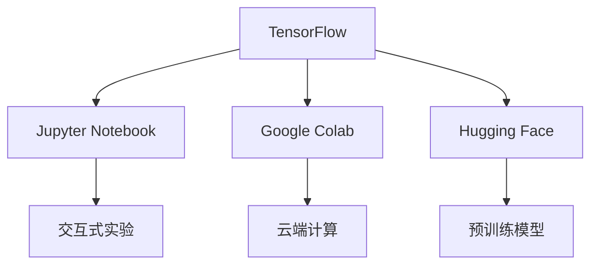

# TensorFlow 未来发展

TensorFlow是由Google开发的开源机器学习框架，自2015年发布以来，已经成为全球最受欢迎的深度学习框架之一。它不仅支持从研究到生产的全流程，还拥有庞大的生态系统，涵盖了从模型开发到部署的各个环节。本文将探讨TensorFlow的未来发展方向，帮助初学者了解其最新趋势和技术创新。

## 1. TensorFlow的现状

TensorFlow目前已经发展成为一个功能强大且灵活的框架，支持多种编程语言（如Python、JavaScript、C++等），并提供了丰富的工具和库，如TensorFlow Lite（用于移动和嵌入式设备）、TensorFlow.js（用于浏览器和Node.js）以及TensorFlow Extended（用于生产环境）。此外，TensorFlow Hub和TensorFlow Model Garden等资源库为开发者提供了大量预训练模型和示例代码。

## 2. TensorFlow的未来趋势

### 2.1 更高效的模型训练与推理

随着硬件技术的进步，TensorFlow正在优化其计算性能，以支持更高效的模型训练和推理。例如，TensorFlow正在集成对新一代硬件（如TPU、GPU和AI加速器）的支持，并引入新的优化技术，如混合精度训练和量化感知训练。

```python
# 示例：混合精度训练
import tensorflow as tf
from tensorflow.keras.mixed_precision import experimental as mixed_precision

policy = mixed_precision.Policy('mixed_float16')
mixed_precision.set_policy(policy)

model = tf.keras.models.Sequential([
    tf.keras.layers.Dense(64, activation='relu'),
    tf.keras.layers.Dense(10, activation='softmax')
])

model.compile(optimizer='adam', loss='sparse_categorical_crossentropy', metrics=['accuracy'])
```

:::tip
混合精度训练可以显著减少内存占用并加速训练过程，特别适合大规模深度学习模型。
:::

### 2.2 更友好的开发者体验

TensorFlow团队正在努力降低入门门槛，使初学者更容易上手。例如，TensorFlow 2.x版本引入了Keras作为默认的高级API，简化了模型构建和训练流程。未来，TensorFlow可能会进一步优化文档、教程和示例代码，并提供更多的交互式学习工具。

```python
# 示例：使用Keras构建简单模型
model = tf.keras.Sequential([
    tf.keras.layers.Dense(128, activation='relu'),
    tf.keras.layers.Dense(10, activation='softmax')
])

model.compile(optimizer='adam', loss='sparse_categorical_crossentropy', metrics=['accuracy'])
model.fit(train_data, train_labels, epochs=5)
```

:::note
Keras API的设计目标是让深度学习变得更加直观和易于使用，特别适合初学者。
:::

### 2.3 更广泛的应用场景

TensorFlow正在扩展到更多的应用领域，如自然语言处理（NLP）、计算机视觉（CV）、强化学习（RL）和生成对抗网络（GANs）。未来，TensorFlow可能会推出更多针对特定领域的工具和库，帮助开发者快速构建和部署相关应用。

```python
# 示例：使用TensorFlow进行图像分类
from tensorflow.keras.applications import ResNet50
from tensorflow.keras.preprocessing import image
from tensorflow.keras.applications.resnet50 import preprocess_input, decode_predictions
import numpy as np

model = ResNet50(weights='imagenet')
img_path = 'example.jpg'
img = image.load_img(img_path, target_size=(224, 224))
x = image.img_to_array(img)
x = np.expand_dims(x, axis=0)
x = preprocess_input(x)

preds = model.predict(x)
print('Predicted:', decode_predictions(preds, top=3)[0])
```

:::caution
在使用预训练模型时，请确保输入数据的格式和预处理步骤与模型要求一致。
:::

### 2.4 更强的生态系统整合

TensorFlow正在与其他开源工具和平台进行深度整合，以提供更完整的解决方案。例如，TensorFlow与Jupyter Notebook、Google Colab、Hugging Face等工具的集成，使得开发者可以更轻松地进行实验和协作。



:::warning
虽然生态系统整合提供了便利，但也需要注意不同工具之间的兼容性问题。
:::

## 3. 实际案例：TensorFlow在医疗影像中的应用

TensorFlow在医疗影像领域有着广泛的应用。例如，研究人员可以使用TensorFlow构建深度学习模型，自动分析X光片或MRI图像，辅助医生进行疾病诊断。以下是一个简化的示例：

```python
# 示例：医疗影像分类
from tensorflow.keras.applications import DenseNet121
from tensorflow.keras.layers import Dense, GlobalAveragePooling2D
from tensorflow.keras.models import Model

base_model = DenseNet121(weights='imagenet', include_top=False)
x = base_model.output
x = GlobalAveragePooling2D()(x)
x = Dense(1024, activation='relu')(x)
predictions = Dense(2, activation='softmax')(x)

model = Model(inputs=base_model.input, outputs=predictions)
model.compile(optimizer='adam', loss='categorical_crossentropy', metrics=['accuracy'])
```

:::tip
在医疗影像领域，数据隐私和模型准确性至关重要，开发者需要特别注意这些问题。
:::

## 4. 总结

TensorFlow作为领先的机器学习框架，正在不断进化以满足开发者和研究者的需求。未来，TensorFlow将继续优化性能、简化开发流程、扩展应用场景，并加强与其他工具的整合。对于初学者来说，掌握TensorFlow不仅意味着学习一个强大的工具，还意味着加入一个充满活力的社区。

## 5. 附加资源与练习

- **官方文档**: [TensorFlow官网](https://www.tensorflow.org/)
- **教程**: [TensorFlow入门教程](https://www.tensorflow.org/tutorials)
- **练习**: 尝试使用TensorFlow构建一个简单的图像分类模型，并使用Google Colab进行训练和测试。

:::note
通过实践巩固知识是学习TensorFlow的最佳方式。建议初学者从简单的项目开始，逐步深入。
:::