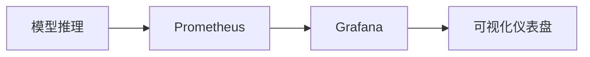

# TensorFlow 生产环境最佳实践

在生产环境中部署和管理TensorFlow模型是机器学习工作流中的关键步骤。无论是为实时预测服务还是批量处理任务，确保模型的性能、可扩展性和可靠性都至关重要。本文将介绍一些TensorFlow生产环境的最佳实践，帮助初学者顺利将模型从开发环境迁移到生产环境。

## 1. 模型优化与导出

在生产环境中，模型的性能直接影响用户体验和系统资源消耗。因此，优化模型是第一步。

### 1.1 模型量化
模型量化是一种通过减少模型权重和激活值的精度来减小模型大小和加速推理的技术。TensorFlow提供了多种量化方法，例如**Post-training quantization**和**Quantization-aware training**。

```python
import tensorflow as tf

# 加载已训练的模型
model = tf.keras.models.load_model('my_model.h5')

# 应用后训练量化
converter = tf.lite.TFLiteConverter.from_keras_model(model)
converter.optimizations = [tf.lite.Optimize.DEFAULT]
quantized_model = converter.convert()

# 保存量化后的模型
with open('quantized_model.tflite', 'wb') as f:
    f.write(quantized_model)
```

:::tip
量化后的模型通常比原始模型小4倍，推理速度也更快，但可能会略微降低精度。
:::

### 1.2 模型导出
在生产环境中，通常需要将模型导出为适合部署的格式。TensorFlow支持多种导出格式，如**SavedModel**和**TensorFlow Lite**。

```python
# 导出为SavedModel格式
model.save('my_model_savedmodel')
```

## 2. 模型部署

部署TensorFlow模型时，选择合适的工具和平台至关重要。以下是几种常见的部署方式：

### 2.1 TensorFlow Serving
TensorFlow Serving是一个高性能的服务系统，专门用于部署机器学习模型。它支持模型版本管理、自动更新和A/B测试。

```bash
# 启动TensorFlow Serving
tensorflow_model_server --rest_api_port=8501 --model_name=my_model --model_base_path=/path/to/my_model_savedmodel
```

### 2.2 TensorFlow Lite
对于移动设备和嵌入式设备，TensorFlow Lite是理想的选择。它提供了轻量级的推理引擎，适用于资源受限的环境。

```python
# 加载TensorFlow Lite模型
interpreter = tf.lite.Interpreter(model_path='quantized_model.tflite')
interpreter.allocate_tensors()

# 获取输入和输出张量
input_details = interpreter.get_input_details()
output_details = interpreter.get_output_details()

# 运行推理
interpreter.set_tensor(input_details[0]['index'], input_data)
interpreter.invoke()
output_data = interpreter.get_tensor(output_details[0]['index'])
```

## 3. 监控与日志

在生产环境中，监控模型的性能和日志记录是确保系统稳定性的关键。

### 3.1 监控模型性能
使用工具如**Prometheus**和**Grafana**可以实时监控模型的推理延迟、吞吐量和错误率。



### 3.2 日志记录
TensorFlow提供了`tf.summary`模块，可以记录训练和推理过程中的关键指标。

```python
import tensorflow as tf

# 创建日志目录
log_dir = "logs/fit/" + datetime.datetime.now().strftime("%Y%m%d-%H%M%S")
tensorboard_callback = tf.keras.callbacks.TensorBoard(log_dir=log_dir, histogram_freq=1)

# 在训练过程中记录日志
model.fit(train_data, epochs=5, callbacks=[tensorboard_callback])
```

## 4. 实际案例

假设你正在为一个电商网站开发推荐系统，以下是生产环境中可能的应用场景：

1. **模型训练**：使用历史用户行为数据训练推荐模型。
2. **模型优化**：对模型进行量化以减小大小并加速推理。
3. **模型部署**：使用TensorFlow Serving将模型部署到生产服务器。
4. **监控与日志**：实时监控推荐系统的性能，并记录用户反馈以改进模型。

## 5. 总结

在生产环境中部署TensorFlow模型需要综合考虑模型优化、部署工具、监控和日志记录等多个方面。通过遵循上述最佳实践，你可以确保模型在生产环境中高效、稳定地运行。

## 6. 附加资源与练习

- **资源**：
  - [TensorFlow官方文档](https://www.tensorflow.org/)
  - [TensorFlow Serving指南](https://www.tensorflow.org/tfx/guide/serving)
  - [TensorFlow Lite教程](https://www.tensorflow.org/lite/guide)

- **练习**：
  1. 尝试将一个简单的Keras模型导出为SavedModel格式，并使用TensorFlow Serving部署。
  2. 使用TensorFlow Lite将一个模型量化并部署到移动设备上。
  3. 使用Prometheus和Grafana监控一个TensorFlow模型的推理性能。

通过实践这些步骤，你将更好地理解如何在生产环境中高效地使用TensorFlow。