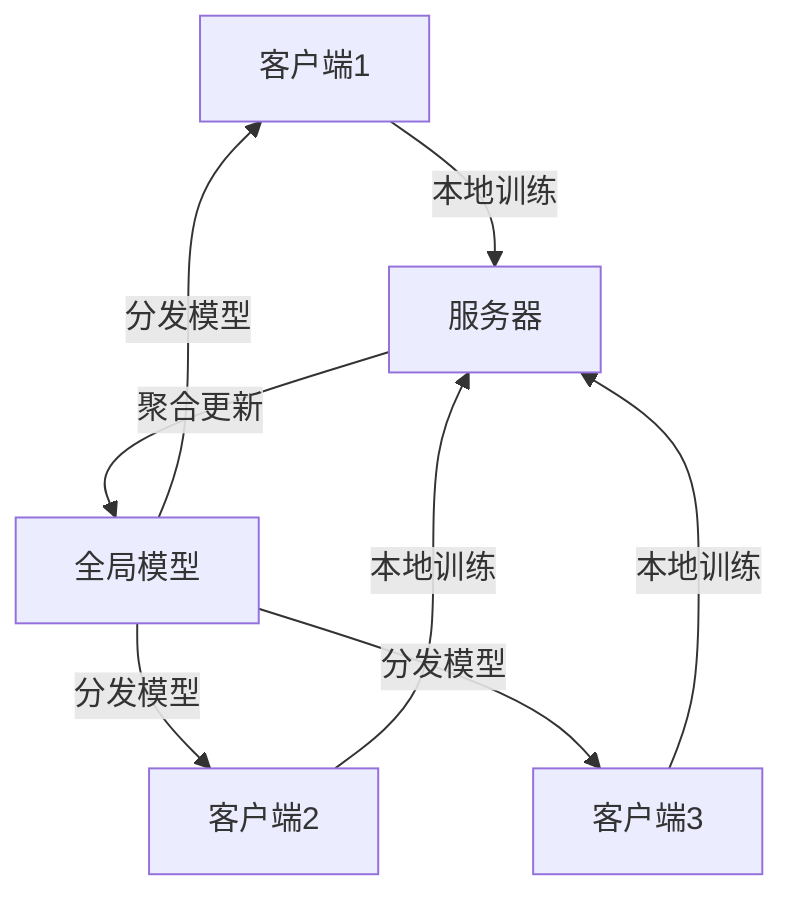

# TensorFlow 联邦学习项目

## 什么是联邦学习？

联邦学习（Federated Learning）是一种分布式机器学习方法，允许多个设备或客户端在不共享原始数据的情况下协作训练模型。这种方法特别适用于数据隐私敏感的场景，例如医疗、金融等领域。TensorFlow Federated (TFF) 是 TensorFlow 提供的用于联邦学习的框架。

## 联邦学习的核心概念

1. **客户端（Client）**：每个客户端拥有自己的本地数据，并在本地训练模型。
2. **服务器（Server）**：服务器负责聚合来自多个客户端的模型更新，并生成全局模型。
3. **联邦平均（Federated Averaging）**：一种常用的联邦学习算法，通过加权平均客户端模型的更新来更新全局模型。

## 联邦学习的工作流程



1. **初始化**：服务器初始化全局模型并将其分发给所有客户端。
2. **本地训练**：每个客户端使用本地数据训练模型。
3. **模型更新**：客户端将模型更新发送到服务器。
4. **聚合更新**：服务器聚合所有客户端的模型更新，生成新的全局模型。
5. **分发模型**：服务器将更新后的全局模型分发给所有客户端。
6. **重复**：重复上述步骤，直到模型收敛。

## TensorFlow Federated (TFF) 简介

TensorFlow Federated (TFF) 是 TensorFlow 提供的用于联邦学习的框架。它提供了高级 API 和低级 API，方便用户实现联邦学习算法。

### 安装 TFF

```bash
pip install tensorflow-federated
```

### 简单示例

以下是一个简单的联邦学习示例，使用 TFF 实现联邦平均算法。

```python
import tensorflow as tf
import tensorflow_federated as tff

# 加载示例数据集
emnist_train, emnist_test = tff.simulation.datasets.emnist.load_data()

# 定义模型
def create_keras_model():
    return tf.keras.models.Sequential([
        tf.keras.layers.InputLayer(input_shape=(28, 28)),
        tf.keras.layers.Flatten(),
        tf.keras.layers.Dense(10, activation='softmax')
    ])

# 定义模型函数
def model_fn():
    keras_model = create_keras_model()
    return tff.learning.from_keras_model(
        keras_model,
        input_spec=emnist_train.element_spec,
        loss=tf.keras.losses.SparseCategoricalCrossentropy(),
        metrics=[tf.keras.metrics.SparseCategoricalAccuracy()]
    )

# 定义联邦平均算法
iterative_process = tff.learning.build_federated_averaging_process(
    model_fn,
    client_optimizer_fn=lambda: tf.keras.optimizers.SGD(learning_rate=0.02),
    server_optimizer_fn=lambda: tf.keras.optimizers.SGD(learning_rate=1.0)
)

# 初始化状态
state = iterative_process.initialize()

# 训练模型
for round_num in range(5):
    sampled_clients = emnist_train.client_ids[:10]  # 随机选择10个客户端
    federated_train_data = [emnist_train.create_tf_dataset_for_client(client) for client in sampled_clients]
    state, metrics = iterative_process.next(state, federated_train_data)
    print(f'Round {round_num}, Metrics: {metrics}')
```

### 输出示例

```plaintext
Round 0, Metrics: OrderedDict([('train', OrderedDict([('sparse_categorical_accuracy', 0.1234), ('loss', 2.3456)]))])
Round 1, Metrics: OrderedDict([('train', OrderedDict([('sparse_categorical_accuracy', 0.2345), ('loss', 2.1234)]))])
...
```

## 实际应用场景

### 医疗领域

在医疗领域，医院之间可以通过联邦学习协作训练疾病预测模型，而无需共享敏感的医疗数据。

### 金融领域

银行可以使用联邦学习协作训练信用评分模型，而无需共享客户的财务数据。

## 总结

联邦学习是一种强大的分布式机器学习方法，能够在保护数据隐私的同时训练高质量的模型。TensorFlow Federated (TFF) 提供了实现联邦学习的工具和框架，使得开发者能够轻松构建联邦学习系统。

## 附加资源

- [TensorFlow Federated 官方文档](https://www.tensorflow.org/federated)
- [联邦学习论文](https://arxiv.org/abs/1602.05629)
- [TensorFlow 官方教程](https://www.tensorflow.org/tutorials)

## 练习

1. 尝试修改上述代码，使用不同的优化器和学习率进行训练。
2. 使用不同的数据集（如 CIFAR-10）进行联邦学习实验。
3. 探索 TFF 的高级 API，实现自定义的联邦学习算法。
