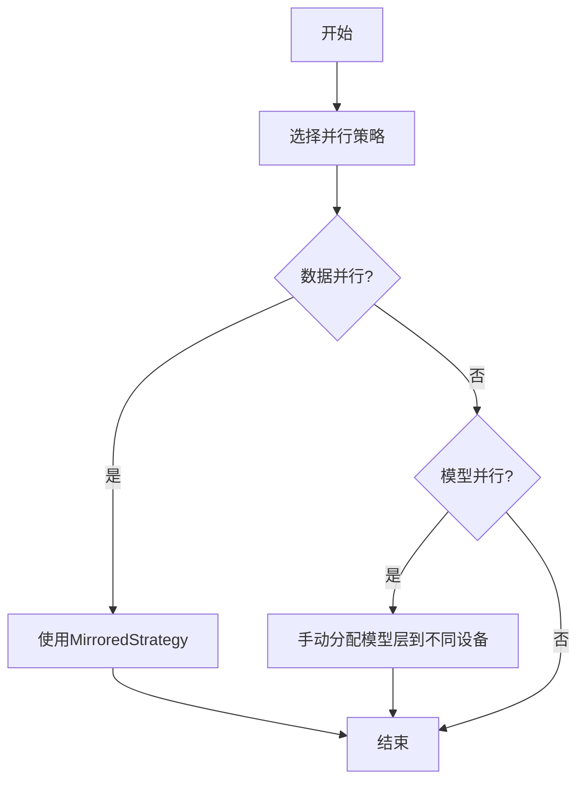

# TensorFlow 大规模模型训练

在深度学习中，随着模型和数据集的规模不断增大，单机训练已经无法满足需求。TensorFlow提供了多种工具和技术来支持大规模模型训练，包括分布式训练、数据并行和模型并行等。本文将逐步介绍这些概念，并通过实际案例展示如何在实际场景中应用这些技术。

## 1. 什么是大规模模型训练？

大规模模型训练是指在处理大规模数据集或复杂模型时，通过分布式计算资源来加速训练过程的技术。通常，这涉及到将计算任务分配到多个设备（如GPU或TPU）或多个节点（如多台机器）上。

:::note
**注意**：大规模模型训练不仅仅是加速训练过程，还包括如何有效地管理内存、优化通信开销以及处理数据分布等问题。
:::

## 2. 分布式训练的基本概念

### 2.1 数据并行

数据并行是最常见的分布式训练方法。在数据并行中，每个设备都拥有模型的完整副本，但处理不同的数据子集。每个设备计算梯度后，梯度会被汇总并更新到所有设备上的模型参数中。

```python
import tensorflow as tf

strategy = tf.distribute.MirroredStrategy()

with strategy.scope():
    model = tf.keras.Sequential([
        tf.keras.layers.Dense(128, activation='relu'),
        tf.keras.layers.Dense(10)
    ])
    model.compile(optimizer='adam', loss=tf.keras.losses.SparseCategoricalCrossentropy(from_logits=True))

model.fit(train_dataset, epochs=5)
```

### 2.2 模型并行

模型并行是将模型的不同部分分配到不同的设备上。这种方法通常用于模型太大而无法在单个设备上存储的情况。

```python
with tf.device('/GPU:0'):
    layer1 = tf.keras.layers.Dense(128, activation='relu')

with tf.device('/GPU:1'):
    layer2 = tf.keras.layers.Dense(10)

model = tf.keras.Sequential([layer1, layer2])
model.compile(optimizer='adam', loss=tf.keras.losses.SparseCategoricalCrossentropy(from_logits=True))

model.fit(train_dataset, epochs=5)
```

## 3. 实际案例：图像分类任务

假设我们有一个包含100万张图像的数据集，每张图像的大小为224x224。我们使用ResNet-50模型进行训练。

### 3.1 数据并行训练

```python
strategy = tf.distribute.MirroredStrategy()

with strategy.scope():
    model = tf.keras.applications.ResNet50(weights=None, classes=1000)
    model.compile(optimizer='adam', loss='categorical_crossentropy', metrics=['accuracy'])

model.fit(train_dataset, epochs=10)
```

### 3.2 模型并行训练

```python
with tf.device('/GPU:0'):
    conv1 = tf.keras.layers.Conv2D(64, (7, 7), strides=(2, 2), padding='same', activation='relu')

with tf.device('/GPU:1'):
    conv2 = tf.keras.layers.Conv2D(64, (3, 3), padding='same', activation='relu')

model = tf.keras.Sequential([conv1, conv2])
model.compile(optimizer='adam', loss='categorical_crossentropy', metrics=['accuracy'])

model.fit(train_dataset, epochs=10)
```

## 4. 总结

大规模模型训练是深度学习中的一个重要课题，尤其是在处理大规模数据集和复杂模型时。TensorFlow提供了多种工具和技术来支持分布式训练、数据并行和模型并行。通过合理使用这些技术，可以显著加速训练过程并提高模型性能。

:::tip
**提示**：在实际应用中，选择合适的并行策略和优化通信开销是关键。建议根据具体任务和硬件资源进行调优。
:::

## 5. 附加资源与练习

- **资源**：
  - [TensorFlow官方文档](https://www.tensorflow.org/guide/distributed_training)
  - [深度学习中的分布式训练](https://arxiv.org/abs/2006.15704)

- **练习**：
  1. 尝试在本地机器上使用多个GPU进行数据并行训练。
  2. 修改上述代码，使用模型并行训练一个更大的模型（如ResNet-101）。
  3. 探索TensorFlow的`tf.distribute.Strategy` API，了解其他分布式训练策略。



通过本文的学习，你应该对TensorFlow中的大规模模型训练有了初步的了解。希望你能在实际项目中应用这些知识，并不断探索更多高级技术。