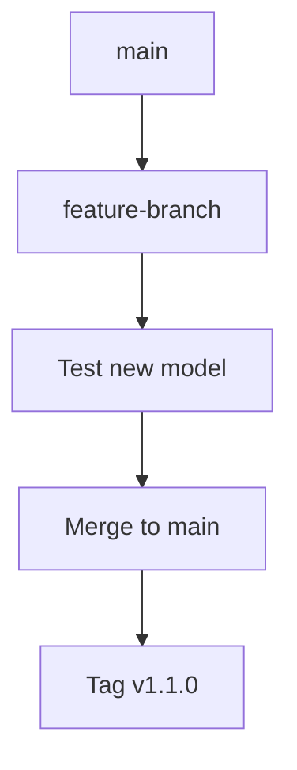

# TensorFlow 版本控制

在开发TensorFlow项目时，版本控制是一个至关重要的环节。它不仅能帮助你跟踪代码的变化，还能确保团队成员之间的协作顺利进行。本文将详细介绍如何在TensorFlow项目中使用版本控制，并提供一些最佳实践。

## 什么是版本控制？

版本控制是一种记录文件内容变化，以便将来查阅特定版本历史的系统。它允许你回滚到之前的版本，比较不同版本之间的差异，以及合并多个开发者的工作。

## 为什么需要版本控制？

1. **协作开发**：多个开发者可以同时工作在同一个项目上，而不会互相干扰。
2. **历史记录**：你可以查看代码的每一次更改，了解谁在什么时候做了什么。
3. **回滚功能**：如果新引入的代码导致问题，你可以轻松回滚到之前的稳定版本。
4. **分支管理**：你可以创建分支来开发新功能或修复bug，而不会影响主代码库。

## 使用Git进行版本控制

Git是目前最流行的版本控制系统。以下是如何在TensorFlow项目中使用Git的基本步骤。

### 1. 初始化Git仓库

首先，你需要在项目目录中初始化一个Git仓库。

```bash
git init
```

### 2. 添加文件到暂存区

将项目中的文件添加到Git的暂存区。

```bash
git add .
```

### 3. 提交更改

提交更改并添加提交信息。

```bash
git commit -m "Initial commit"
```

### 4. 创建分支

你可以创建一个新的分支来开发新功能。

```bash
git checkout -b feature-branch
```

### 5. 合并分支

当功能开发完成后，你可以将分支合并到主分支。

```bash
git checkout main
git merge feature-branch
```

## TensorFlow 版本控制的最佳实践

### 1. 使用`.gitignore`文件

在TensorFlow项目中，通常会生成一些临时文件或日志文件，这些文件不需要纳入版本控制。你可以创建一个`.gitignore`文件来忽略这些文件。

```plaintext
# Ignore TensorFlow logs
logs/
# Ignore Python compiled files
__pycache__/
# Ignore virtual environments
venv/
```

### 2. 使用语义化版本控制

语义化版本控制（Semantic Versioning）是一种版本命名规范，格式为`MAJOR.MINOR.PATCH`。例如，`2.1.0`表示主版本2，次版本1，补丁版本0。

- **MAJOR**：当你做了不兼容的API修改时。
- **MINOR**：当你做了向下兼容的功能性新增时。
- **PATCH**：当你做了向下兼容的问题修正时。

### 3. 使用标签（Tag）标记重要版本

在Git中，你可以使用标签来标记重要的版本发布。

```bash
git tag -a v1.0.0 -m "Release version 1.0.0"
git push origin v1.0.0
```

### 4. 使用GitHub Actions进行自动化测试

你可以使用GitHub Actions来自动化测试你的TensorFlow项目。以下是一个简单的GitHub Actions配置文件示例。

```yaml
name: TensorFlow CI

on: [push, pull_request]

jobs:
  test:
    runs-on: ubuntu-latest
    steps:
      - uses: actions/checkout@v2
      - name: Set up Python
        uses: actions/setup-python@v2
        with:
          python-version: '3.8'
      - name: Install dependencies
        run: |
          python -m pip install --upgrade pip
          pip install -r requirements.txt
      - name: Run tests
        run: |
          python -m pytest
```

## 实际案例

假设你正在开发一个基于TensorFlow的图像分类模型。你可以在`main`分支上保持稳定的代码，而在`feature-branch`分支上开发新的模型架构。当新模型经过测试并验证有效后，你可以将其合并到`main`分支，并打上新的版本标签。



## 总结

版本控制是TensorFlow项目开发中不可或缺的一部分。通过使用Git，你可以有效地管理代码的变化，确保项目的稳定性和可维护性。遵循最佳实践，如使用`.gitignore`文件、语义化版本控制和GitHub Actions，可以进一步提高开发效率。

## 附加资源

- [Git官方文档](https://git-scm.com/doc)
- [语义化版本控制](https://semver.org/)
- [GitHub Actions文档](https://docs.github.com/en/actions)

## 练习

1. 在你的TensorFlow项目中初始化一个Git仓库，并提交初始代码。
2. 创建一个新的分支，开发一个新功能，并将其合并到主分支。
3. 使用Git标签标记一个重要的版本发布。
4. 配置GitHub Actions来自动化测试你的TensorFlow项目。

通过完成这些练习，你将更好地掌握TensorFlow项目中的版本控制技巧。