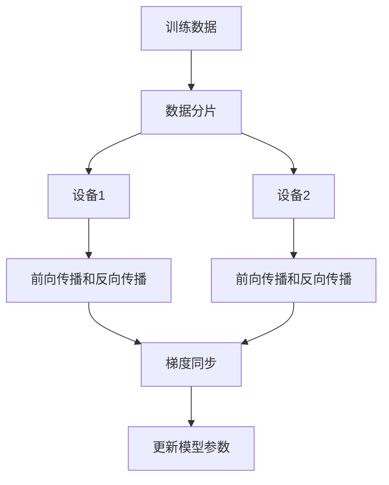

# TensorFlow 数据并行处理

在现代深度学习中，数据量通常非常庞大，单机训练模型可能会耗费大量时间。为了提高训练效率，TensorFlow 提供了数据并行处理的功能，允许我们同时使用多个设备（如 GPU 或 TPU）来加速训练过程。本文将详细介绍 TensorFlow 中的数据并行处理，并通过代码示例帮助初学者理解其工作原理。

## 什么是数据并行处理？

数据并行处理是一种将数据分割成多个子集，并在多个设备上同时处理这些子集的技术。每个设备都会独立地计算模型的前向传播和反向传播，然后通过某种方式（如梯度平均）将结果汇总，更新模型参数。这种方式可以显著减少训练时间，尤其是在处理大规模数据集时。

:::note
数据并行处理的核心思想是：**将数据分片，让多个设备同时处理不同的数据子集**。
:::

## TensorFlow 中的数据并行处理

TensorFlow 提供了多种实现数据并行处理的方式，其中最常用的是 `tf.distribute.Strategy` API。该 API 封装了分布式训练的复杂性，使得开发者可以轻松地在多个设备上并行训练模型。

### 1. 使用 `MirroredStrategy` 实现数据并行

`MirroredStrategy` 是 TensorFlow 中最简单的数据并行策略，适用于单机多 GPU 的场景。它会在每个 GPU 上复制模型，并将数据分片分配给不同的 GPU。

以下是一个简单的代码示例，展示如何使用 `MirroredStrategy`：

```python
import tensorflow as tf

# 定义模型
def create_model():
    model = tf.keras.Sequential([
        tf.keras.layers.Dense(128, activation='relu'),
        tf.keras.layers.Dense(10, activation='softmax')
    ])
    return model

# 使用 MirroredStrategy
strategy = tf.distribute.MirroredStrategy()

with strategy.scope():
    model = create_model()
    model.compile(optimizer='adam',
                  loss='sparse_categorical_crossentropy',
                  metrics=['accuracy'])

# 加载数据集
(x_train, y_train), (x_test, y_test) = tf.keras.datasets.mnist.load_data()
x_train, x_test = x_train / 255.0, x_test / 255.0

# 训练模型
model.fit(x_train, y_train, epochs=5)
```

:::tip
`MirroredStrategy` 会自动将数据分片并分配给每个 GPU，同时处理梯度同步的问题。
:::

### 2. 数据并行的工作原理

为了更好地理解数据并行处理，我们可以通过以下步骤来描述其工作原理：

1. **数据分片**：将训练数据分成多个子集，每个子集分配给一个设备。
2. **模型复制**：在每个设备上复制一份完整的模型。
3. **并行计算**：每个设备使用自己的数据子集进行前向传播和反向传播，计算梯度。
4. **梯度同步**：将所有设备的梯度进行平均，并更新模型参数。



### 3. 实际应用案例

假设我们正在训练一个图像分类模型，数据集包含 100 万张图片。使用单 GPU 训练可能需要数小时甚至数天。通过数据并行处理，我们可以将数据集分片并分配给多个 GPU，从而显著减少训练时间。

例如，使用 4 个 GPU 进行训练，每个 GPU 只需要处理 25 万张图片，训练时间可以缩短为原来的 1/4 左右。

## 总结

数据并行处理是加速深度学习模型训练的重要技术。通过 TensorFlow 的 `tf.distribute.Strategy` API，我们可以轻松地在多个设备上并行训练模型，显著提高训练效率。本文介绍了如何使用 `MirroredStrategy` 实现数据并行处理，并通过代码示例和实际案例帮助初学者理解其工作原理。

:::caution
虽然数据并行处理可以加速训练，但它也会增加内存和通信开销。在实际应用中，需要根据硬件条件和数据集大小选择合适的并行策略。
:::

## 附加资源与练习

- **官方文档**：[TensorFlow 分布式训练指南](https://www.tensorflow.org/guide/distributed_training)
- **练习**：尝试在本地机器上使用多个 GPU 训练一个简单的神经网络，并观察训练时间的变化。
- **进阶阅读**：了解 TensorFlow 中的其他分布式策略，如 `MultiWorkerMirroredStrategy` 和 `TPUStrategy`。
