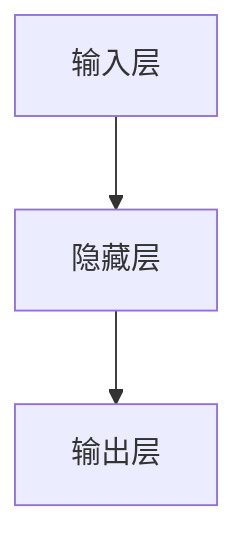

# TensorFlow 神经网络基础

神经网络是深度学习的核心组成部分，而TensorFlow是构建和训练神经网络的强大工具。本文将带你了解TensorFlow中神经网络的基础知识，并通过代码示例和实际案例帮助你快速上手。

## 什么是神经网络？

神经网络是一种模仿人脑神经元工作方式的算法模型。它由多个层（layers）组成，每一层包含多个神经元（neurons）。神经网络通过调整神经元之间的连接权重来学习数据中的模式，从而完成分类、回归等任务。

在TensorFlow中，神经网络通常通过`tf.keras` API来构建，这是一个高级API，简化了神经网络的创建和训练过程。

---

## 构建一个简单的神经网络

以下是一个使用TensorFlow构建简单神经网络的示例。我们将创建一个用于分类手写数字（MNIST数据集）的模型。

### 1. 导入必要的库

首先，我们需要导入TensorFlow和其他必要的库：

```python
import tensorflow as tf
from tensorflow.keras import layers, models
```

### 2. 加载和预处理数据

我们将使用MNIST数据集，这是一个包含手写数字图像的数据集。TensorFlow提供了便捷的方法来加载和预处理数据：

```python
# 加载MNIST数据集
mnist = tf.keras.datasets.mnist
(x_train, y_train), (x_test, y_test) = mnist.load_data()

# 归一化数据（将像素值从0-255缩放到0-1）
x_train, x_test = x_train / 255.0, x_test / 255.0
```

### 3. 构建神经网络模型

接下来，我们使用`tf.keras.Sequential`来构建一个简单的全连接神经网络：

```python
model = models.Sequential([
    layers.Flatten(input_shape=(28, 28)),  # 将28x28的图像展平为784维向量
    layers.Dense(128, activation='relu'), # 全连接层，128个神经元，激活函数为ReLU
    layers.Dropout(0.2),                  # Dropout层，防止过拟合
    layers.Dense(10, activation='softmax') # 输出层，10个神经元（对应10个类别），激活函数为Softmax
])
```

### 4. 编译模型

在训练模型之前，我们需要指定损失函数、优化器和评估指标：

```python
model.compile(optimizer='adam',
              loss='sparse_categorical_crossentropy',
              metrics=['accuracy'])
```

### 5. 训练模型

使用训练数据训练模型：

```python
model.fit(x_train, y_train, epochs=5)
```

### 6. 评估模型

在测试数据上评估模型的性能：

```python
test_loss, test_acc = model.evaluate(x_test, y_test, verbose=2)
print(f"测试准确率: {test_acc}")
```

---

## 神经网络的结构

为了更好地理解神经网络，我们可以将其结构可视化。以下是一个简单的神经网络结构图：



- **输入层**：接收输入数据（例如图像像素值）。
- **隐藏层**：通过激活函数（如ReLU）对输入数据进行非线性变换。
- **输出层**：生成最终的预测结果（例如分类概率）。

---

## 实际应用场景

神经网络在许多领域都有广泛应用，例如：

1. **图像分类**：识别图像中的物体或场景。
2. **自然语言处理**：文本分类、机器翻译等。
3. **推荐系统**：根据用户行为推荐商品或内容。

例如，在医疗领域，神经网络可以用于分析医学影像，帮助医生诊断疾病。

---

## 总结

本文介绍了TensorFlow中神经网络的基础知识，包括如何构建、训练和评估一个简单的神经网络模型。通过MNIST数据集的示例，我们展示了神经网络的完整工作流程。

:::tip 提示
如果你想进一步学习，可以尝试以下练习：
1. 修改神经网络的层数和神经元数量，观察模型性能的变化。
2. 尝试使用不同的优化器（如SGD、RMSprop）和激活函数（如tanh、sigmoid）。
3. 探索更复杂的数据集（如CIFAR-10）和模型（如卷积神经网络）。
:::

---

## 附加资源

- [TensorFlow官方文档](https://www.tensorflow.org/)
- [Keras官方指南](https://keras.io/guides/)
- 《深度学习入门：基于Python的理论与实现》——斋藤康毅

希望本文能帮助你快速入门TensorFlow神经网络！继续探索深度学习的奇妙世界吧！