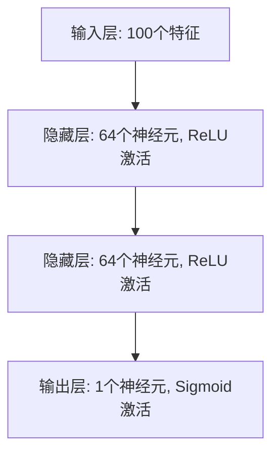

# TensorFlow 全连接网络

全连接网络（Fully Connected Neural Network，FCNN）是深度学习中最基础的神经网络结构之一。它由多个全连接层（Dense Layer）组成，每一层的神经元与前一层的所有神经元相连。全连接网络广泛应用于分类、回归等任务中。

在本教程中，我们将逐步讲解如何使用TensorFlow构建一个全连接网络，并通过实际案例展示其应用。

## 什么是全连接网络？

全连接网络是一种前馈神经网络，其中每一层的每个神经元都与前一层的所有神经元相连。这种结构使得网络能够学习输入数据中的复杂特征。

### 全连接层（Dense Layer）

全连接层是神经网络的基本构建块之一。它的每个神经元接收来自前一层的所有输入，并通过权重和偏置进行线性变换，然后通过激活函数进行非线性变换。

```python
import tensorflow as tf

# 定义一个全连接层
dense_layer = tf.keras.layers.Dense(units=64, activation='relu')
```

在上面的代码中，我们定义了一个具有64个神经元和ReLU激活函数的全连接层。

## 构建一个简单的全连接网络

让我们从一个简单的全连接网络开始，该网络用于解决二分类问题。

```python
import tensorflow as tf
from tensorflow.keras import layers

# 定义模型
model = tf.keras.Sequential([
    layers.Dense(64, activation='relu', input_shape=(100,)),  # 输入层
    layers.Dense(64, activation='relu'),  # 隐藏层
    layers.Dense(1, activation='sigmoid')  # 输出层
])

# 编译模型
model.compile(optimizer='adam',
              loss='binary_crossentropy',
              metrics=['accuracy'])

# 打印模型摘要
model.summary()
```

### 模型结构



### 解释

- **输入层**：接受100个特征作为输入。
- **隐藏层**：两个全连接层，每层有64个神经元，使用ReLU激活函数。
- **输出层**：一个神经元，使用Sigmoid激活函数，输出二分类结果。

## 训练模型

接下来，我们将使用合成数据来训练这个模型。

```python
import numpy as np

# 生成合成数据
x_train = np.random.random((1000, 100))
y_train = np.random.randint(2, size=(1000, 1))
x_test = np.random.random((200, 100))
y_test = np.random.randint(2, size=(200, 1))

# 训练模型
model.fit(x_train, y_train, epochs=10, batch_size=32, validation_data=(x_test, y_test))
```

### 输出

```plaintext
Epoch 1/10
32/32 [==============================] - 1s 10ms/step - loss: 0.6931 - accuracy: 0.5000 - val_loss: 0.6931 - val_accuracy: 0.5000
...
Epoch 10/10
32/32 [==============================] - 0s 5ms/step - loss: 0.6928 - accuracy: 0.5100 - val_loss: 0.6931 - val_accuracy: 0.5000
```

:::note
由于我们使用的是随机数据，模型的准确率可能不会很高。在实际应用中，您应该使用真实数据集来训练模型。
:::

## 实际应用案例

全连接网络在许多实际应用中都有广泛的应用，例如：

- **图像分类**：虽然卷积神经网络（CNN）在图像分类中更为常见，但全连接网络也可以用于简单的图像分类任务。
- **文本分类**：全连接网络可以用于文本分类任务，如情感分析。
- **回归问题**：全连接网络可以用于预测连续值，如房价预测。

### 示例：房价预测

假设我们有一个包含房屋特征（如面积、房间数等）的数据集，我们可以使用全连接网络来预测房价。

```python
# 假设我们有一个包含10个特征的房价数据集
model = tf.keras.Sequential([
    layers.Dense(64, activation='relu', input_shape=(10,)),
    layers.Dense(64, activation='relu'),
    layers.Dense(1)  # 输出层，预测房价
])

model.compile(optimizer='adam', loss='mse')

# 训练模型
model.fit(x_train, y_train, epochs=10, batch_size=32)
```

## 总结

全连接网络是深度学习中最基础的神经网络结构之一。通过本教程，您已经学会了如何使用TensorFlow构建和训练一个简单的全连接网络，并了解了其在实际应用中的一些场景。

:::tip
为了进一步巩固您的知识，建议您尝试以下练习：
1. 使用真实数据集（如MNIST）训练一个全连接网络。
2. 尝试调整网络结构（如增加层数或神经元数量），观察模型性能的变化。
3. 将全连接网络与其他类型的神经网络（如卷积神经网络）进行比较。
:::

## 附加资源

- [TensorFlow官方文档](https://www.tensorflow.org/)
- [深度学习入门](https://www.deeplearningbook.org/)
- [Keras官方指南](https://keras.io/guides/)

希望本教程对您的学习有所帮助！继续探索深度学习的奇妙世界吧！