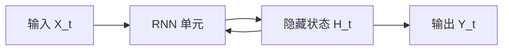

# TensorFlow 递归神经网络

递归神经网络（Recurrent Neural Networks, RNN）是一种专门用于处理序列数据的神经网络。与传统的神经网络不同，RNN 具有记忆能力，能够捕捉序列数据中的时间依赖关系。这使得 RNN 在自然语言处理、时间序列预测等任务中表现出色。

## 什么是递归神经网络？

递归神经网络的核心思想是引入“记忆”机制。RNN 的每个时间步都会接收当前输入和前一时刻的隐藏状态，并输出当前时刻的隐藏状态和预测结果。这种结构使得 RNN 能够处理任意长度的序列数据。



:::note
RNN 的隐藏状态 `H_t` 是网络的“记忆”，它包含了之前时间步的信息。
:::

## TensorFlow 中的 RNN 实现

在 TensorFlow 中，RNN 可以通过 `tf.keras.layers.SimpleRNN` 或 `tf.keras.layers.LSTM` 等层来实现。以下是一个简单的 RNN 示例，用于预测时间序列数据。

```python
import tensorflow as tf
from tensorflow.keras.models import Sequential
from tensorflow.keras.layers import SimpleRNN, Dense

# 创建一个简单的 RNN 模型
model = Sequential([
    SimpleRNN(50, input_shape=(None, 1),  # 50 个隐藏单元，输入形状为 (时间步长, 特征数)
    Dense(1)  # 输出层
])

model.compile(optimizer='adam', loss='mse')

# 示例输入数据
import numpy as np
X = np.array([[[1], [2], [3], [4], [5]]])  # 输入序列
y = np.array([[6]])  # 目标输出

# 训练模型
model.fit(X, y, epochs=10)
```

:::tip
`SimpleRNN` 是最基础的 RNN 实现。对于更复杂的任务，可以使用 `LSTM` 或 `GRU`，它们能够更好地捕捉长期依赖关系。
:::

## 实际应用场景

### 1. 自然语言处理（NLP）
RNN 在 NLP 中广泛应用，例如文本生成、机器翻译和情感分析。通过捕捉句子中单词的上下文关系，RNN 能够生成连贯的文本或理解句子的情感倾向。

### 2. 时间序列预测
RNN 可以用于预测股票价格、天气变化等时间序列数据。通过分析历史数据，RNN 能够预测未来的趋势。

### 3. 语音识别
RNN 能够处理音频信号的时间序列特性，从而实现语音到文本的转换。

## 总结

递归神经网络是一种强大的工具，特别适合处理序列数据。通过 TensorFlow，我们可以轻松构建和训练 RNN 模型，并将其应用于各种实际任务中。

:::caution
RNN 在处理长序列时可能会遇到梯度消失或梯度爆炸的问题。为了解决这些问题，可以使用 LSTM 或 GRU 等改进的 RNN 结构。
:::

## 附加资源与练习

- **练习**：尝试使用 RNN 模型预测一个简单的时间序列数据集，例如正弦波。
- **资源**：
  - [TensorFlow 官方文档](https://www.tensorflow.org/guide/keras/rnn)
  - 《深度学习》 by Ian Goodfellow（第 10 章介绍了 RNN 及其变体）

通过学习和实践，你将能够掌握 RNN 的核心概念，并将其应用于实际问题中。