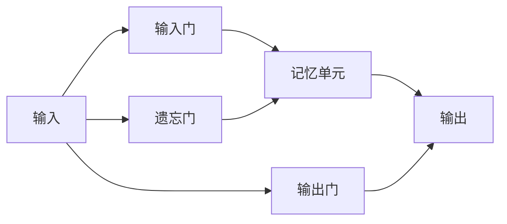

# TensorFlow LSTM网络

长短期记忆网络（LSTM，Long Short-Term Memory）是一种特殊的循环神经网络（RNN），专门设计用于处理序列数据。LSTM网络通过引入记忆单元和门控机制，能够有效地捕捉时间序列数据中的长期依赖关系。在本教程中，我们将介绍如何使用TensorFlow构建和训练LSTM网络，并展示其在真实场景中的应用。

## 什么是LSTM？

LSTM是一种改进的RNN，它通过引入记忆单元和门控机制来解决传统RNN在处理长序列数据时容易出现的梯度消失问题。LSTM的核心思想是通过三个门（输入门、遗忘门和输出门）来控制信息的流动，从而决定哪些信息需要保留，哪些信息需要丢弃。

### LSTM的基本结构

LSTM单元由以下几个关键部分组成：

1. **记忆单元（Cell State）**：存储长期记忆。
2. **输入门（Input Gate）**：决定哪些新信息将被存储到记忆单元中。
3. **遗忘门（Forget Gate）**：决定哪些信息将从记忆单元中丢弃。
4. **输出门（Output Gate）**：决定哪些信息将从记忆单元中输出。



## 使用TensorFlow构建LSTM网络

在TensorFlow中，我们可以使用`tf.keras.layers.LSTM`层来构建LSTM网络。以下是一个简单的LSTM网络示例，用于处理时间序列数据。

### 示例：时间序列预测

假设我们有一组时间序列数据，我们希望使用LSTM网络来预测未来的值。以下是构建和训练LSTM网络的步骤：

1. **导入必要的库**：

```python
import tensorflow as tf
from tensorflow.keras.models import Sequential
from tensorflow.keras.layers import LSTM, Dense
import numpy as np
```

2. **准备数据**：

```python
# 生成示例数据
def generate_time_series(batch_size, n_steps):
    freq1, freq2, offsets1, offsets2 = np.random.rand(4, batch_size, 1)
    time = np.linspace(0, 1, n_steps)
    series = 0.5 * np.sin((time - offsets1) * (freq1 * 10 + 10))  # 波形1
    series += 0.2 * np.sin((time - offsets2) * (freq2 * 20 + 20))  # 波形2
    series += 0.1 * (np.random.rand(batch_size, n_steps) - 0.5)  # 噪声
    return series[..., np.newaxis].astype(np.float32)

n_steps = 50
batch_size = 1000
series = generate_time_series(batch_size, n_steps + 1)
X_train, y_train = series[:700, :n_steps], series[:700, -1]
X_valid, y_valid = series[700:, :n_steps], series[700:, -1]
```

3. **构建LSTM模型**：

```python
model = Sequential([
    LSTM(50, return_sequences=False, input_shape=[None, 1]),
    Dense(1)
])

model.compile(loss="mse", optimizer="adam")
```

4. **训练模型**：

```python
history = model.fit(X_train, y_train, epochs=20, validation_data=(X_valid, y_valid))
```

5. **预测结果**：

```python
y_pred = model.predict(X_valid)
```

### 输出示例

```python
print("预测值:", y_pred[:5])
print("实际值:", y_valid[:5])
```

## 实际应用场景

LSTM网络在许多实际应用中表现出色，特别是在处理时间序列数据时。以下是一些常见的应用场景：

1. **股票价格预测**：使用历史股票价格数据预测未来的价格走势。
2. **自然语言处理（NLP）**：用于文本生成、机器翻译、情感分析等任务。
3. **语音识别**：将语音信号转换为文本。
4. **异常检测**：检测时间序列数据中的异常模式。

## 总结

LSTM网络是一种强大的工具，特别适合处理具有长期依赖关系的序列数据。通过TensorFlow，我们可以轻松构建和训练LSTM模型，并将其应用于各种实际问题中。希望本教程能帮助你理解LSTM的基本概念，并激发你在实际项目中使用它的兴趣。

## 附加资源与练习

- **练习**：尝试使用LSTM网络处理你自己的时间序列数据，并观察模型的性能。
- **资源**：
  - [TensorFlow官方文档](https://www.tensorflow.org/api_docs/python/tf/keras/layers/LSTM)
  - [Deep Learning with Python by François Chollet](https://www.manning.com/books/deep-learning-with-python)

:::tip
如果你对LSTM网络的工作原理感兴趣，可以深入研究LSTM的数学公式和门控机制，这将帮助你更好地理解其内部运作。
:::