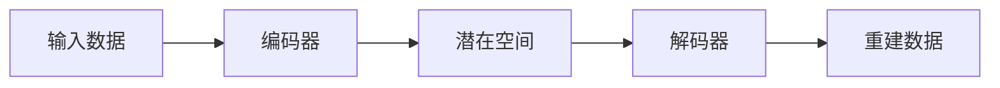

# TensorFlow 自编码器

自编码器（Autoencoder）是一种无监督学习的神经网络模型，主要用于数据的降维和特征提取。它通过学习输入数据的压缩表示（编码），然后从压缩表示中重建原始数据（解码）。自编码器在图像去噪、数据压缩和异常检测等领域有广泛的应用。

## 自编码器的基本结构

自编码器通常由两部分组成：编码器（Encoder）和解码器（Decoder）。

- **编码器**：将输入数据压缩为低维表示（通常称为潜在空间或编码）。
- **解码器**：从低维表示中重建原始数据。



## 自编码器的工作原理

自编码器的目标是使重建数据尽可能接近原始数据。通过最小化重建误差（如均方误差），模型可以学习到输入数据的有用特征。

### 1. 编码过程
编码器将输入数据 `x` 映射到潜在空间 `z`：
```python
z = encoder(x)
```

### 2. 解码过程
解码器将潜在空间 `z` 映射回重建数据 `x'`：
```python
x' = decoder(z)
```

### 3. 损失函数
自编码器的损失函数通常是重建误差，例如均方误差（MSE）：
```python
loss = tf.reduce_mean(tf.square(x - x'))
```

## 使用TensorFlow实现自编码器

下面是一个简单的自编码器实现示例，使用TensorFlow和Keras API。

```python
import tensorflow as tf
from tensorflow.keras import layers, models

# 定义编码器
encoder_input = tf.keras.Input(shape=(784,))
encoded = layers.Dense(64, activation='relu')(encoder_input)

# 定义解码器
decoded = layers.Dense(784, activation='sigmoid')(encoded)

# 构建自编码器模型
autoencoder = models.Model(encoder_input, decoded)

# 编译模型
autoencoder.compile(optimizer='adam', loss='mse')

# 假设我们有一些MNIST数据
(x_train, _), (x_test, _) = tf.keras.datasets.mnist.load_data()
x_train = x_train.reshape(-1, 784).astype('float32') / 255
x_test = x_test.reshape(-1, 784).astype('float32') / 255

# 训练模型
autoencoder.fit(x_train, x_train, epochs=50, batch_size=256, shuffle=True, validation_data=(x_test, x_test))
```

:::note
**注意**：在这个示例中，我们使用了MNIST数据集，并将图像展平为784维的向量。编码器将数据压缩到64维的潜在空间，然后解码器将其重建回784维。
:::

## 自编码器的应用场景

自编码器在许多实际应用中都有广泛的应用，以下是一些常见的场景：

### 1. 图像去噪
自编码器可以用于去除图像中的噪声。通过训练自编码器，模型可以学习到干净图像的特征，从而在输入噪声图像时重建出干净的图像。

### 2. 数据压缩
自编码器可以用于数据的压缩和降维。通过将高维数据压缩到低维潜在空间，可以有效地减少存储和计算成本。

### 3. 异常检测
自编码器可以用于检测异常数据。由于自编码器在训练过程中学习了正常数据的特征，因此当输入异常数据时，重建误差会显著增加，从而可以用于检测异常。

## 总结

自编码器是一种强大的无监督学习工具，能够有效地进行数据降维、特征提取和重建。通过TensorFlow和Keras，我们可以轻松地构建和训练自编码器模型，并将其应用于各种实际场景中。

:::tip
**提示**：如果你想进一步探索自编码器，可以尝试使用不同的数据集、调整网络结构或尝试其他类型的自编码器（如变分自编码器）。
:::

## 附加资源与练习

- **练习**：尝试使用自编码器对CIFAR-10数据集进行图像去噪。
- **资源**：阅读TensorFlow官方文档，了解更多关于自编码器的实现细节和高级技巧。