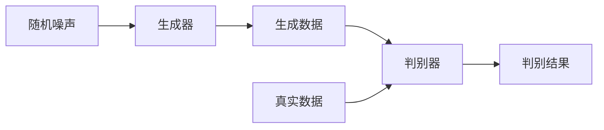

# TensorFlow 生成对抗网络

生成对抗网络（Generative Adversarial Networks，简称GAN）是深度学习领域中最具创新性的技术之一。它由两个神经网络组成：生成器（Generator）和判别器（Discriminator）。这两个网络通过对抗的方式进行训练，最终生成器能够生成逼真的数据，而判别器则试图区分真实数据和生成数据。

## 什么是生成对抗网络？

生成对抗网络由Ian Goodfellow于2014年提出。它由两个主要部分组成：

1. **生成器（Generator）**：生成器的作用是从随机噪声中生成数据。它的目标是生成与真实数据尽可能相似的数据，以欺骗判别器。
2. **判别器（Discriminator）**：判别器的作用是区分输入数据是来自真实数据集还是生成器生成的假数据。它的目标是尽可能准确地识别出真实数据和生成数据。

这两个网络在训练过程中相互对抗，生成器试图生成更逼真的数据，而判别器则试图更好地识别假数据。这种对抗过程最终使得生成器能够生成高质量的数据。

## GAN的基本结构



在上图中，生成器从随机噪声中生成数据，判别器则同时接收生成数据和真实数据，并输出判别结果。

## 使用TensorFlow构建GAN

下面是一个简单的GAN实现示例，使用TensorFlow和Keras API。

### 1. 导入必要的库

```python
import tensorflow as tf
from tensorflow.keras import layers
import numpy as np
import matplotlib.pyplot as plt
```

### 2. 定义生成器

生成器是一个简单的全连接神经网络，它将随机噪声映射到生成的数据。

```python
def build_generator(latent_dim):
    model = tf.keras.Sequential([
        layers.Dense(256, input_dim=latent_dim),
        layers.LeakyReLU(alpha=0.2),
        layers.BatchNormalization(),
        layers.Dense(512),
        layers.LeakyReLU(alpha=0.2),
        layers.BatchNormalization(),
        layers.Dense(1024),
        layers.LeakyReLU(alpha=0.2),
        layers.BatchNormalization(),
        layers.Dense(784, activation='tanh'),
        layers.Reshape((28, 28, 1))
    ])
    return model
```

### 3. 定义判别器

判别器也是一个全连接神经网络，它将输入数据映射到一个二元分类结果（真实或生成）。

```python
def build_discriminator(img_shape):
    model = tf.keras.Sequential([
        layers.Flatten(input_shape=img_shape),
        layers.Dense(512),
        layers.LeakyReLU(alpha=0.2),
        layers.Dense(256),
        layers.LeakyReLU(alpha=0.2),
        layers.Dense(1, activation='sigmoid')
    ])
    return model
```

### 4. 构建GAN模型

将生成器和判别器组合成一个GAN模型。

```python
def build_gan(generator, discriminator):
    discriminator.trainable = False
    model = tf.keras.Sequential([
        generator,
        discriminator
    ])
    return model
```

### 5. 训练GAN

训练过程包括交替训练生成器和判别器。

```python
def train_gan(generator, discriminator, gan, dataset, latent_dim, epochs=100, batch_size=128):
    for epoch in range(epochs):
        for real_images in dataset:
            # 生成随机噪声
            noise = np.random.normal(0, 1, (batch_size, latent_dim))
            # 生成假图像
            fake_images = generator.predict(noise)
            # 获取真实图像
            real_images = real_images[np.random.randint(0, real_images.shape[0], batch_size)]
            # 训练判别器
            d_loss_real = discriminator.train_on_batch(real_images, np.ones((batch_size, 1)))
            d_loss_fake = discriminator.train_on_batch(fake_images, np.zeros((batch_size, 1)))
            d_loss = 0.5 * np.add(d_loss_real, d_loss_fake)
            # 训练生成器
            noise = np.random.normal(0, 1, (batch_size, latent_dim))
            g_loss = gan.train_on_batch(noise, np.ones((batch_size, 1)))
            # 打印损失
            print(f"{epoch}/{epochs} [D loss: {d_loss[0]}, acc.: {100*d_loss[1]]}%] [G loss: {g_loss}]")
```

### 6. 生成图像

训练完成后，可以使用生成器生成新的图像。

```python
def generate_images(generator, latent_dim, n_samples=16):
    noise = np.random.normal(0, 1, (n_samples, latent_dim))
    generated_images = generator.predict(noise)
    plt.figure(figsize=(10, 10))
    for i in range(n_samples):
        plt.subplot(4, 4, i+1)
        plt.imshow(generated_images[i], cmap='gray')
        plt.axis('off')
    plt.show()
```

## 实际应用场景

生成对抗网络在许多领域都有广泛的应用，包括但不限于：

- **图像生成**：生成逼真的图像，如人脸、风景等。
- **图像修复**：修复损坏或缺失的图像部分。
- **风格迁移**：将一种图像的风格应用到另一种图像上。
- **数据增强**：生成更多的训练数据以提高模型的泛化能力。

## 总结

生成对抗网络是一种强大的深度学习技术，它通过生成器和判别器的对抗训练，能够生成逼真的数据。通过TensorFlow，我们可以轻松构建和训练GAN模型，并将其应用于各种实际场景中。

## 附加资源与练习

- **练习**：尝试修改生成器和判别器的结构，观察生成图像的变化。
- **资源**：
  - [TensorFlow官方文档](https://www.tensorflow.org/)
  - [GAN论文](https://arxiv.org/abs/1406.2661)
  - [深度学习课程](https://www.coursera.org/specializations/deep-learning)

通过不断实践和探索，你将能够掌握生成对抗网络的精髓，并将其应用到更多有趣的项目中。