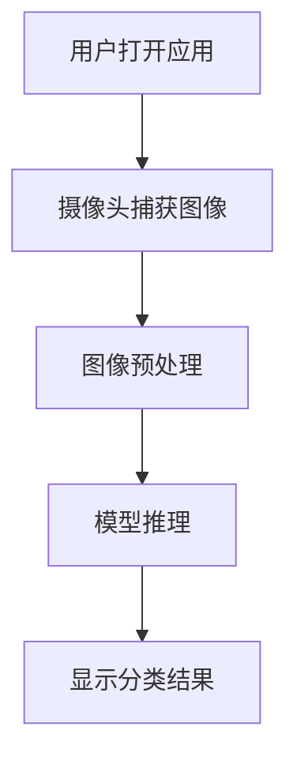
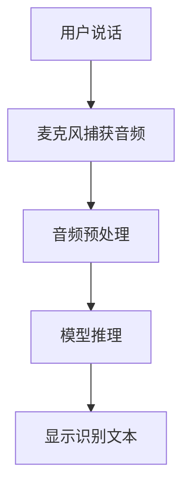

# TensorFlow 移动端部署

在现代人工智能应用中，移动设备的普及使得将机器学习模型部署到移动端变得至关重要。TensorFlow提供了多种工具和技术，帮助开发者将训练好的模型部署到Android和iOS设备上。本文将详细介绍如何实现TensorFlow模型的移动端部署，并优化其性能。

## 1. 什么是TensorFlow移动端部署？

TensorFlow移动端部署是指将训练好的TensorFlow模型转换为适合在移动设备上运行的格式，并将其集成到移动应用程序中。由于移动设备的计算资源和存储空间有限，部署过程中需要对模型进行优化，以确保其高效运行。

## 2. 为什么需要移动端部署？

移动端部署的主要优势包括：

- **实时性**：在设备上直接运行模型，无需依赖云端服务，可以实现实时推理。
- **隐私保护**：数据无需上传到云端，直接在设备上处理，保护用户隐私。
- **离线可用性**：模型可以在没有网络连接的情况下运行，适用于各种场景。

## 3. TensorFlow移动端部署的步骤

### 3.1 模型转换

首先，需要将训练好的TensorFlow模型转换为适合移动端运行的格式。TensorFlow提供了`TensorFlow Lite`（TFLite）工具，用于将模型转换为轻量级的TFLite格式。

```python
import tensorflow as tf

# 加载训练好的模型
model = tf.keras.models.load_model('my_model.h5')

# 转换为TFLite格式
converter = tf.lite.TFLiteConverter.from_keras_model(model)
tflite_model = converter.convert()

# 保存转换后的模型
with open('model.tflite', 'wb') as f:
    f.write(tflite_model)
```

### 3.2 模型优化

为了在移动设备上高效运行，通常需要对模型进行优化。TensorFlow Lite提供了多种优化技术，包括量化、剪枝等。

```python
# 使用量化优化
converter.optimizations = [tf.lite.Optimize.DEFAULT]
tflite_quant_model = converter.convert()

# 保存量化后的模型
with open('model_quant.tflite', 'wb') as f:
    f.write(tflite_quant_model)
```

### 3.3 集成到移动应用

将转换和优化后的TFLite模型集成到移动应用中。以下是一个简单的Android应用示例，展示如何加载和运行TFLite模型。

```java
import org.tensorflow.lite.Interpreter;

public class MainActivity extends AppCompatActivity {
    private Interpreter tflite;

    @Override
    protected void onCreate(Bundle savedInstanceState) {
        super.onCreate(savedInstanceState);
        setContentView(R.layout.activity_main);

        // 加载TFLite模型
        try {
            tflite = new Interpreter(loadModelFile());
        } catch (IOException e) {
            e.printStackTrace();
        }

        // 运行模型推理
        float[][] input = new float[1][224];
        float[][] output = new float[1][1000];
        tflite.run(input, output);
    }

    private MappedByteBuffer loadModelFile() throws IOException {
        AssetFileDescriptor fileDescriptor = getAssets().openFd("model.tflite");
        FileInputStream inputStream = new FileInputStream(fileDescriptor.getFileDescriptor());
        FileChannel fileChannel = inputStream.getChannel();
        long startOffset = fileDescriptor.getStartOffset();
        long declaredLength = fileDescriptor.getDeclaredLength();
        return fileChannel.map(FileChannel.MapMode.READ_ONLY, startOffset, declaredLength);
    }
}
```

## 4. 实际案例

### 4.1 图像分类应用

假设我们有一个图像分类模型，可以识别1000种不同的物体。通过将模型部署到移动设备上，用户可以使用手机摄像头实时识别物体。



### 4.2 语音识别应用

另一个常见的应用场景是语音识别。通过将语音识别模型部署到移动设备上，用户可以在离线状态下进行语音输入。



## 5. 总结

TensorFlow移动端部署是将机器学习模型应用于移动设备的关键步骤。通过模型转换、优化和集成，开发者可以在移动设备上实现高效的实时推理。本文介绍了TensorFlow Lite的基本使用方法，并通过实际案例展示了其在图像分类和语音识别中的应用。

## 6. 附加资源与练习

- **官方文档**：[TensorFlow Lite官方文档](https://www.tensorflow.org/lite)
- **练习**：尝试将一个简单的图像分类模型部署到Android设备上，并测试其性能。
- **进一步学习**：探索TensorFlow Lite的其他优化技术，如剪枝、蒸馏等。

:::tip
在部署过程中，务必测试模型在不同设备上的性能，以确保其在不同硬件条件下的兼容性和效率。
:::