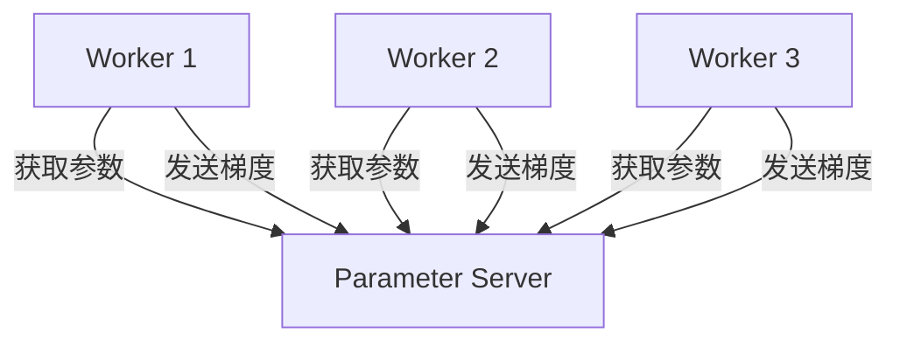

# TensorFlow 参数服务器

在分布式机器学习中，**参数服务器**（Parameter Server）是一种用于存储和更新模型参数的架构。它允许多个工作节点（Worker）并行计算梯度，并通过参数服务器集中管理模型参数的更新。TensorFlow提供了对参数服务器的原生支持，使得分布式训练变得更加高效和灵活。

## 什么是参数服务器？

参数服务器是一种分布式系统架构，主要用于存储和更新机器学习模型的参数。在分布式训练中，模型参数通常非常大，无法完全存储在单个设备上。参数服务器通过将参数分布到多个服务器节点上，解决了这一问题。

### 参数服务器的工作原理

在参数服务器架构中，通常有两种角色：

1. **工作节点（Worker）**：负责计算梯度并更新模型参数。
2. **参数服务器节点（Parameter Server）**：负责存储和更新模型参数。

工作节点从参数服务器获取最新的模型参数，计算梯度，然后将梯度发送回参数服务器。参数服务器根据接收到的梯度更新模型参数。



## TensorFlow 中的参数服务器

TensorFlow通过`tf.distribute.experimental.ParameterServerStrategy`提供了对参数服务器的支持。该策略允许用户轻松配置参数服务器架构，并自动处理参数的分发和更新。

### 配置参数服务器

要使用参数服务器策略，首先需要配置集群。集群通常由多个工作节点和参数服务器节点组成。每个节点都需要知道其他节点的地址。

```python
import tensorflow as tf

# 定义集群
cluster_resolver = tf.distribute.cluster_resolver.TFConfigClusterResolver()

# 使用参数服务器策略
strategy = tf.distribute.experimental.ParameterServerStrategy(cluster_resolver)
```

### 定义模型

接下来，定义模型并将其包装在策略范围内。这样，模型参数将自动分布在参数服务器上。

```python
with strategy.scope():
    model = tf.keras.Sequential([
        tf.keras.layers.Dense(128, activation='relu', input_shape=(784,)),
        tf.keras.layers.Dense(10, activation='softmax')
    ])
    model.compile(optimizer='adam', loss='sparse_categorical_crossentropy', metrics=['accuracy'])
```

### 分布式训练

在分布式训练中，工作节点从参数服务器获取模型参数，计算梯度，并将梯度发送回参数服务器。参数服务器根据接收到的梯度更新模型参数。

```python
# 假设我们有一个数据集
dataset = tf.data.Dataset.from_tensor_slices((x_train, y_train)).batch(32)

# 分布式训练
model.fit(dataset, epochs=5)
```

:::note
在分布式训练中，工作节点和参数服务器之间的通信可能会成为性能瓶颈。因此，优化通信效率是分布式训练中的一个重要课题。
:::

## 实际应用场景

参数服务器广泛应用于大规模机器学习任务中，特别是在需要处理海量数据和复杂模型的场景中。以下是一些典型的应用场景：

1. **推荐系统**：推荐系统通常需要处理大量的用户和物品数据，参数服务器可以有效地存储和更新这些数据。
2. **自然语言处理**：在训练大型语言模型时，参数服务器可以帮助分布式存储和更新模型参数。
3. **图像识别**：在训练深度卷积神经网络时，参数服务器可以加速模型的训练过程。

## 总结

参数服务器是分布式机器学习中的一种重要架构，它通过将模型参数分布到多个服务器节点上，解决了大规模模型训练中的存储和更新问题。TensorFlow提供了对参数服务器的原生支持，使得分布式训练变得更加高效和灵活。

### 附加资源

- [TensorFlow官方文档：ParameterServerStrategy](https://www.tensorflow.org/api_docs/python/tf/distribute/experimental/ParameterServerStrategy)
- [分布式机器学习：理论与实践](https://www.oreilly.com/library/view/distributed-machine-learning/9781492044785/)

### 练习

1. 尝试在本地机器上配置一个简单的参数服务器集群，并使用`ParameterServerStrategy`进行分布式训练。
2. 研究如何优化参数服务器和工作节点之间的通信效率，以减少分布式训练中的通信开销。

通过本文的学习，你应该对TensorFlow参数服务器有了初步的了解，并能够在实际项目中应用这一技术。