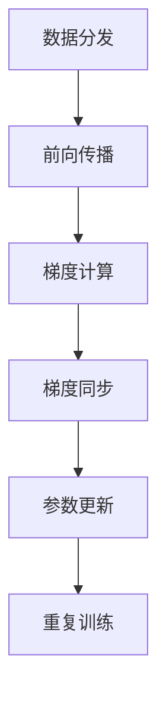

# TensorFlow 同步训练

在分布式深度学习中，同步训练是一种常见的训练策略，用于确保多个工作节点（workers）在更新模型参数时保持一致性。本文将详细介绍 TensorFlow 中的同步训练机制，并通过代码示例和实际案例帮助初学者理解其工作原理和应用场景。

## 什么是同步训练？

同步训练是指在分布式训练过程中，所有工作节点在每一轮训练（即一个批次）结束后，必须等待其他节点完成计算，然后同步更新模型参数。这种机制确保了所有节点使用相同的参数进行下一轮训练，从而避免了参数不一致的问题。

与异步训练不同，同步训练虽然可能会增加训练时间（因为需要等待最慢的节点），但它能够保证模型的收敛性和稳定性，特别适合对模型精度要求较高的场景。

## 同步训练的工作原理

在 TensorFlow 中，同步训练通常通过 **`tf.distribute.Strategy`** 实现。以下是同步训练的基本流程：

1. **数据分发**：将训练数据分发给多个工作节点。
2. **前向传播**：每个节点独立计算损失和梯度。
3. **梯度同步**：所有节点将计算出的梯度发送到参数服务器（Parameter Server）或通过 All-Reduce 操作进行同步。
4. **参数更新**：使用同步后的梯度更新模型参数。
5. **重复训练**：重复上述步骤，直到模型收敛。

以下是一个简单的同步训练流程图：



## 代码示例：使用 `MirroredStrategy` 实现同步训练

`MirroredStrategy` 是 TensorFlow 提供的一种同步训练策略，适用于单机多 GPU 或多机多 GPU 的场景。以下是一个简单的代码示例：

```python
import tensorflow as tf

# 定义模型
def create_model():
    model = tf.keras.Sequential([
        tf.keras.layers.Dense(128, activation='relu', input_shape=(784,)),
        tf.keras.layers.Dense(10, activation='softmax')
    ])
    return model

# 使用 MirroredStrategy 进行同步训练
strategy = tf.distribute.MirroredStrategy()

with strategy.scope():
    model = create_model()
    model.compile(optimizer='adam',
                  loss='sparse_categorical_crossentropy',
                  metrics=['accuracy'])

# 加载数据
(x_train, y_train), (x_test, y_test) = tf.keras.datasets.mnist.load_data()
x_train = x_train.reshape(-1, 784).astype('float32') / 255
x_test = x_test.reshape(-1, 784).astype('float32') / 255

# 训练模型
model.fit(x_train, y_train, epochs=5, batch_size=64)

# 评估模型
model.evaluate(x_test, y_test)
```

### 代码说明
1. **`MirroredStrategy`**：用于在多个 GPU 上同步训练模型。
2. **`strategy.scope()`**：确保模型和优化器在分布式环境中正确初始化。
3. **`model.fit()`**：在分布式环境中训练模型。

:::note
在实际应用中，`MirroredStrategy` 会自动处理梯度同步和参数更新，开发者无需手动实现这些逻辑。
:::

## 实际案例：图像分类任务

假设我们需要训练一个深度卷积神经网络（CNN）来完成图像分类任务。由于数据集较大，单 GPU 训练速度较慢，因此我们可以使用同步训练来加速训练过程。

### 场景描述
- **数据集**：CIFAR-10（包含 60,000 张 32x32 彩色图像，共 10 个类别）。
- **模型**：ResNet-50。
- **硬件环境**：4 个 GPU。

### 实现步骤
1. 使用 `MirroredStrategy` 初始化模型和优化器。
2. 将数据集分发给多个 GPU。
3. 在分布式环境中训练模型。

```python
import tensorflow as tf
from tensorflow.keras.applications import ResNet50

# 使用 MirroredStrategy
strategy = tf.distribute.MirroredStrategy()

with strategy.scope():
    model = ResNet50(weights=None, input_shape=(32, 32, 3), classes=10)
    model.compile(optimizer='adam',
                  loss='sparse_categorical_crossentropy',
                  metrics=['accuracy'])

# 加载 CIFAR-10 数据集
(x_train, y_train), (x_test, y_test) = tf.keras.datasets.cifar10.load_data()

# 训练模型
model.fit(x_train, y_train, epochs=10, batch_size=128)

# 评估模型
model.evaluate(x_test, y_test)
```

:::tip
在实际应用中，可以通过调整 `batch_size` 和 GPU 数量来优化训练性能。
:::

## 总结

同步训练是分布式深度学习中一种重要的训练策略，能够确保模型参数的一致性，从而提高模型的收敛性和稳定性。通过 TensorFlow 的 `MirroredStrategy`，开发者可以轻松实现同步训练，并充分利用多 GPU 的计算能力。

## 附加资源与练习

1. **官方文档**：阅读 [TensorFlow 分布式训练指南](https://www.tensorflow.org/guide/distributed_training) 了解更多细节。
2. **练习**：尝试在本地机器上使用多个 GPU 运行上述代码，并观察训练时间的变化。
3. **扩展阅读**：了解异步训练的原理及其与同步训练的优缺点对比。

希望本文能帮助你理解 TensorFlow 中的同步训练机制，并为你的分布式深度学习项目提供指导！