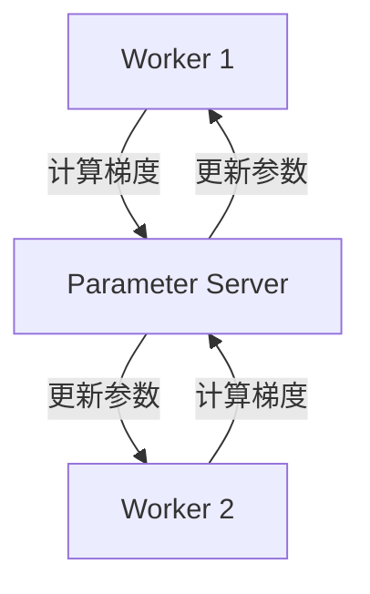

# TensorFlow 异步训练

在分布式机器学习中，**异步训练**是一种常见的训练策略，它允许多个工作节点（workers）独立地更新模型参数，而无需等待其他节点的同步。这种方式可以显著提高训练效率，尤其是在大规模数据集和复杂模型的场景下。本文将详细介绍 TensorFlow 中的异步训练机制，并通过代码示例和实际案例帮助你理解其工作原理。

---

## 什么是异步训练？

在传统的同步训练中，所有工作节点需要在每个训练步骤中同步更新模型参数。这意味着较慢的节点会成为整个系统的瓶颈，拖慢整体训练速度。而**异步训练**则允许每个工作节点独立地计算梯度并更新模型参数，无需等待其他节点。这种方式可以充分利用计算资源，减少训练时间。

:::note
异步训练的核心思想是：**去中心化**和**非阻塞**。每个工作节点可以独立工作，模型的参数更新是异步进行的。
:::

---

## TensorFlow 中的异步训练实现

TensorFlow 提供了多种分布式训练策略，其中 `ParameterServerStrategy` 是实现异步训练的常用方式。以下是一个简单的异步训练示例：

### 1. 设置分布式环境

首先，我们需要配置分布式训练的环境。假设我们有两个工作节点和一个参数服务器（Parameter Server）。

```python
import tensorflow as tf

# 定义集群
cluster = tf.train.ClusterSpec({
    "worker": ["worker0.example.com:2222", "worker1.example.com:2222"],
    "ps": ["ps0.example.com:2222"]
})

# 启动参数服务器
if FLAGS.job_name == "ps":
    server = tf.distribute.Server(cluster, job_name="ps", task_index=FLAGS.task_index)
    server.join()
```

### 2. 定义模型和训练逻辑

接下来，我们定义一个简单的模型，并在工作节点上实现异步训练逻辑。

```python
# 在工作节点上定义模型
if FLAGS.job_name == "worker":
    server = tf.distribute.Server(cluster, job_name="worker", task_index=FLAGS.task_index)
    with tf.device(tf.train.replica_device_setter(
        worker_device="/job:worker/task:%d" % FLAGS.task_index,
        cluster=cluster)):
        
        # 定义模型
        model = tf.keras.Sequential([
            tf.keras.layers.Dense(10, activation='relu'),
            tf.keras.layers.Dense(1)
        ])
        
        # 定义损失函数和优化器
        loss_fn = tf.keras.losses.MeanSquaredError()
        optimizer = tf.keras.optimizers.SGD(learning_rate=0.01)
        
        # 定义训练步骤
        @tf.function
        def train_step(inputs, labels):
            with tf.GradientTape() as tape:
                predictions = model(inputs)
                loss = loss_fn(labels, predictions)
            gradients = tape.gradient(loss, model.trainable_variables)
            optimizer.apply_gradients(zip(gradients, model.trainable_variables))
            return loss
        
        # 模拟训练数据
        dataset = tf.data.Dataset.from_tensor_slices((tf.random.normal([1000, 10]), tf.random.normal([1000, 1])))
        dataset = dataset.batch(32).repeat()
        
        # 开始训练
        for inputs, labels in dataset:
            loss = train_step(inputs, labels)
            print(f"Loss: {loss.numpy()}")
```

### 3. 运行分布式训练

在工作节点上运行上述代码，每个节点会独立地计算梯度并更新模型参数。由于使用了 `ParameterServerStrategy`，参数服务器会异步地接收和更新参数。

---

## 异步训练的工作原理

为了更好地理解异步训练，我们可以通过以下流程图展示其工作原理：



1. 每个工作节点从参数服务器获取最新的模型参数。
2. 工作节点使用本地数据计算梯度。
3. 工作节点将梯度发送给参数服务器。
4. 参数服务器异步地更新模型参数，并将更新后的参数返回给工作节点。

:::tip
异步训练的优势在于：**容错性强**和**扩展性好**。即使某个工作节点出现故障，其他节点仍可以继续训练。
:::

---

## 实际应用场景

异步训练在大规模机器学习任务中非常有用，例如：

1. **推荐系统**：处理海量用户行为数据时，异步训练可以加速模型更新。
2. **自然语言处理**：训练大型语言模型（如 GPT）时，异步训练可以减少同步开销。
3. **图像分类**：在分布式环境中训练深度卷积神经网络（CNN）时，异步训练可以提高资源利用率。

---

## 总结

TensorFlow 的异步训练机制通过去中心化和非阻塞的方式，显著提高了分布式训练的效率和扩展性。本文介绍了异步训练的基本概念、实现方法以及实际应用场景。希望这些内容能帮助你更好地理解和应用异步训练。

---

## 附加资源与练习

1. **官方文档**：阅读 [TensorFlow 分布式训练指南](https://www.tensorflow.org/guide/distributed_training) 以了解更多细节。
2. **练习**：尝试在本地模拟一个包含 2 个工作节点和 1 个参数服务器的分布式训练环境，并运行异步训练代码。
3. **进阶学习**：探索 TensorFlow 中的其他分布式策略，如 `MirroredStrategy` 和 `MultiWorkerMirroredStrategy`。

Happy coding! 🚀