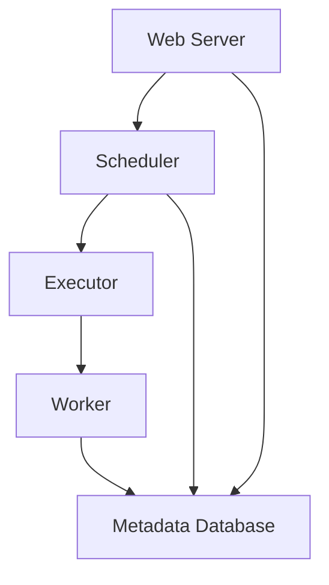

## 介绍

Apache Airflow 是一个用于编排复杂工作流的开源平台。它通过有向无环图（DAG）来定义任务及其依赖关系，并提供了丰富的调度和监控功能。为了充分利用 Airflow，理解其架构是至关重要的。本文将带你深入了解 Airflow 的核心组件及其工作原理。

## Airflow 的核心架构

Airflow 的架构主要由以下几个关键组件组成：

1. **Web Server**：提供用户界面，用于查看和管理 DAG、任务状态、日志等。
2. **Scheduler**：负责解析 DAG 并调度任务执行。
3. **Executor**：执行任务的实际工作组件，支持多种执行模式（如本地执行、Celery 执行等）。
4. **Metadata Database**：存储 DAG、任务状态、变量、连接等元数据。
5. **Worker**：在分布式环境中执行任务的节点。

以下是一个简单的架构图，展示了这些组件之间的关系：



### 1. Web Server

Web Server 是 Airflow 的用户界面，基于 Flask 框架构建。它允许用户通过浏览器查看 DAG、任务状态、日志等信息。Web Server 还提供了 API 接口，方便与其他系统集成。

### 2. Scheduler

Scheduler 是 Airflow 的核心组件之一，负责解析 DAG 文件并调度任务执行。它会定期检查 DAG 文件的变化，并根据任务依赖关系和时间安排触发任务执行。

:::tip
Scheduler 的性能直接影响 Airflow 的整体表现。在高负载场景下，建议优化 Scheduler 的配置或使用分布式调度器。
:::

### 3. Executor

Executor 是实际执行任务的组件。Airflow 支持多种 Executor，例如：

- **SequentialExecutor**：顺序执行任务，适用于开发和测试。
- **LocalExecutor**：在本地并行执行任务。
- **CeleryExecutor**：使用 Celery 分布式任务队列执行任务。
- **KubernetesExecutor**：在 Kubernetes 集群中动态创建 Pod 执行任务。

### 4. Metadata Database

Metadata Database 存储了 Airflow 的所有元数据，包括 DAG 定义、任务状态、变量、连接等。常用的数据库包括 PostgreSQL、MySQL 和 SQLite。

:::caution
在生产环境中，建议使用高性能的数据库（如 PostgreSQL）来存储元数据，以确保系统的稳定性和扩展性。
:::

### 5. Worker

Worker 是分布式环境中实际执行任务的节点。当使用 CeleryExecutor 或 KubernetesExecutor 时，Worker 会从任务队列中获取任务并执行。

## 实际案例

假设我们需要每天从多个数据源提取数据，并将其加载到数据仓库中。我们可以使用 Airflow 来编排这个工作流。以下是一个简单的 DAG 示例：

```python
from airflow import DAG
from airflow.operators.python_operator import PythonOperator
from datetime import datetime

def extract_data():
    print("Extracting data...")

def transform_data():
    print("Transforming data...")

def load_data():
    print("Loading data...")

dag = DAG(
    'etl_pipeline',
    description='A simple ETL pipeline',
    schedule_interval='@daily',
    start_date=datetime(2023, 1, 1),
    catchup=False
)

extract_task = PythonOperator(
    task_id='extract',
    python_callable=extract_data,
    dag=dag
)

transform_task = PythonOperator(
    task_id='transform',
    python_callable=transform_data,
    dag=dag
)

load_task = PythonOperator(
    task_id='load',
    python_callable=load_data,
    dag=dag
)

extract_task >> transform_task >> load_task
```

在这个例子中，我们定义了一个包含三个任务的 DAG：`extract`、`transform` 和 `load`。任务之间通过 `>>` 符号定义了依赖关系。

## 总结

通过本文，我们了解了 Apache Airflow 的核心架构及其组件。掌握这些知识将帮助你更好地使用 Airflow 构建和管理复杂的工作流。在实际应用中，建议根据具体需求选择合适的 Executor 和数据库，并优化 Scheduler 的配置以提高性能。

## 附加资源

- [Airflow 官方文档](https://airflow.apache.org/docs/)
- [Airflow GitHub 仓库](https://github.com/apache/airflow)
- [Airflow 最佳实践](https://airflow.apache.org/docs/apache-airflow/stable/best-practices.html)

## 练习

1. 尝试在本地安装 Airflow 并运行上述 ETL 示例。
2. 修改 DAG，添加一个新的任务 `validate_data`，并在 `load` 任务之后执行。
3. 研究并尝试使用不同的 Executor（如 CeleryExecutor 或 KubernetesExecutor）。
