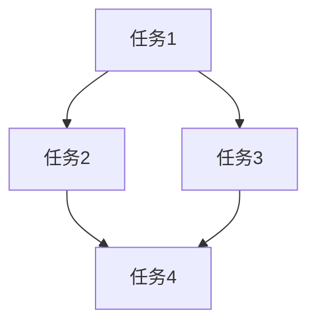

# Airflow 执行器类型

Apache Airflow 是一个强大的工作流调度和编排工具，它允许用户通过编写Python代码来定义、调度和监控复杂的工作流。在Airflow中，**执行器（Executor）** 是一个核心组件，负责实际执行任务。不同的执行器类型适用于不同的场景，了解它们的区别和适用场景对于优化工作流性能至关重要。

## 什么是执行器？

执行器是Airflow中负责执行任务的组件。它决定了任务是如何被调度和执行的。Airflow支持多种执行器类型，每种类型都有其独特的优势和适用场景。选择合适的执行器可以帮助你更好地管理资源、提高任务执行效率。

## 常见的执行器类型

Airflow支持以下几种常见的执行器类型：

1. **SequentialExecutor**
2. **LocalExecutor**
3. **CeleryExecutor**
4. **KubernetesExecutor**

### 1. SequentialExecutor

`SequentialExecutor` 是Airflow的默认执行器，它按顺序执行任务，一次只执行一个任务。这种执行器适用于开发和调试环境，但不适合生产环境，因为它无法并行执行任务。

**适用场景：**
- 开发和调试
- 单任务测试

**代码示例：**
```python
from airflow import DAG
from airflow.operators.dummy_operator import DummyOperator
from datetime import datetime

dag = DAG('sequential_executor_example', start_date=datetime(2023, 1, 1))

task1 = DummyOperator(task_id='task1', dag=dag)
task2 = DummyOperator(task_id='task2', dag=dag)

task1 >> task2
```

### 2. LocalExecutor

`LocalExecutor` 允许在本地并行执行任务。它使用多进程或多线程来并行执行任务，适合在单机上运行多个任务。

**适用场景：**
- 单机多任务并行执行
- 小规模生产环境

**代码示例：**
```python
from airflow import DAG
from airflow.operators.dummy_operator import DummyOperator
from datetime import datetime

dag = DAG('local_executor_example', start_date=datetime(2023, 1, 1))

task1 = DummyOperator(task_id='task1', dag=dag)
task2 = DummyOperator(task_id='task2', dag=dag)
task3 = DummyOperator(task_id='task3', dag=dag)

task1 >> task2 >> task3
```

### 3. CeleryExecutor

`CeleryExecutor` 是一个分布式执行器，它使用Celery作为任务队列，可以在多个工作节点上并行执行任务。这种执行器适合大规模生产环境。

**适用场景：**
- 大规模分布式任务执行
- 高并发生产环境

**代码示例：**
```python
from airflow import DAG
from airflow.operators.dummy_operator import DummyOperator
from datetime import datetime

dag = DAG('celery_executor_example', start_date=datetime(2023, 1, 1))

task1 = DummyOperator(task_id='task1', dag=dag)
task2 = DummyOperator(task_id='task2', dag=dag)
task3 = DummyOperator(task_id='task3', dag=dag)

task1 >> task2 >> task3
```

### 4. KubernetesExecutor

`KubernetesExecutor` 是一个基于Kubernetes的执行器，它可以在Kubernetes集群中动态创建和销毁Pod来执行任务。这种执行器适合需要高度弹性和资源隔离的场景。

**适用场景：**
- 需要动态资源管理的场景
- 高弹性需求的生产环境

**代码示例：**
```python
from airflow import DAG
from airflow.operators.dummy_operator import DummyOperator
from datetime import datetime

dag = DAG('kubernetes_executor_example', start_date=datetime(2023, 1, 1))

task1 = DummyOperator(task_id='task1', dag=dag)
task2 = DummyOperator(task_id='task2', dag=dag)
task3 = DummyOperator(task_id='task3', dag=dag)

task1 >> task2 >> task3
```

## 实际案例

假设你有一个需要处理大量数据的ETL任务，并且你希望在多个节点上并行执行这些任务。在这种情况下，`CeleryExecutor` 或 `KubernetesExecutor` 是更好的选择，因为它们可以充分利用分布式计算资源。



## 总结

选择合适的执行器对于优化Airflow工作流的性能至关重要。`SequentialExecutor` 适合开发和调试，`LocalExecutor` 适合单机多任务并行执行，`CeleryExecutor` 和 `KubernetesExecutor` 则适合大规模分布式任务执行。根据你的需求和环境选择合适的执行器，可以显著提高任务执行效率。

## 附加资源

- [Airflow官方文档](https://airflow.apache.org/docs/)
- [Celery官方文档](https://docs.celeryproject.org/en/stable/)
- [Kubernetes官方文档](https://kubernetes.io/docs/home/)

## 练习

1. 尝试在本地环境中使用 `LocalExecutor` 运行一个包含多个任务的DAG。
2. 研究如何在生产环境中配置 `CeleryExecutor` 或 `KubernetesExecutor`。
3. 比较不同执行器的性能差异，并记录你的发现。
