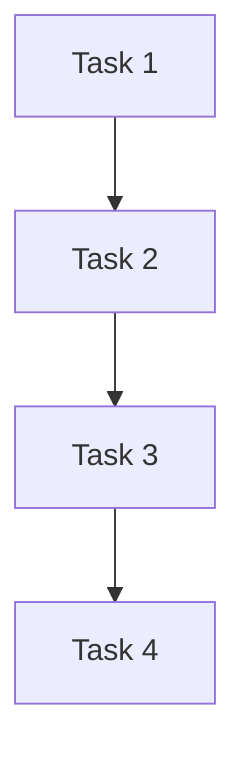

# Airflow Web服务器

## 介绍

Apache Airflow 是一个开源的工作流管理平台，用于编排和调度复杂的数据管道。Airflow Web服务器是Airflow的核心组件之一，它提供了一个用户友好的Web界面，用于监控和管理工作流（DAGs）。通过Web服务器，用户可以轻松地查看任务状态、触发任务、查看日志以及管理DAGs。

## Airflow Web服务器的功能

Airflow Web服务器提供了以下主要功能：

1. **DAGs管理**：查看、触发、暂停和删除DAGs。
2. **任务监控**：实时监控任务的执行状态、重试次数、执行时间等。
3. **日志查看**：查看任务的详细日志，帮助调试和排查问题。
4. **任务触发**：手动触发任务的执行。
5. **任务依赖图**：可视化展示任务之间的依赖关系。
6. **配置管理**：查看和修改Airflow的配置。

## 启动Airflow Web服务器

在安装并配置好Airflow后，可以通过以下命令启动Web服务器：

```bash
airflow webserver
```

默认情况下，Web服务器会监听在 `http://localhost:8080`。你可以在浏览器中访问该地址，进入Airflow的Web界面。

## Web界面概览

Airflow Web界面主要由以下几个部分组成：

1. **DAGs列表**：显示所有已加载的DAGs，并提供操作按钮（如触发、暂停等）。
2. **任务实例**：显示每个DAG中任务的执行状态。
3. **任务日志**：显示任务的详细日志信息。
4. **任务依赖图**：以图形化的方式展示任务之间的依赖关系。
5. **配置**：显示Airflow的配置信息。

## 实际案例

假设我们有一个简单的DAG，用于每天执行一次数据清洗任务。以下是一个简单的DAG定义：

```python
from airflow import DAG
from airflow.operators.bash import BashOperator
from datetime import datetime

default_args = {
    'owner': 'airflow',
    'start_date': datetime(2023, 1, 1),
}

dag = DAG(
    'data_cleaning',
    default_args=default_args,
    schedule_interval='@daily',
)

task = BashOperator(
    task_id='clean_data',
    bash_command='echo "Cleaning data..."',
    dag=dag,
)
```

在Web界面中，你可以看到这个DAG的状态、任务的执行情况以及任务的日志信息。

## 任务依赖图

Airflow Web服务器提供了一个任务依赖图，用于可视化展示任务之间的依赖关系。以下是一个简单的任务依赖图示例：



在这个图中，`Task 1` 是 `Task 2` 的前置任务，`Task 2` 是 `Task 3` 的前置任务，依此类推。

## 总结

Airflow Web服务器是Airflow的核心组件之一，它提供了一个强大的Web界面，用于管理和监控工作流。通过Web服务器，用户可以轻松地查看任务状态、触发任务、查看日志以及管理DAGs。对于初学者来说，掌握Airflow Web服务器的使用是学习Airflow的重要一步。

## 附加资源

- [Airflow官方文档](https://airflow.apache.org/docs/)
- [Airflow GitHub仓库](https://github.com/apache/airflow)
- [Airflow教程](https://airflow.apache.org/docs/apache-airflow/stable/tutorial.html)

## 练习

1. 启动Airflow Web服务器，并访问 `http://localhost:8080`。
2. 创建一个简单的DAG，并在Web界面中查看其状态。
3. 尝试手动触发一个任务，并查看其日志信息。
4. 使用任务依赖图功能，查看任务之间的依赖关系。
