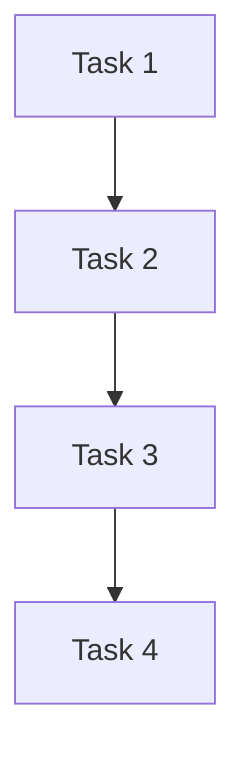

## 介绍

Apache Airflow 是一个用于编排和调度复杂工作流的开源工具。它的Web UI界面是用户与Airflow交互的主要方式，提供了直观的可视化工具来监控、管理和调试工作流。本文将带你逐步了解Airflow UI的核心功能，并通过实际案例展示如何使用这些功能。

## Airflow UI的核心功能

### 1. **DAGs（有向无环图）列表**

DAGs列表是Airflow UI的主页，展示了所有已定义的工作流（DAGs）。每个DAG都有一个状态指示器，显示其当前状态（如运行中、成功、失败等）。

- **状态颜色**：
  - 绿色：DAG运行成功
  - 红色：DAG运行失败
  - 蓝色：DAG正在运行
  - 灰色：DAG未运行

:::tip
你可以通过点击DAG名称来查看其详细信息，包括任务状态、运行历史和日志。
:::

### 2. **DAG详情页面**

点击某个DAG后，你将进入DAG详情页面。该页面提供了以下信息：

- **Graph View**：以图形化的方式展示DAG的任务及其依赖关系。
- **Tree View**：以树状结构展示DAG的运行历史。
- **Code View**：显示DAG的Python代码。
- **Task Duration**：展示每个任务的执行时间。
- **Gantt Chart**：甘特图展示任务的执行时间线。

### 3. **任务实例详情**

在DAG详情页面中，点击某个任务实例，你将进入任务实例详情页面。该页面提供了以下信息：

- **Task Logs**：任务的执行日志，用于调试和监控。
- **Task Details**：任务的详细信息，包括执行时间、状态、重试次数等。
- **Rendered Template**：展示任务模板渲染后的内容。

:::caution
如果任务失败，务必查看任务日志以了解失败原因。
:::

### 4. **变量（Variables）管理**

Airflow允许你通过UI管理变量，这些变量可以在DAG中使用。你可以在 **Admin > Variables** 中查看、添加、编辑和删除变量。

:::note
变量可以用于存储配置信息，如API密钥、数据库连接字符串等。
:::

### 5. **连接（Connections）管理**

Airflow支持多种外部系统的连接（如数据库、云服务等）。你可以在 **Admin > Connections** 中管理这些连接。

:::tip
确保在创建连接时正确填写连接信息，如主机名、端口、用户名和密码等。
:::

### 6. **任务重试和回填**

Airflow允许你手动触发任务的重试或回填。在DAG详情页面中，你可以选择某个任务实例并点击 **Clear** 按钮来重新运行该任务。

:::warning
重试任务时，请确保任务逻辑是幂等的，以避免数据不一致。
:::

## 实际案例

假设你有一个DAG，用于每天从数据库中提取数据并生成报告。以下是该DAG的UI界面使用场景：

1. **监控DAG状态**：在DAGs列表中，你可以看到该DAG的状态。如果状态为绿色，表示报告生成成功；如果为红色，表示生成失败。
2. **查看任务日志**：如果报告生成失败，你可以点击任务实例查看日志，找出失败原因。
3. **重试任务**：如果失败原因是临时性的（如网络问题），你可以手动重试任务。
4. **管理变量**：如果报告生成需要API密钥，你可以在 **Admin > Variables** 中管理该密钥。

## 总结

Airflow的Web UI界面提供了强大的工具来监控、管理和调试工作流。通过本文的介绍，你应该能够熟练使用Airflow UI的核心功能，并在实际项目中应用这些知识。

## 附加资源

- [Airflow官方文档](https://airflow.apache.org/docs/)
- [Airflow GitHub仓库](https://github.com/apache/airflow)
- [Airflow教程视频](https://www.youtube.com/results?search_query=airflow+tutorial)

## 练习

1. 创建一个简单的DAG，并使用Airflow UI监控其运行状态。
2. 在DAG中添加一个任务，并使用Airflow UI查看其日志。
3. 在 **Admin > Variables** 中添加一个变量，并在DAG中使用该变量。
