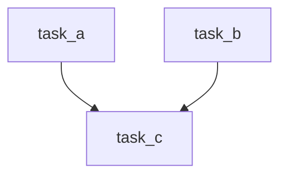
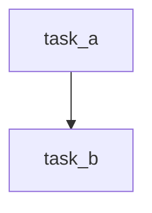

# Airflow DAG触发规则

在Apache Airflow中，DAG（有向无环图）是任务调度的核心。每个DAG由多个任务组成，这些任务按照特定的顺序执行。然而，任务的执行顺序不仅仅依赖于它们在DAG中的位置，还依赖于**触发规则**（Trigger Rules）。触发规则决定了任务在什么条件下可以被触发执行。

## 什么是触发规则？

触发规则是Airflow中用于控制任务执行逻辑的机制。它定义了任务在满足特定条件时才会被触发执行。默认情况下，Airflow使用`all_success`规则，即只有当所有上游任务都成功时，当前任务才会被执行。

## 常见的触发规则

以下是Airflow中常见的触发规则及其含义：

1. **all_success**（默认）：所有上游任务都成功时触发。
2. **all_failed**：所有上游任务都失败时触发。
3. **all_done**：所有上游任务都完成（无论成功或失败）时触发。
4. **one_success**：至少有一个上游任务成功时触发。
5. **one_failed**：至少有一个上游任务失败时触发。
6. **none_failed**：没有上游任务失败时触发（允许跳过）。
7. **none_skipped**：没有上游任务被跳过时触发。
8. **dummy**：无论上游任务状态如何，都会触发。

## 代码示例

以下是一个简单的DAG示例，展示了如何使用不同的触发规则：

```python
from airflow import DAG
from airflow.operators.dummy_operator import DummyOperator
from airflow.utils.dates import days_ago

default_args = {
    'owner': 'airflow',
    'start_date': days_ago(1),
}

dag = DAG(
    'trigger_rules_example',
    default_args=default_args,
    schedule_interval=None,
)

task_a = DummyOperator(task_id='task_a', dag=dag)
task_b = DummyOperator(task_id='task_b', dag=dag)
task_c = DummyOperator(task_id='task_c', dag=dag, trigger_rule='all_success')
task_d = DummyOperator(task_id='task_d', dag=dag, trigger_rule='one_failed')

task_a >> task_c
task_b >> task_c
task_c >> task_d
```

在这个例子中，`task_c`只有在`task_a`和`task_b`都成功时才会执行（`all_success`规则）。而`task_d`则会在`task_c`失败时执行（`one_failed`规则）。

## 实际应用场景

### 场景1：并行任务的成功依赖

假设你有两个并行运行的任务`task_a`和`task_b`，你希望只有在它们都成功时才执行后续任务`task_c`。这时，你可以使用`all_success`规则。



### 场景2：失败处理

在某些情况下，你可能希望在某个任务失败时执行特定的处理任务。例如，如果`task_a`失败，你希望立即执行`task_b`来处理错误。这时，你可以使用`one_failed`规则。



## 总结

触发规则是Airflow中控制任务执行顺序和条件的重要机制。通过合理使用触发规则，你可以更灵活地控制DAG的执行流程，确保任务在正确的条件下被执行。

## 附加资源

- [Airflow官方文档 - Trigger Rules](https://airflow.apache.org/docs/apache-airflow/stable/concepts/dags.html#trigger-rules)
- [Airflow GitHub仓库](https://github.com/apache/airflow)

## 练习

1. 创建一个DAG，包含三个任务`task_a`、`task_b`和`task_c`，要求`task_c`只有在`task_a`成功且`task_b`失败时才会执行。
2. 修改上述DAG，使得`task_c`在任何情况下都会执行，无论`task_a`和`task_b`的状态如何。

通过完成这些练习，你将更深入地理解Airflow中的触发规则及其应用。