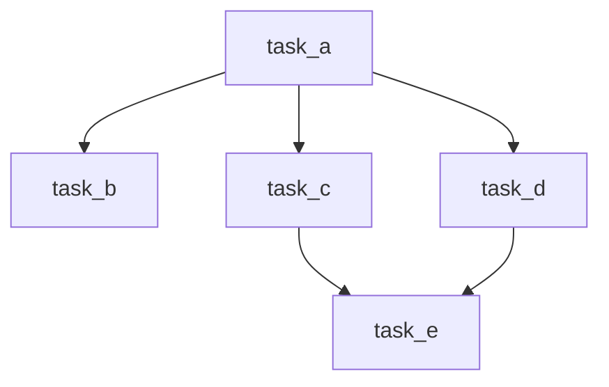

# Airflow 任务Dependencies

在Apache Airflow中，任务（Task）是工作流的基本构建块。每个任务代表一个独立的操作单元，而任务之间的依赖关系决定了它们的执行顺序。理解如何定义和管理这些依赖关系是构建高效、可靠工作流的关键。

## 什么是任务依赖关系？

任务依赖关系定义了任务之间的执行顺序。在Airflow中，任务可以依赖于其他任务的完成状态。例如，任务B可能需要在任务A成功完成后才能开始执行。这种依赖关系确保了工作流的逻辑顺序，避免了任务在错误的时间执行。

## 如何定义任务依赖关系

在Airflow中，任务依赖关系通过操作符（Operator）的 `>>` 和 `<<` 符号来定义。这些符号允许你直观地表达任务之间的依赖关系。

### 示例：简单的任务依赖关系

假设我们有两个任务：`task_a` 和 `task_b`，我们希望 `task_b` 在 `task_a` 完成后执行。可以使用以下代码定义这种依赖关系：

```python
from airflow import DAG
from airflow.operators.dummy_operator import DummyOperator
from datetime import datetime

dag = DAG(
    'simple_dependency_example',
    start_date=datetime(2023, 1, 1),
    schedule_interval='@daily'
)

task_a = DummyOperator(task_id='task_a', dag=dag)
task_b = DummyOperator(task_id='task_b', dag=dag)

task_a >> task_b  # task_b 依赖于 task_a
```

在这个例子中，`task_b` 将在 `task_a` 完成后执行。

### 示例：复杂的任务依赖关系

有时，任务之间的依赖关系可能更加复杂。例如，你可能希望多个任务依赖于一个任务，或者一个任务依赖于多个任务。以下是一个更复杂的示例：

```python
task_c = DummyOperator(task_id='task_c', dag=dag)
task_d = DummyOperator(task_id='task_d', dag=dag)
task_e = DummyOperator(task_id='task_e', dag=dag)

task_a >> [task_c, task_d]  # task_c 和 task_d 都依赖于 task_a
[task_c, task_d] >> task_e  # task_e 依赖于 task_c 和 task_d
```

在这个例子中，`task_c` 和 `task_d` 都依赖于 `task_a`，而 `task_e` 则依赖于 `task_c` 和 `task_d`。

## 任务依赖关系的可视化

Airflow提供了强大的可视化工具，帮助你理解任务之间的依赖关系。你可以通过Airflow的Web界面查看DAG的图形表示，直观地了解任务的执行顺序。



## 实际应用场景

### 数据管道中的任务依赖关系

假设你正在构建一个数据管道，需要从多个数据源提取数据，进行转换，然后加载到目标数据库中。你可以使用Airflow来定义这些任务的依赖关系，确保数据在正确的时间被处理和加载。

```python
extract_data = PythonOperator(
    task_id='extract_data',
    python_callable=extract_data_function,
    dag=dag
)

transform_data = PythonOperator(
    task_id='transform_data',
    python_callable=transform_data_function,
    dag=dag
)

load_data = PythonOperator(
    task_id='load_data',
    python_callable=load_data_function,
    dag=dag
)

extract_data >> transform_data >> load_data
```

在这个例子中，`transform_data` 任务依赖于 `extract_data` 任务的完成，而 `load_data` 任务则依赖于 `transform_data` 任务的完成。

## 总结

任务依赖关系是Airflow中构建工作流的核心概念。通过定义任务之间的依赖关系，你可以确保任务按预期顺序执行，从而构建高效、可靠的工作流。无论是简单的线性依赖，还是复杂的并行依赖，Airflow都提供了灵活的工具来满足你的需求。

## 附加资源

- [Airflow官方文档](https://airflow.apache.org/docs/)
- [Airflow教程](https://airflow.apache.org/docs/apache-airflow/stable/tutorial.html)
- [Airflow任务依赖关系示例](https://airflow.apache.org/docs/apache-airflow/stable/concepts.html#task-dependencies)

## 练习

1. 创建一个包含三个任务的DAG，其中第二个任务依赖于第一个任务，第三个任务依赖于第二个任务。
2. 修改上述DAG，使得第三个任务同时依赖于第一个和第二个任务。
3. 使用Airflow的Web界面查看DAG的图形表示，并验证任务依赖关系是否正确。

通过完成这些练习，你将更好地理解如何在Airflow中定义和管理任务依赖关系。