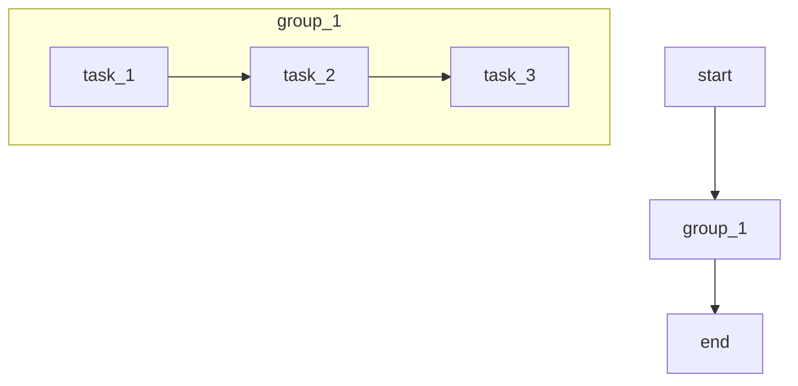

# Airflow Tasks 分组

在 Apache Airflow 中，DAG（有向无环图）是工作流的核心。随着工作流变得越来越复杂，DAG 中的任务数量也会急剧增加。为了保持代码的可读性和可维护性，Airflow 提供了 **任务分组（Task Groups）** 功能。任务分组允许你将相关的任务组织在一起，形成一个逻辑单元，从而简化 DAG 的结构。

## 什么是任务分组？

任务分组是 Airflow 2.0 引入的一个功能，它允许你将多个任务组合成一个逻辑组。这个组可以像单个任务一样被引用和管理，同时仍然保留组内任务的独立性。任务分组特别适用于以下场景：

- 将相关的任务组织在一起，提升代码的可读性。
- 在复杂的 DAG 中，减少任务的嵌套层级。
- 复用任务逻辑，避免重复代码。

## 如何使用任务分组？

在 Airflow 中，任务分组通过 `TaskGroup` 类实现。以下是一个简单的示例，展示如何在 DAG 中使用任务分组。

### 示例：简单的任务分组

```python
from airflow import DAG
from airflow.operators.dummy import DummyOperator
from airflow.utils.task_group import TaskGroup
from airflow.utils.dates import days_ago

with DAG(
    dag_id="task_group_example",
    start_date=days_ago(1),
    schedule_interval=None,
) as dag:

    start = DummyOperator(task_id="start")

    with TaskGroup(group_id="group_1") as group_1:
        task_1 = DummyOperator(task_id="task_1")
        task_2 = DummyOperator(task_id="task_2")
        task_3 = DummyOperator(task_id="task_3")

        task_1 >> task_2 >> task_3

    end = DummyOperator(task_id="end")

    start >> group_1 >> end
```

在这个示例中，我们创建了一个包含三个任务的组 `group_1`。这些任务被组织在一起，并通过 `>>` 操作符定义了它们的依赖关系。最终，`group_1` 作为一个整体与 `start` 和 `end` 任务连接。

### 任务分组的可视化

在 Airflow 的 UI 中，任务分组会以折叠的形式显示。你可以点击组名展开或折叠组内的任务。以下是一个 Mermaid 图表示例，展示了任务分组的结构：



## 任务分组的实际应用场景

任务分组在以下场景中非常有用：

1. **数据处理管道**：将数据提取、转换和加载（ETL）的各个阶段分组。
2. **多环境部署**：将开发、测试和生产环境的部署任务分组。
3. **复杂依赖管理**：将具有复杂依赖关系的任务组织在一起，简化 DAG 结构。

### 示例：ETL 管道中的任务分组

以下是一个更复杂的示例，展示了如何在 ETL 管道中使用任务分组：

```python
from airflow import DAG
from airflow.operators.dummy import DummyOperator
from airflow.utils.task_group import TaskGroup
from airflow.utils.dates import days_ago

with DAG(
    dag_id="etl_pipeline",
    start_date=days_ago(1),
    schedule_interval=None,
) as dag:

    start = DummyOperator(task_id="start")

    with TaskGroup(group_id="extract") as extract:
        extract_task_1 = DummyOperator(task_id="extract_task_1")
        extract_task_2 = DummyOperator(task_id="extract_task_2")
        extract_task_1 >> extract_task_2

    with TaskGroup(group_id="transform") as transform:
        transform_task_1 = DummyOperator(task_id="transform_task_1")
        transform_task_2 = DummyOperator(task_id="transform_task_2")
        transform_task_1 >> transform_task_2

    with TaskGroup(group_id="load") as load:
        load_task_1 = DummyOperator(task_id="load_task_1")
        load_task_2 = DummyOperator(task_id="load_task_2")
        load_task_1 >> load_task_2

    end = DummyOperator(task_id="end")

    start >> extract >> transform >> load >> end
```

在这个示例中，我们将 ETL 管道的各个阶段（提取、转换、加载）分别分组，并通过任务分组清晰地展示了管道的逻辑结构。

## 总结

任务分组是 Airflow 中一个强大的功能，能够帮助你更好地组织和管理复杂的 DAG。通过将相关的任务组合在一起，你可以提升代码的可读性和可维护性，同时简化依赖关系的管理。

:::tip 提示
在实际项目中，尽量将逻辑相关的任务分组，避免创建过于复杂的 DAG 结构。
:::

## 附加资源与练习

- **官方文档**：阅读 [Airflow TaskGroup 官方文档](https://airflow.apache.org/docs/apache-airflow/stable/concepts/task-groups.html) 以了解更多高级用法。
- **练习**：尝试在现有的 DAG 中引入任务分组，观察其对代码结构和 UI 显示的影响。

通过掌握任务分组，你将能够更高效地构建和管理复杂的 Airflow DAG。继续探索 Airflow 的其他功能，提升你的工作流自动化能力！