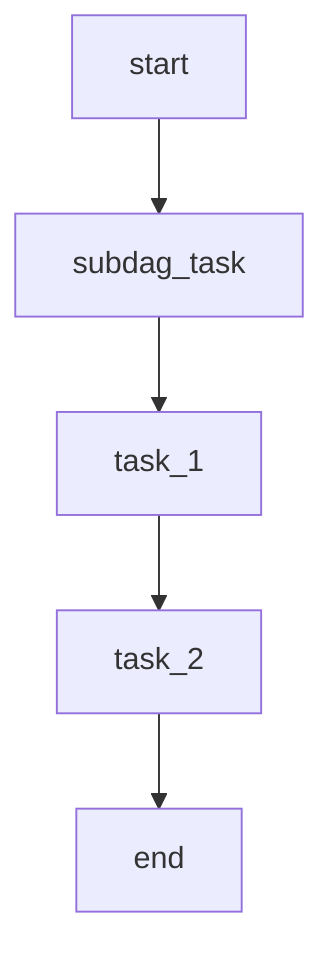

# Airflow 子 DAG

在 Apache Airflow 中，DAG（有向无环图）是用于定义工作流的核心概念。随着工作流变得越来越复杂，管理和维护这些 DAG 可能会变得困难。这时，**子 DAG** 就派上用场了。子 DAG 允许你将一个复杂的 DAG 分解为多个较小的、可重用的 DAG，从而使代码更易于管理和维护。

## 什么是子 DAG？

子 DAG 是嵌套在父 DAG 中的 DAG。它允许你将一组相关的任务封装在一个独立的 DAG 中，然后在父 DAG 中引用它。子 DAG 的主要目的是简化复杂工作流的管理，同时提高代码的可重用性。

:::note
子 DAG 在 Airflow 1.x 中非常流行，但在 Airflow 2.x 中，官方推荐使用 **TaskGroup** 来代替子 DAG，因为 TaskGroup 提供了更好的性能和更简洁的语法。不过，了解子 DAG 仍然是有价值的，尤其是在维护旧代码时。
:::

## 如何创建子 DAG？

要创建子 DAG，你需要定义一个独立的 DAG，然后在父 DAG 中使用 `SubDagOperator` 来引用它。以下是一个简单的示例：

### 1. 定义子 DAG

首先，我们定义一个子 DAG，它包含两个任务：`task_1` 和 `task_2`。

```python
from airflow import DAG
from airflow.operators.dummy import DummyOperator
from airflow.utils.dates import days_ago

def create_subdag(parent_dag_name, child_dag_name, args):
    dag_subdag = DAG(
        dag_id=f'{parent_dag_name}.{child_dag_name}',
        default_args=args,
        schedule_interval=None,
    )

    task_1 = DummyOperator(
        task_id='task_1',
        dag=dag_subdag,
    )

    task_2 = DummyOperator(
        task_id='task_2',
        dag=dag_subdag,
    )

    task_1 >> task_2

    return dag_subdag
```

### 2. 在父 DAG 中使用子 DAG

接下来，我们在父 DAG 中使用 `SubDagOperator` 来引用子 DAG。

```python
from airflow import DAG
from airflow.operators.subdag import SubDagOperator
from airflow.utils.dates import days_ago

default_args = {
    'owner': 'airflow',
    'start_date': days_ago(1),
}

dag = DAG(
    dag_id='parent_dag',
    default_args=default_args,
    schedule_interval=None,
)

start_task = DummyOperator(
    task_id='start',
    dag=dag,
)

subdag_task = SubDagOperator(
    task_id='subdag_task',
    subdag=create_subdag('parent_dag', 'subdag_task', default_args),
    dag=dag,
)

end_task = DummyOperator(
    task_id='end',
    dag=dag,
)

start_task >> subdag_task >> end_task
```

### 3. 运行父 DAG

当你运行父 DAG 时，子 DAG 中的任务也会被触发。父 DAG 和子 DAG 的任务关系如下：



## 实际应用场景

子 DAG 在以下场景中非常有用：

1. **复杂工作流的模块化**：当你的工作流包含多个独立的逻辑部分时，可以将每个部分封装为一个子 DAG，从而使父 DAG 更加简洁。
2. **任务重用**：如果你有多个 DAG 需要执行相同的任务序列，可以将这些任务封装为一个子 DAG，然后在多个父 DAG 中重用。
3. **团队协作**：不同的团队可以负责不同的子 DAG，从而简化协作和代码管理。

:::caution
虽然子 DAG 在某些情况下非常有用，但它们也有一些缺点。例如，子 DAG 会增加 Airflow 的调度复杂性，并且可能会导致性能问题。因此，在 Airflow 2.x 中，官方推荐使用 **TaskGroup** 来代替子 DAG。
:::

## 总结

子 DAG 是 Apache Airflow 中用于简化复杂工作流管理的重要工具。通过将一组相关的任务封装在一个独立的 DAG 中，你可以使代码更易于维护和重用。然而，随着 Airflow 2.x 的发布，官方推荐使用 **TaskGroup** 来代替子 DAG，因为 TaskGroup 提供了更好的性能和更简洁的语法。

## 附加资源

- [Airflow 官方文档 - SubDagOperator](https://airflow.apache.org/docs/apache-airflow/stable/_api/airflow/operators/subdag/index.html)
- [Airflow 官方文档 - TaskGroup](https://airflow.apache.org/docs/apache-airflow/stable/concepts/taskgroup.html)
- [Airflow 最佳实践](https://airflow.apache.org/docs/apache-airflow/stable/best-practices.html)

## 练习

1. 创建一个包含两个子 DAG 的父 DAG，并确保子 DAG 中的任务按顺序执行。
2. 将子 DAG 替换为 TaskGroup，并比较两者的代码复杂性和性能。

通过完成这些练习，你将更好地理解子 DAG 和 TaskGroup 的使用场景和优缺点。