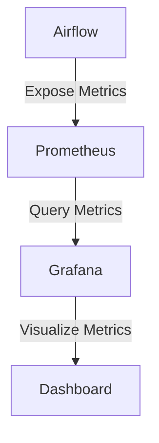
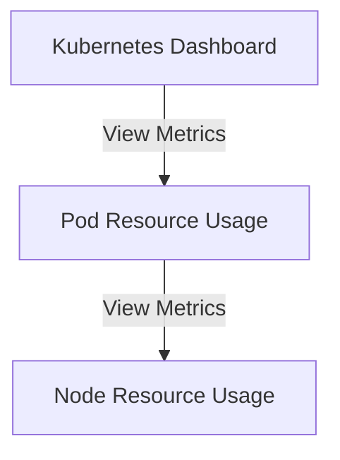

# Airflow 资源使用监控

Apache Airflow 是一个强大的工作流管理工具，广泛用于数据管道的编排和调度。随着任务数量和复杂性的增加，监控 Airflow 的资源使用情况变得至关重要。通过监控资源使用情况，您可以确保任务高效运行，避免资源瓶颈，并优化整体性能。

## 什么是资源使用监控？

资源使用监控是指跟踪和分析 Airflow 系统中各种资源（如 CPU、内存、磁盘 I/O 和网络带宽）的使用情况。通过监控这些资源，您可以识别潜在的性能问题，优化任务调度，并确保系统在高负载下仍能稳定运行。

## 为什么需要监控资源使用情况？

1. **性能优化**：通过监控资源使用情况，您可以识别哪些任务消耗了过多的资源，从而优化这些任务的性能。
2. **故障排除**：当任务失败或系统变慢时，资源使用监控可以帮助您快速定位问题。
3. **容量规划**：了解资源使用情况有助于您规划未来的硬件需求，确保系统能够应对不断增长的工作负载。

## 如何监控 Airflow 的资源使用情况？

### 1. 使用 Airflow 的内置监控工具

Airflow 提供了一些内置的监控工具，可以帮助您跟踪任务的执行情况和资源使用情况。

#### 使用 Airflow 的日志系统

Airflow 的日志系统记录了每个任务的执行日志，您可以通过日志查看任务的资源使用情况。例如，您可以在日志中查找以下信息：

- 任务的启动时间和结束时间
- 任务执行期间的内存使用情况
- 任务的 CPU 使用率

```python
# 示例：查看任务的日志
from airflow.models import TaskInstance
task_instance = TaskInstance(task=my_task, execution_date=execution_date)
logs = task_instance.log_filepath
print(logs)
```

#### 使用 Airflow 的 Metrics API

Airflow 提供了一个 Metrics API，您可以通过该 API 获取系统的各种指标，如任务执行时间、任务失败率等。

```python
# 示例：使用 Metrics API 获取任务执行时间
from airflow.metrics import Stats
task_duration = Stats.get_value("task_duration", tags={"task_id": "my_task"})
print(f"Task duration: {task_duration} seconds")
```

### 2. 使用外部监控工具

除了 Airflow 的内置工具，您还可以使用外部监控工具来更全面地监控资源使用情况。

#### 使用 Prometheus 和 Grafana

Prometheus 是一个开源的监控和警报工具，Grafana 是一个开源的可视化工具。您可以将 Airflow 与 Prometheus 和 Grafana 集成，以实时监控资源使用情况。



#### 配置 Prometheus 监控 Airflow

首先，您需要在 Airflow 中配置 Prometheus 的 Exporter，以便 Prometheus 可以抓取 Airflow 的指标。

```yaml
# 示例：配置 Prometheus Exporter
metrics:
  prometheus:
    enabled: true
    port: 9111
```

然后，您可以在 Prometheus 中配置抓取任务，以定期从 Airflow 获取指标。

```yaml
# 示例：Prometheus 配置
scrape_configs:
  - job_name: 'airflow'
    static_configs:
      - targets: ['airflow:9111']
```

最后，您可以在 Grafana 中创建仪表板，以可视化 Prometheus 收集的指标。

### 3. 使用 Kubernetes 的资源监控

如果您的 Airflow 部署在 Kubernetes 上，您可以使用 Kubernetes 的资源监控工具来监控 Airflow 的资源使用情况。

#### 使用 Kubernetes Metrics Server

Kubernetes Metrics Server 提供了集群中 Pod 和节点的资源使用情况。您可以使用 `kubectl top` 命令查看资源使用情况。

```bash
# 示例：查看 Pod 的资源使用情况
kubectl top pod -n airflow
```

#### 使用 Kubernetes Dashboard

Kubernetes Dashboard 是一个基于 Web 的用户界面，您可以使用它来监控集群中的资源使用情况。



## 实际案例：优化 Airflow 任务的资源使用

假设您有一个 Airflow DAG，其中包含一个消耗大量 CPU 的任务。通过监控资源使用情况，您发现该任务在高峰期占用了过多的 CPU 资源，导致其他任务无法及时执行。

### 优化步骤

1. **识别问题任务**：通过 Airflow 的日志和 Metrics API，您发现 `my_cpu_intensive_task` 在高峰期占用了 90% 的 CPU 资源。
2. **调整任务配置**：您可以通过调整任务的 `executor_config` 来限制该任务的 CPU 使用率。

```python
# 示例：调整任务的 CPU 使用率
my_cpu_intensive_task = PythonOperator(
    task_id='my_cpu_intensive_task',
    python_callable=my_function,
    executor_config={
        "KubernetesExecutor": {
            "resources": {
                "requests": {"cpu": "1"},
                "limits": {"cpu": "2"}
            }
        }
    },
    dag=dag,
)
```

3. **重新部署并监控**：重新部署 DAG 后，您继续监控资源使用情况，确保任务在高峰期不再占用过多的 CPU 资源。

## 总结

监控 Airflow 的资源使用情况是确保系统高效运行的关键步骤。通过使用 Airflow 的内置工具和外部监控工具，您可以识别性能瓶颈、优化任务调度，并确保系统在高负载下仍能稳定运行。

## 附加资源

- [Airflow 官方文档](https://airflow.apache.org/docs/)
- [Prometheus 官方文档](https://prometheus.io/docs/)
- [Grafana 官方文档](https://grafana.com/docs/)
- [Kubernetes 官方文档](https://kubernetes.io/docs/)

## 练习

1. 配置 Airflow 的 Prometheus Exporter，并在 Grafana 中创建一个仪表板，显示任务的 CPU 和内存使用情况。
2. 使用 Kubernetes Metrics Server 监控 Airflow Pod 的资源使用情况，并尝试优化一个高资源消耗的任务。