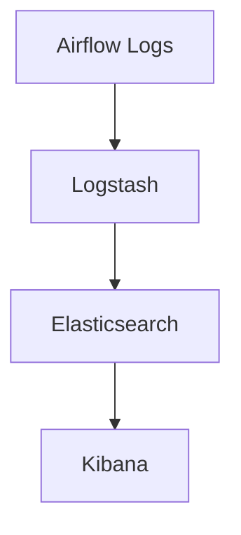

# Airflow 安全审计

## 介绍

在Apache Airflow中，安全审计是确保系统安全性和合规性的重要步骤。通过审计，您可以跟踪和记录系统中的关键操作，识别潜在的安全威胁，并确保所有操作都符合组织的安全策略。本文将介绍如何在Airflow中实施安全审计，并提供实际的代码示例和案例。

## 为什么需要安全审计？

安全审计的主要目的是：

1. **跟踪操作**：记录谁在何时执行了什么操作。
2. **识别威胁**：通过分析日志，识别潜在的安全威胁。
3. **合规性**：确保系统操作符合法律法规和内部政策。

## 实施安全审计的步骤

### 1. 启用日志记录

Airflow默认会记录所有任务的执行日志，但您可以通过配置来增强日志记录的详细程度。在`airflow.cfg`中，您可以设置日志级别和日志存储位置。

```python
[logging]
# 设置日志级别为DEBUG
logging_level = DEBUG

# 设置日志存储位置
base_log_folder = /path/to/logs
```

### 2. 自定义日志记录

您可以通过编写自定义日志处理器来记录特定的操作。例如，记录所有DAG的触发和执行情况。

```python
import logging
from airflow.models import DagRun

def log_dag_run(dag_run: DagRun):
    logger = logging.getLogger(__name__)
    logger.info(f"DAG {dag_run.dag_id} triggered by {dag_run.execution_date}")

# 在DAG定义中调用
log_dag_run(dag_run)
```

### 3. 使用Airflow的审计日志插件

Airflow社区提供了一些插件，可以帮助您更轻松地实施安全审计。例如，`airflow-audit-log-plugin`可以记录所有用户操作和系统事件。

```python
from airflow.plugins_manager import AirflowPlugin
from airflow_audit_log_plugin import AuditLogPlugin

class MyAuditLogPlugin(AirflowPlugin):
    name = "audit_log_plugin"
    hooks = []
    macros = []
    admin_views = []
    flask_blueprints = []
    menu_links = []
    appbuilder_views = []
    appbuilder_menu_items = []
    global_operator_extra_links = []
    operator_extra_links = []

# 注册插件
plugins = [MyAuditLogPlugin]
```

### 4. 分析日志

定期分析日志是安全审计的关键步骤。您可以使用工具如ELK Stack（Elasticsearch, Logstash, Kibana）来集中管理和分析日志。



## 实际案例

假设您在一个金融公司工作，需要确保所有DAG的执行都符合合规要求。您可以通过以下步骤实施安全审计：

1. **启用详细日志记录**：在`airflow.cfg`中设置日志级别为`DEBUG`。
2. **自定义日志记录**：编写一个自定义日志处理器，记录所有DAG的触发和执行情况。
3. **使用审计日志插件**：安装并配置`airflow-audit-log-plugin`，记录所有用户操作。
4. **分析日志**：使用ELK Stack集中管理和分析日志，识别潜在的安全威胁。

## 总结

安全审计是确保Apache Airflow系统安全性和合规性的重要步骤。通过启用详细日志记录、自定义日志处理、使用审计日志插件和定期分析日志，您可以有效地实施安全审计。

## 附加资源

- [Airflow官方文档](https://airflow.apache.org/docs/)
- [ELK Stack官方文档](https://www.elastic.co/guide/index.html)
- [Airflow Audit Log Plugin](https://github.com/airflow-plugins/airflow-audit-log-plugin)

## 练习

1. 在您的Airflow环境中启用详细日志记录，并记录一个DAG的执行情况。
2. 编写一个自定义日志处理器，记录所有DAG的触发和执行情况。
3. 安装并配置`airflow-audit-log-plugin`，记录所有用户操作。
4. 使用ELK Stack集中管理和分析日志，识别潜在的安全威胁。