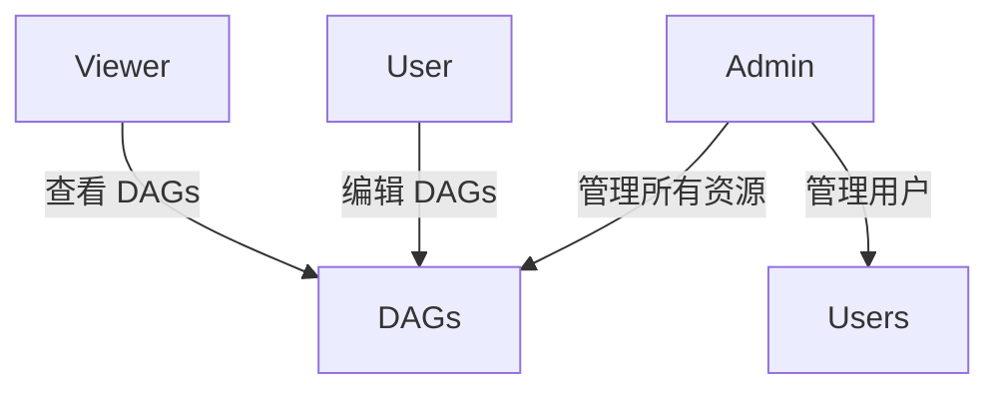

## 介绍

Apache Airflow 是一个强大的工作流管理平台，广泛用于数据管道的编排和调度。随着 Airflow 的使用场景越来越广泛，其 API 接口的安全性也变得至关重要。API 是 Airflow 与外部系统交互的主要方式，因此确保 API 的安全性可以防止未经授权的访问和数据泄露。

本文将逐步介绍如何保护 Airflow 的 API 接口，包括身份验证、授权机制以及一些实际应用场景。

---

## Airflow API 的身份验证

Airflow 提供了多种身份验证机制来保护其 API 接口。以下是常见的几种方式：

### 1. 基本身份验证（Basic Authentication）

基本身份验证是最简单的身份验证方式。用户需要提供用户名和密码，Airflow 会验证这些凭据是否有效。

```python
import requests
from requests.auth import HTTPBasicAuth

response = requests.get(
    "http://localhost:8080/api/v1/dags",
    auth=HTTPBasicAuth("username", "password")
)
print(response.json())
```

**输入：**  
- 用户名和密码  
- API 端点（如 `http://localhost:8080/api/v1/dags`）

**输出：**  
- 返回 DAG 列表的 JSON 数据

:::caution
基本身份验证的安全性较低，因为用户名和密码以明文形式传输。建议在生产环境中使用更安全的身份验证方式。
:::

### 2. OAuth 身份验证

OAuth 是一种更安全的身份验证方式，适用于需要与第三方服务集成的场景。Airflow 支持通过 OAuth 2.0 进行身份验证。

```python
import requests

headers = {
    "Authorization": "Bearer <access_token>"
}
response = requests.get(
    "http://localhost:8080/api/v1/dags",
    headers=headers
)
print(response.json())
```

**输入：**  
- OAuth 访问令牌  
- API 端点

**输出：**  
- 返回 DAG 列表的 JSON 数据

:::tip
OAuth 2.0 提供了更高的安全性，适合需要与外部系统集成的场景。
:::

---

## Airflow API 的授权机制

身份验证只是第一步，授权机制确保用户只能访问其权限范围内的资源。Airflow 使用基于角色的访问控制（RBAC）来管理用户权限。

### 1. 角色与权限

Airflow 提供了多种预定义角色，如 `Admin`、`User`、`Viewer` 等。每个角色都有不同的权限级别。



:::note
管理员可以创建和管理用户，并为用户分配适当的角色。
:::

### 2. 自定义角色

如果需要更细粒度的权限控制，可以创建自定义角色并分配特定权限。

```bash
# 创建自定义角色
airflow roles create --role CustomRole --permissions can_read,can_edit
```

**输入：**  
- 角色名称（如 `CustomRole`）  
- 权限列表（如 `can_read`, `can_edit`）

**输出：**  
- 成功创建自定义角色

---

## 实际应用场景

### 场景 1：保护生产环境的 API

在生产环境中，API 接口可能会暴露给多个团队或外部系统。通过 OAuth 和 RBAC，可以确保只有授权用户和系统能够访问 API。

### 场景 2：自动化工作流的 API 调用

在自动化工作流中，可能需要通过 API 触发 DAG 或查询任务状态。使用 OAuth 访问令牌可以确保调用的安全性。

```python
import requests

def trigger_dag(dag_id, access_token):
    headers = {
        "Authorization": f"Bearer {access_token}"
    }
    response = requests.post(
        f"http://localhost:8080/api/v1/dags/{dag_id}/dagRuns",
        headers=headers,
        json={"conf": {}}
    )
    return response.json()

# 示例调用
access_token = "your_access_token"
dag_id = "example_dag"
print(trigger_dag(dag_id, access_token))
```

**输入：**  
- DAG ID  
- OAuth 访问令牌

**输出：**  
- 返回触发 DAG 的结果

---

## 总结

保护 Airflow API 接口是确保数据和工作流安全的关键步骤。通过身份验证（如基本身份验证或 OAuth）和授权机制（如 RBAC），可以有效防止未经授权的访问。在实际应用中，结合 OAuth 和 RBAC 可以提供更高的安全性。

---

## 附加资源与练习

### 资源
- [Airflow 官方文档 - API 安全](https://airflow.apache.org/docs/apache-airflow/stable/security/api.html)
- [OAuth 2.0 详解](https://oauth.net/2/)

### 练习
1. 配置 Airflow 使用 OAuth 2.0 进行身份验证。
2. 创建一个自定义角色，并为其分配特定权限。
3. 编写一个脚本，通过 API 触发 DAG 并查询其状态。