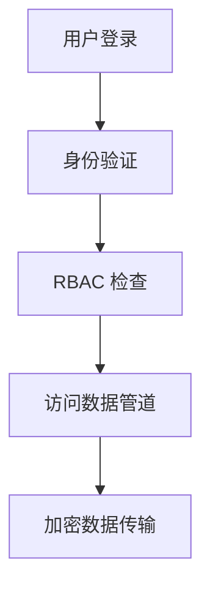
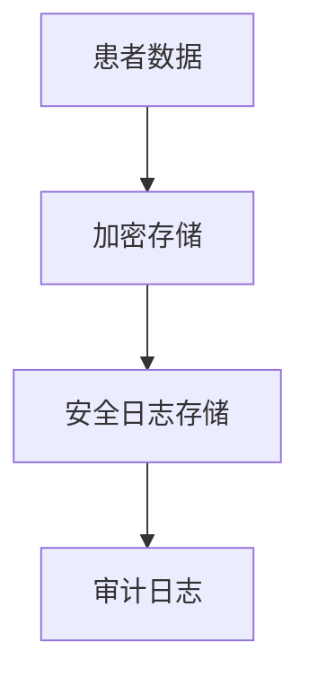

## 介绍

Apache Airflow 是一个强大的工作流管理平台，广泛用于数据管道的编排和调度。然而，随着其功能的强大，安全性也成为一个不可忽视的问题。本文将介绍如何通过最佳实践来确保 Airflow 的安全性，包括身份验证、授权、加密和日志管理等方面。

## 1. 身份验证与授权

### 1.1 启用身份验证

默认情况下，Airflow 不启用身份验证，这意味着任何人都可以访问 Web UI 并执行操作。为了确保安全性，您需要启用身份验证。

```python
# 在 airflow.cfg 中启用身份验证
[webserver]
authenticate = True
auth_backend = airflow.contrib.auth.backends.password_auth
```

### 1.2 使用角色和权限

Airflow 提供了基于角色的访问控制（RBAC），您可以通过配置不同的角色和权限来限制用户的操作。

```python
# 在 airflow.cfg 中启用 RBAC
[webserver]
rbac = True
```

:::tip
您可以通过 Airflow 的 Web UI 创建和管理用户、角色和权限。
:::

## 2. 加密与安全通信

### 2.1 使用 HTTPS

确保 Airflow Web UI 和 API 通过 HTTPS 进行通信，以防止数据在传输过程中被窃取。

```python
# 在 airflow.cfg 中配置 HTTPS
[webserver]
web_server_ssl_cert = /path/to/cert.pem
web_server_ssl_key = /path/to/key.pem
```

### 2.2 加密敏感数据

Airflow 允许您加密敏感数据，如数据库连接信息和 API 密钥。您可以使用 Fernet 密钥来加密这些数据。

```python
# 在 airflow.cfg 中配置 Fernet 密钥
[core]
fernet_key = your_fernet_key
```

:::caution
请确保 Fernet 密钥的安全存储，丢失密钥将导致无法解密数据。
:::

## 3. 日志管理与审计

### 3.1 配置日志存储

将 Airflow 的日志存储在安全的位置，并确保只有授权用户可以访问。

```python
# 在 airflow.cfg 中配置日志存储
[core]
base_log_folder = /secure/path/to/logs
```

### 3.2 启用审计日志

启用审计日志以记录所有用户操作，便于追踪和审查。

```python
# 在 airflow.cfg 中启用审计日志
[logging]
audit_log_enabled = True
audit_log_file = /secure/path/to/audit.log
```

## 4. 实际案例

### 4.1 案例：金融数据管道

假设您正在管理一个金融数据管道，其中包含敏感的客户信息。通过启用身份验证、RBAC 和 HTTPS，您可以确保只有授权用户可以访问和操作数据管道。



### 4.2 案例：医疗数据处理

在医疗数据处理场景中，您可以使用 Fernet 密钥加密患者数据，并将日志存储在安全的服务器上，以确保数据的机密性和完整性。



## 总结

通过实施这些最佳实践，您可以显著提高 Apache Airflow 的安全性，保护您的数据和工作流免受未经授权的访问和攻击。请务必定期审查和更新您的安全配置，以应对新的威胁和挑战。

## 附加资源

- [Airflow 官方文档](https://airflow.apache.org/docs/)
- [Airflow 安全指南](https://airflow.apache.org/docs/apache-airflow/stable/security.html)
- [Fernet 加密](https://cryptography.io/en/latest/fernet/)

## 练习

1. 在您的 Airflow 实例中启用身份验证和 RBAC。
2. 配置 HTTPS 并测试其安全性。
3. 使用 Fernet 密钥加密敏感数据，并验证其解密过程。
4. 设置审计日志并记录一些操作，然后审查日志内容。

通过完成这些练习，您将更好地理解和掌握 Airflow 的安全最佳实践。