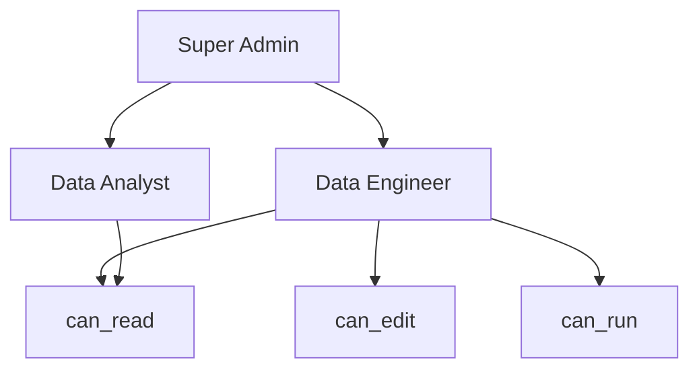

# Airflow RBAC机制

Apache Airflow 是一个强大的工作流调度和管理工具，广泛应用于数据工程和自动化任务中。随着团队规模的扩大和任务的复杂化，确保系统的安全性变得至关重要。Airflow 提供了基于角色的访问控制（RBAC）机制，帮助管理员精细化管理用户权限，确保只有授权用户才能访问和操作特定的资源和功能。

## 什么是RBAC？

RBAC（Role-Based Access Control，基于角色的访问控制）是一种安全模型，通过将权限分配给角色，再将角色分配给用户，来实现对系统资源的访问控制。在 Airflow 中，RBAC 机制允许管理员定义不同的角色，并为每个角色分配特定的权限。用户通过被赋予的角色来获得相应的权限，从而实现对 DAGs、任务、变量等资源的访问控制。

## Airflow RBAC 的核心概念

### 1. 角色（Role）
角色是权限的集合。在 Airflow 中，角色可以包含多个权限，例如“查看 DAG”、“编辑 DAG”、“执行任务”等。管理员可以根据团队的需求创建自定义角色。

### 2. 权限（Permission）
权限是系统中最小的访问控制单元。每个权限对应一个特定的操作或资源访问权限。例如，`can_read` 权限允许用户查看某个资源，而 `can_edit` 权限允许用户编辑该资源。

### 3. 用户（User）
用户是系统中的个体，每个用户可以被分配一个或多个角色。通过角色，用户获得相应的权限。

### 4. 资源（Resource）
资源是系统中需要被保护的对象，例如 DAGs、变量、连接等。每个资源可以被分配特定的权限。

## 配置 Airflow RBAC

Airflow 的 RBAC 功能是通过 Flask AppBuilder（FAB）实现的。要启用 RBAC，需要在 Airflow 的配置文件 `airflow.cfg` 中进行以下设置：

```ini
[webserver]
rbac = True
```

启用 RBAC 后，Airflow 的 Web UI 将显示用户管理和角色管理的界面。

### 创建角色

在 Airflow 中，可以通过 Web UI 或命令行创建角色。以下是通过 Web UI 创建角色的步骤：

1. 登录 Airflow Web UI。
2. 导航到 **Security** > **Roles**。
3. 点击 **Create** 按钮。
4. 输入角色名称，例如 `Data Engineer`。
5. 为该角色分配权限，例如 `can_read`、`can_edit` 等。
6. 点击 **Save** 按钮。

### 分配角色给用户

创建角色后，可以将角色分配给用户。以下是通过 Web UI 分配角色的步骤：

1. 登录 Airflow Web UI。
2. 导航到 **Security** > **Users**。
3. 选择要分配角色的用户。
4. 在 **Roles** 部分，选择刚刚创建的角色，例如 `Data Engineer`。
5. 点击 **Save** 按钮。

## 实际案例

假设我们有一个数据工程团队，团队成员包括数据工程师和数据分析师。我们希望数据工程师能够编辑和运行 DAGs，而数据分析师只能查看 DAGs 的执行状态。

### 步骤 1：创建角色

- 创建 `Data Engineer` 角色，并分配以下权限：
  - `can_read`（查看 DAGs）
  - `can_edit`（编辑 DAGs）
  - `can_run`（运行 DAGs）

- 创建 `Data Analyst` 角色，并分配以下权限：
  - `can_read`（查看 DAGs）

### 步骤 2：分配角色

- 将 `Data Engineer` 角色分配给数据工程师用户。
- 将 `Data Analyst` 角色分配给数据分析师用户。

### 结果

- 数据工程师可以查看、编辑和运行 DAGs。
- 数据分析师只能查看 DAGs 的执行状态，无法编辑或运行 DAGs。

## RBAC 的权限继承

在 Airflow 中，角色可以继承其他角色的权限。例如，可以创建一个 `Super Admin` 角色，继承 `Data Engineer` 和 `Data Analyst` 的所有权限。这样，`Super Admin` 角色将拥有所有权限。



## 总结

Airflow 的 RBAC 机制为系统管理员提供了一种灵活且强大的方式来管理用户权限。通过定义角色、分配权限和将角色分配给用户，管理员可以确保系统的安全性，同时满足不同用户的需求。

:::tip
在实际使用中，建议根据团队的具体需求设计角色和权限，避免过度分配权限，以确保系统的安全性。
:::

## 附加资源

- [Airflow 官方文档 - 安全与身份验证](https://airflow.apache.org/docs/apache-airflow/stable/security/index.html)
- [Flask AppBuilder 文档](https://flask-appbuilder.readthedocs.io/en/latest/)

## 练习

1. 在 Airflow 中创建一个新的角色 `DevOps`，并为其分配以下权限：
   - `can_read`（查看 DAGs）
   - `can_edit`（编辑 DAGs）
   - `can_run`（运行 DAGs）
   - `can_delete`（删除 DAGs）

2. 将 `DevOps` 角色分配给一个新用户，并验证该用户是否能够执行上述操作。

通过以上练习，您将更好地理解 Airflow 的 RBAC 机制，并能够在实际项目中应用它。