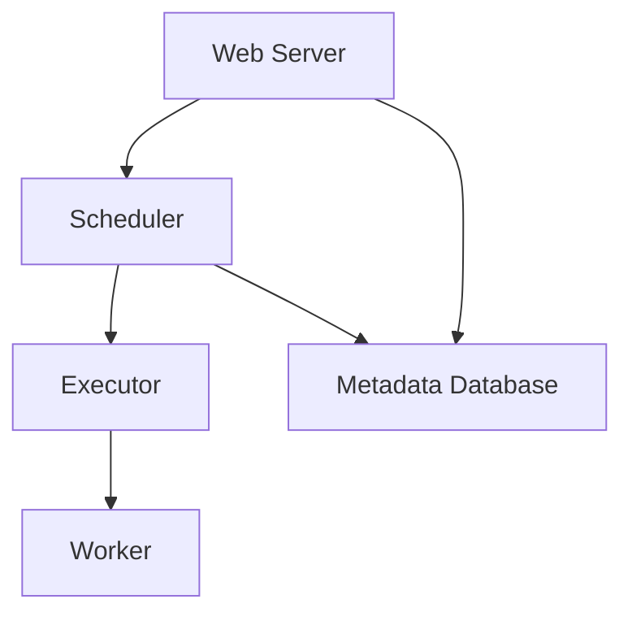
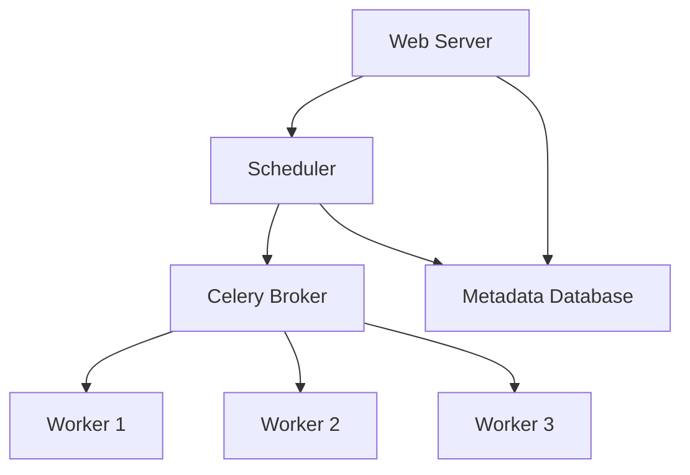

## 介绍

Apache Airflow 是一个用于编排复杂工作流的开源平台。它通过有向无环图（DAG）来定义任务及其依赖关系，并提供了丰富的调度和监控功能。为了在生产环境中高效运行Airflow，理解其部署架构至关重要。本文将详细介绍Airflow的核心组件、部署方式以及如何扩展以满足不同的需求。

## 核心组件

Airflow的部署架构主要由以下几个核心组件组成：

1. **Web Server**：提供用户界面，用于查看和管理DAG、任务状态、日志等。
2. **Scheduler**：负责解析DAG、调度任务，并将任务推送到执行器。
3. **Executor**：负责执行任务。常见的执行器包括`LocalExecutor`、`CeleryExecutor`和`KubernetesExecutor`。
4. **Metadata Database**：存储DAG、任务状态、用户信息等元数据。
5. **Worker**：实际执行任务的节点，通常与`CeleryExecutor`或`KubernetesExecutor`一起使用。



## 部署方式

### 单节点部署

对于小型项目或开发环境，可以使用单节点部署。在这种模式下，所有组件（Web Server、Scheduler、Executor）都运行在同一台机器上。这种部署方式简单易行，但不适合高负载或生产环境。

```bash
# 启动单节点Airflow
airflow webserver
airflow scheduler
```

### 多节点部署

对于生产环境，通常需要将Airflow部署在多个节点上，以提高可用性和扩展性。常见的多节点部署方式包括：

1. **CeleryExecutor**：使用Celery作为任务队列，将任务分发到多个Worker节点。
2. **KubernetesExecutor**：在Kubernetes集群中动态创建Pod来执行任务。



## 扩展与优化

### 水平扩展

通过增加Worker节点，可以水平扩展Airflow的执行能力。使用`CeleryExecutor`时，只需启动更多的Worker节点并连接到同一个消息队列即可。

```bash
# 启动新的Worker节点
airflow celery worker
```

### 垂直扩展

通过增加单个节点的资源（如CPU、内存），可以垂直扩展Airflow的性能。例如，可以为Scheduler分配更多的CPU资源，以提高任务调度的效率。

### 数据库优化

Metadata Database是Airflow的核心组件之一，优化数据库性能可以显著提高Airflow的整体性能。常见的优化措施包括：

- 使用高性能数据库（如PostgreSQL或MySQL）。
- 定期清理历史数据，避免数据库膨胀。

## 实际案例

假设你正在为一个电商平台构建一个数据处理流水线，每天需要处理数百万条订单数据。你可以使用Airflow来编排数据处理任务，并通过`CeleryExecutor`将任务分发到多个Worker节点上执行。

```python
from airflow import DAG
from airflow.operators.python_operator import PythonOperator
from datetime import datetime

def process_order_data():
    # 处理订单数据的逻辑
    pass

dag = DAG('order_processing', description='处理电商平台订单数据',
          schedule_interval='@daily',
          start_date=datetime(2023, 1, 1), catchup=False)

task = PythonOperator(task_id='process_order_data',
                      python_callable=process_order_data,
                      dag=dag)
```

在这个案例中，`CeleryExecutor`可以确保任务在多个Worker节点上并行执行，从而加快数据处理速度。

## 总结

Airflow的部署架构是其高效运行的基础。通过理解其核心组件和部署方式，你可以根据实际需求选择合适的部署策略，并通过水平或垂直扩展来优化性能。对于生产环境，多节点部署和数据库优化是确保Airflow稳定运行的关键。

## 附加资源

- [Apache Airflow官方文档](https://airflow.apache.org/docs/)
- [Airflow部署最佳实践](https://airflow.apache.org/docs/apache-airflow/stable/production-deployment.html)
- [CeleryExecutor配置指南](https://airflow.apache.org/docs/apache-airflow/stable/executor/celery.html)

## 练习

1. 尝试在本地环境中部署一个单节点Airflow实例，并运行一个简单的DAG。
2. 使用`CeleryExecutor`部署一个多节点Airflow集群，并观察任务在多个Worker节点上的执行情况。
3. 优化Metadata Database的性能，记录优化前后的性能差异。

:::tip
在部署Airflow时，务必考虑安全性，例如使用SSL加密通信、设置访问控制等。
:::