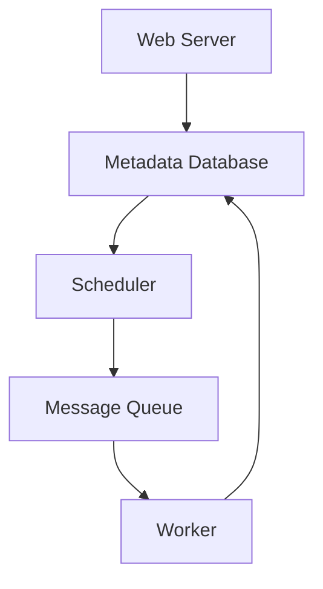

## 介绍

Apache Airflow 是一个强大的工作流调度和管理平台，广泛用于数据管道的编排和自动化。随着任务数量和复杂性的增加，单机部署的 Airflow 可能无法满足需求。此时，**Airflow集群管理**变得至关重要。通过集群管理，您可以扩展 Airflow 的计算能力、提高容错性，并确保高可用性。

本文将逐步介绍 Airflow 集群管理的核心概念、部署策略以及实际应用场景，帮助初学者掌握如何高效管理和扩展 Airflow 集群。

---

## Airflow 集群架构

Airflow 集群通常由以下组件组成：

1. **Web Server**：提供用户界面，用于监控和管理任务。
2. **Scheduler**：负责解析 DAG（有向无环图）并调度任务。
3. **Worker**：执行任务的实际计算节点。
4. **Metadata Database**：存储任务状态、DAG 定义等元数据。
5. **Message Queue**（如 RabbitMQ 或 Redis）：用于 Scheduler 和 Worker 之间的通信。



:::note
**注意**：在集群部署中，每个组件都可以独立扩展，以满足不同的性能需求。
:::

---

## 部署 Airflow 集群

### 1. 选择执行器（Executor）

Airflow 支持多种执行器，选择合适的执行器是集群管理的第一步：

- **LocalExecutor**：适用于单机部署，不支持分布式任务执行。
- **CeleryExecutor**：支持分布式任务执行，适用于集群部署。
- **KubernetesExecutor**：在 Kubernetes 集群中动态创建和销毁任务 Pod。

对于集群管理，推荐使用 **CeleryExecutor** 或 **KubernetesExecutor**。

### 2. 配置消息队列

消息队列是 Scheduler 和 Worker 之间的桥梁。常用的消息队列包括：

- **RabbitMQ**
- **Redis**

以下是一个使用 Redis 作为消息队列的配置示例：

```python
# airflow.cfg
executor = CeleryExecutor
broker_url = redis://redis:6379/0
result_backend = redis://redis:6379/0
```

### 3. 启动集群组件

在集群中，每个组件需要独立启动。以下是一个典型的多节点部署流程：

1. **启动 Metadata Database**：
   ```bash
   docker run -d --name=postgres -e POSTGRES_PASSWORD=airflow postgres:13
   ```
2. **启动 Web Server**：
   ```bash
   airflow webserver
   ```
3. **启动 Scheduler**：
   ```bash
   airflow scheduler
   ```
4. **启动 Worker**：
   ```bash
   airflow celery worker
   ```

:::tip
**提示**：在生产环境中，建议使用 Docker Compose 或 Kubernetes 来管理集群组件的部署。
:::

---

## 扩展 Airflow 集群

### 1. 水平扩展 Worker

通过增加 Worker 节点，可以提高任务执行的并行能力。只需在新节点上启动 Worker 并连接到相同的消息队列即可。

### 2. 高可用性配置

为了提高集群的可用性，可以部署多个 Scheduler 和 Web Server 实例，并使用负载均衡器分发请求。

### 3. 动态资源分配

如果使用 **KubernetesExecutor**，Airflow 可以根据任务需求动态创建和销毁 Pod，从而实现资源的弹性分配。

---

## 实际案例

### 案例：电商平台的数据管道

假设某电商平台需要每天处理数百万条订单数据，并将结果存储到数据仓库中。以下是 Airflow 集群管理的应用场景：

1. **任务调度**：使用 Airflow 调度每日的 ETL（提取、转换、加载）任务。
2. **分布式执行**：通过 CeleryExecutor 将任务分发到多个 Worker 节点，提高处理速度。
3. **高可用性**：部署多个 Scheduler 和 Web Server，确保即使某个节点故障，任务仍能正常执行。

---

## 总结

Airflow 集群管理是确保大规模任务调度高效运行的关键。通过合理配置执行器、消息队列和集群组件，您可以轻松扩展 Airflow 的计算能力并提高系统的可用性。

:::caution
**注意**：在部署集群时，务必监控资源使用情况，避免因资源不足导致任务失败。
:::

---

## 附加资源与练习

### 资源
- [Airflow 官方文档](https://airflow.apache.org/docs/)
- [Celery 官方文档](https://docs.celeryproject.org/en/stable/)

### 练习
1. 尝试在本地使用 Docker Compose 部署一个 Airflow 集群。
2. 使用 CeleryExecutor 配置一个分布式任务，并观察任务的执行情况。
3. 探索 KubernetesExecutor 的使用，了解如何动态分配资源。

通过实践，您将更深入地理解 Airflow 集群管理的核心概念和应用场景。