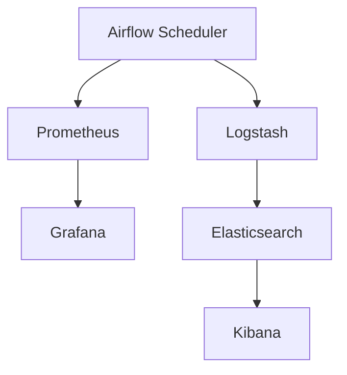

# Airflow DevOps最佳实践

## 介绍

Apache Airflow 是一个开源的工作流管理平台，广泛用于数据管道的编排和调度。随着DevOps文化的普及，将Airflow与CI/CD（持续集成/持续交付）流程结合，可以显著提高工作流的可靠性和可维护性。本文将介绍如何在DevOps环境中使用Airflow，并分享一些最佳实践。

## 什么是Airflow DevOps？

Airflow DevOps 是指将Airflow与DevOps工具和实践结合，以实现工作流的自动化、监控和持续改进。通过CI/CD流程，开发团队可以快速迭代和部署Airflow DAGs（有向无环图），同时确保代码质量和环境一致性。

## 最佳实践

### 1. 使用版本控制系统

将Airflow DAGs存储在版本控制系统（如Git）中是DevOps的基础。这不仅可以跟踪代码变更，还可以与CI/CD工具集成，实现自动化测试和部署。

```bash
# 示例：将DAGs推送到Git仓库
git add dags/
git commit -m "Add new DAG for data processing"
git push origin main
```

### 2. 自动化测试

在CI/CD流程中集成自动化测试，确保DAGs的正确性和稳定性。可以使用Airflow的`unittest`模块编写测试用例。

```python
# 示例：测试DAG的完整性
import unittest
from airflow.models import DagBag

class TestDagIntegrity(unittest.TestCase):
    def test_dag_loading(self):
        dag_bag = DagBag()
        self.assertEqual(len(dag_bag.import_errors), 0, "DAG加载失败")

if __name__ == "__main__":
    unittest.main()
```

### 3. 持续集成与持续交付

使用CI/CD工具（如Jenkins、GitHub Actions）自动化DAGs的部署流程。每次代码提交后，自动运行测试并将DAGs部署到生产环境。

```yaml
# 示例：GitHub Actions配置文件
name: Airflow CI/CD

on:
  push:
    branches:
      - main

jobs:
  test:
    runs-on: ubuntu-latest
    steps:
      - uses: actions/checkout@v2
      - name: Set up Python
        uses: actions/setup-python@v2
        with:
          python-version: '3.8'
      - name: Install dependencies
        run: |
          python -m pip install --upgrade pip
          pip install -r requirements.txt
      - name: Run tests
        run: |
          python -m unittest discover tests
  deploy:
    needs: test
    runs-on: ubuntu-latest
    steps:
      - uses: actions/checkout@v2
      - name: Deploy DAGs
        run: |
          scp -r dags/ user@airflow-server:/path/to/dags/
```

### 4. 环境一致性

使用Docker或Kubernetes确保开发、测试和生产环境的一致性。这可以减少因环境差异导致的问题。

```dockerfile
# 示例：Dockerfile for Airflow
FROM apache/airflow:2.2.3
COPY requirements.txt /
RUN pip install --user -r /requirements.txt
COPY dags/ /usr/local/airflow/dags/
```

### 5. 监控与日志

集成监控工具（如Prometheus、Grafana）和日志管理系统（如ELK Stack），实时监控Airflow的运行状态和日志。



## 实际案例

假设你正在开发一个数据管道，每天从多个数据源提取数据并加载到数据仓库中。通过将Airflow与CI/CD流程结合，你可以实现以下步骤：

1. **开发**：在本地开发DAGs，并推送到Git仓库。
2. **测试**：CI工具自动运行测试，确保DAGs的正确性。
3. **部署**：通过CD工具将DAGs部署到生产环境。
4. **监控**：使用监控工具实时监控数据管道的运行状态。

## 总结

将Airflow与DevOps结合，可以显著提高工作流的可靠性和可维护性。通过版本控制、自动化测试、CI/CD流程、环境一致性和监控，你可以构建一个高效、可靠的Airflow工作流管理系统。

## 附加资源

- [Airflow官方文档](https://airflow.apache.org/docs/)
- [GitHub Actions文档](https://docs.github.com/en/actions)
- [Docker官方文档](https://docs.docker.com/)

## 练习

1. 创建一个简单的Airflow DAG，并将其推送到Git仓库。
2. 配置GitHub Actions，实现DAG的自动化测试和部署。
3. 使用Docker容器化你的Airflow环境，并确保开发和生产环境的一致性。
