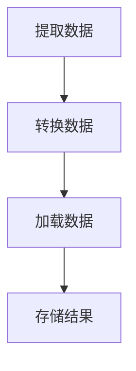

# Airflow DAG部署流程

Apache Airflow 是一个强大的工作流编排工具，广泛用于数据管道的调度和监控。在CI/CD和DevOps环境中，如何高效地部署和管理Airflow DAG（有向无环图）是一个关键问题。本文将详细介绍Airflow DAG的部署流程，帮助初学者理解并掌握这一过程。

## 什么是Airflow DAG？

DAG（有向无环图）是Airflow的核心概念，用于定义任务及其依赖关系。每个DAG由多个任务组成，任务之间通过依赖关系连接，形成一个有向无环图。DAG文件通常以Python脚本的形式编写，定义了任务的执行顺序和逻辑。

## DAG部署流程概述

在CI/CD和DevOps环境中，DAG的部署流程通常包括以下几个步骤：

1. **开发DAG**：编写DAG文件，定义任务及其依赖关系。
2. **版本控制**：将DAG文件提交到版本控制系统（如Git）。
3. **测试**：在开发环境中测试DAG，确保其正确性。
4. **构建和打包**：将DAG文件打包成可部署的格式。
5. **部署**：将DAG文件部署到生产环境的Airflow实例中。
6. **监控和回滚**：监控DAG的执行情况，必要时进行回滚。

## 详细步骤

### 1. 开发DAG

首先，编写DAG文件。以下是一个简单的DAG示例：

```python
from airflow import DAG
from airflow.operators.dummy_operator import DummyOperator
from datetime import datetime

default_args = {
    'owner': 'airflow',
    'start_date': datetime(2023, 1, 1),
}

dag = DAG(
    'example_dag',
    default_args=default_args,
    schedule_interval='@daily',
)

start_task = DummyOperator(task_id='start_task', dag=dag)
end_task = DummyOperator(task_id='end_task', dag=dag)

start_task >> end_task
```

### 2. 版本控制

将DAG文件提交到Git仓库中，确保代码的可追溯性和团队协作。

```bash
git add dags/example_dag.py
git commit -m "Add example DAG"
git push origin main
```

### 3. 测试

在开发环境中测试DAG，确保其逻辑正确。可以使用Airflow的`airflow tasks test`命令来测试单个任务。

```bash
airflow tasks test example_dag start_task 2023-01-01
```

### 4. 构建和打包

在CI/CD管道中，通常会将DAG文件打包成可部署的格式。例如，使用Docker镜像来打包DAG文件。

```dockerfile
FROM apache/airflow:2.5.0
COPY dags/ /usr/local/airflow/dags/
```

### 5. 部署

将打包好的DAG文件部署到生产环境的Airflow实例中。可以使用Kubernetes、Docker Swarm等工具进行部署。

```bash
kubectl apply -f airflow-deployment.yaml
```

### 6. 监控和回滚

使用Airflow的Web UI或CLI工具监控DAG的执行情况。如果发现问题，可以回滚到之前的版本。

```bash
kubectl rollout undo deployment/airflow
```

## 实际案例

假设你正在开发一个数据管道，每天从多个数据源提取数据，进行ETL处理，并将结果存储到数据库中。你可以使用Airflow来编排这个流程，并通过CI/CD管道自动化部署。



## 总结

通过本文，你应该已经了解了如何在CI/CD和DevOps环境中部署Airflow DAG。从开发到部署，再到监控和回滚，每个步骤都至关重要。希望这些内容能帮助你在实际项目中更好地应用Airflow。

## 附加资源

- [Airflow官方文档](https://airflow.apache.org/docs/)
- [CI/CD最佳实践](https://www.redhat.com/en/topics/devops/what-is-ci-cd)
- [Docker官方文档](https://docs.docker.com/)

## 练习

1. 编写一个简单的DAG，包含两个任务：`task1`和`task2`，并设置`task1`依赖`task2`。
2. 使用Git提交你的DAG文件，并在本地测试其执行。
3. 尝试将DAG文件打包成Docker镜像，并部署到Kubernetes集群中。

:::tip
在开发DAG时，建议使用Airflow的`airflow tasks test`命令来测试单个任务，确保其逻辑正确。
:::

:::caution
在部署到生产环境之前，务必在开发环境中充分测试DAG，以避免潜在的问题。
:::