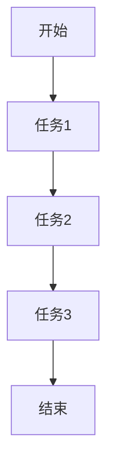
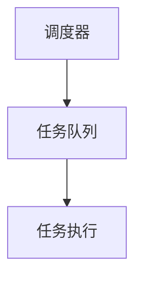

# Airflow 关键指标监控

Apache Airflow 是一个强大的工作流管理工具，广泛用于数据管道的编排和调度。为了确保 Airflow 的稳定性和高效性，监控其关键指标至关重要。本文将介绍如何监控 Airflow 的关键指标，并提供实际案例和代码示例，帮助你更好地理解和应用这些概念。

## 1. 什么是关键指标监控？

关键指标监控是指通过收集和分析系统的关键性能指标（KPIs），来评估系统的健康状况和性能表现。对于 Airflow 来说，这些指标可以帮助你识别潜在的问题，优化工作流的执行效率，并确保系统的稳定性。

## 2. 为什么需要监控 Airflow 的关键指标？

- **故障排除**：通过监控关键指标，可以快速识别和定位问题，减少故障排除时间。
- **性能优化**：了解系统的瓶颈和性能瓶颈，可以帮助你优化工作流的执行效率。
- **资源管理**：监控资源使用情况，可以更好地分配和管理计算资源，避免资源浪费。

## 3. Airflow 的关键指标

以下是 Airflow 中一些常见的关键指标：

### 3.1 DAG 执行状态

- **DAG 执行时间**：每个 DAG 的执行时间，可以帮助你识别执行时间过长的 DAG。
- **任务执行状态**：每个任务的执行状态（成功、失败、重试等），可以帮助你识别失败的任务。

### 3.2 调度器性能

- **调度延迟**：调度器从任务提交到任务执行的时间延迟。
- **调度器心跳**：调度器的心跳频率，可以帮助你识别调度器是否正常运行。

### 3.3 执行器性能

- **任务队列长度**：任务队列中的任务数量，可以帮助你识别任务积压情况。
- **任务执行时间**：每个任务的执行时间，可以帮助你识别执行时间过长的任务。

### 3.4 资源使用情况

- **CPU 使用率**：Airflow 工作节点的 CPU 使用率。
- **内存使用率**：Airflow 工作节点的内存使用率。
- **磁盘 I/O**：Airflow 工作节点的磁盘 I/O 情况。

## 4. 如何监控 Airflow 的关键指标

### 4.1 使用 Airflow 的内置监控工具

Airflow 提供了内置的监控工具，可以帮助你监控关键指标。以下是一些常用的工具：

- **Airflow UI**：Airflow 的 Web UI 提供了 DAG 和任务的执行状态、调度延迟等信息。
- **Airflow Metrics**：Airflow 提供了 Prometheus 和 StatsD 等监控工具的集成，可以收集和展示关键指标。

### 4.2 使用 Prometheus 和 Grafana

Prometheus 是一个开源的监控和告警工具，Grafana 是一个开源的可视化工具。你可以使用 Prometheus 收集 Airflow 的关键指标，并使用 Grafana 进行可视化展示。

以下是一个使用 Prometheus 和 Grafana 监控 Airflow 的示例：

```yaml
# prometheus.yml
scrape_configs:
  - job_name: 'airflow'
    static_configs:
      - targets: ['localhost:8080']
```

```yaml
# grafana_dashboard.json
{
  "panels": [
    {
      "type": "graph",
      "title": "DAG Execution Time",
      "targets": [
        {
          "expr": "rate(airflow_dag_run_duration_seconds_sum[1m])",
          "legendFormat": "{{dag_id}}"
        }
      ]
    }
  ]
}
```

### 4.3 使用 StatsD

StatsD 是一个简单的网络守护进程，可以收集和聚合应用程序的指标。Airflow 支持 StatsD，你可以使用 StatsD 收集 Airflow 的关键指标。

以下是一个使用 StatsD 监控 Airflow 的示例：

```python
# airflow.cfg
[metrics]
statsd_on = True
statsd_host = localhost
statsd_port = 8125
statsd_prefix = airflow
```

## 5. 实际案例

### 5.1 监控 DAG 执行时间

假设你有一个 DAG，每天执行一次，但最近发现执行时间越来越长。你可以使用 Prometheus 和 Grafana 监控该 DAG 的执行时间，并识别执行时间过长的任务。



通过监控，你发现任务2的执行时间明显增加。经过进一步分析，你发现任务2的查询语句效率低下，优化查询语句后，DAG 的执行时间恢复正常。

### 5.2 监控调度器性能

假设你发现调度器的调度延迟增加，导致任务执行时间延长。你可以使用 Prometheus 和 Grafana 监控调度器的调度延迟，并识别调度器的性能瓶颈。



通过监控，你发现调度器的 CPU 使用率过高，导致调度延迟增加。你决定增加调度器的 CPU 资源，调度延迟恢复正常。

## 6. 总结

监控 Airflow 的关键指标是确保系统稳定性和性能优化的重要手段。通过使用 Airflow 的内置监控工具、Prometheus 和 Grafana、以及 StatsD，你可以有效地监控 Airflow 的关键指标，识别和解决潜在的问题。

## 7. 附加资源与练习

- **练习**：尝试在你的 Airflow 环境中配置 Prometheus 和 Grafana，并监控一个 DAG 的执行时间。
- **资源**：
  - [Airflow 官方文档](https://airflow.apache.org/docs/)
  - [Prometheus 官方文档](https://prometheus.io/docs/)
  - [Grafana 官方文档](https://grafana.com/docs/)

通过本文的学习，你应该能够理解并应用 Airflow 的关键指标监控，确保你的工作流稳定高效地运行。